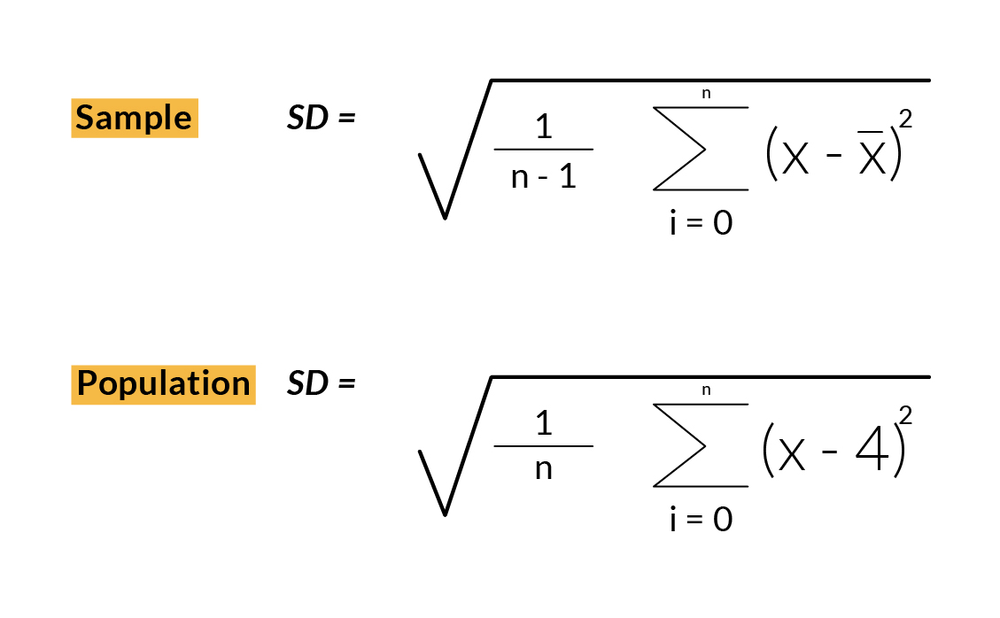
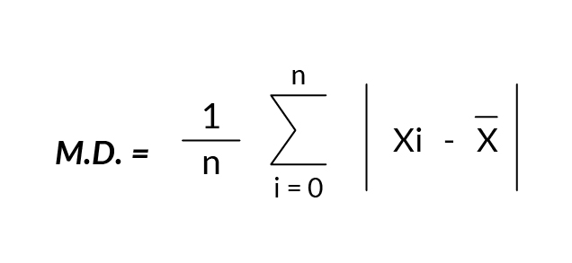
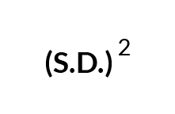
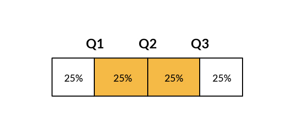
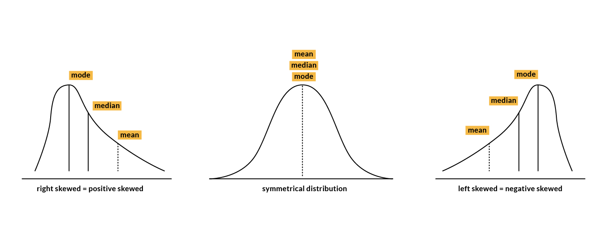
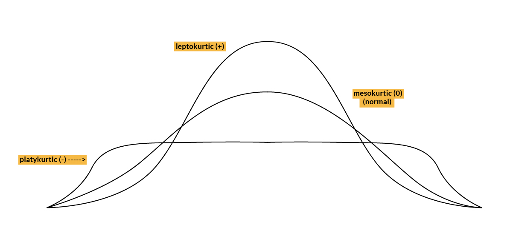

# ESTADISTICA DESCRIPTIVA

Podemos dividir el campo Estadísticas en dos categorías:
    
Estadística Descriptiva y Estadística Inferencial.

Estadística Descriptiva significa resumir y organizar los datos, por ejemplo, teniendo una gran cantidad de datos, deseas contárselo a alguien pero sin darle todos, puedes usar números indicativos.

Esto es diferente de la Estadística Inferencial.

Estadística Inferencial significa intentar hacer inferencias o conclusiones de una muestra a toda la población.

Entonces, utilizando Estadística Descriptiva, quiza quieras tal vez usar un número que sea más indicativo de todos los números en ese conjunto. O algunos de los números que representan la tendencia central.

Comenzaremos enumerando las medidas de tendencia central, que representan la idea de que hay un número que resume mejor todo el conjunto.

### Medidas de tendencia central

**Momentos**

Un momento es una medida cuantitativa que dice algo sobre la forma de una distribución. Hay momentos centrales y no centrales. Esta sección se enfoca en los momentos centrales. Estas medidas de tendencia central representan la idea de que hay un número que resume mejor todo el set.

El momento central 0 es la probabilidad total y siempre es igual a 1.

El 1er momento es la media (valor esperado).

El 2do momento central es la varianza.

**Media**

La media aritmética es probablemente con lo que estás más familiarizado cuando la gente habla de promedio. Si tienes cinco números, la media sería la suma de todos dividido entre 5. Es el punto de balance y también es llamado el primer momento.

**Mediana**

Es el valor que divide los datos en dos partes iguales, Si el número de elementos en los datos es par, entonces la mediana sería el promedio de los dos términos medios.

Cuando la diferencia entre los términos consecutivos es constante (progresión aritmética) entonces la mediana = media.

**Moda**

la moda es escencialmente que número es el mas común en un set. Si dos valores aparecen al mismo tiempo más que otros, entonces tenemos un conjunto bimodal. También podemos tener conjuntos trimodales o multimodales.

### Medidas de variabilidad

Estas medidas representan la dispersión de los datos.

**Desviación Estándar**

La Desviación Estándar nos dice qué tan lejos está la media de cada observación en el.

En estadística descriptiva generalmente tratamos con datos disponibles en una muestra, no en una población. La desviación estándar se calcula con la raíz cuadrada de la varianza.

**Desviación media**

La Desviación media da información sobre la distancia entre los valores de los datos y el valor medio.

**Varianza**

Es solamente otra medida de dispersión, de cómo los puntos de datos difieren de la media. La varianza es la expectativa de la desviación al cuadrado de una variable aleatoria de su media poblacional o media muestral.

La varianza es mastante interesante en un sentido matemático, pero la desviación estándar suele ser una medida mucho mejor de cuán dispersa está la distribución.

**Rango**

El rango es la diferencia entre el valor más bajo y el más alto.

**Percentil**

Es una forma de representar la posición de un valor en un conjunto de datos. Para calcularlo, los valores deben estar siempre en orden ascendente.

12  

24

41   

51  

67  

67   

85   

99

La mediana 59 tiene cuatro valores menos que ella misma de ocho. 59 es el percentil 50 porque el 50 % de los datos son inferiores a 59.

**Cuartiles**

Los cuartiles son valores que dividen tus datos en cuartos. Ordenados de manera ascendente.

12

24

41

51

67

67

85

99

115

Q2 = 67 es el percentil 50 de los datos y también es la mediana.

Q1 = 41 es el percentil 25 de los datos.

Q3 = 85 es el percentil 75 de los datos

IQR = rango intercuantílico $= Q3 - Q1 = 85 - 41 = 44$
                

### Asimetría

El tercer momento central es la asimetría. Una medida que describe el contraste de una cola frente a la otra cola.

Por ejemplo, si hay más valores altos en tu distibución que valores bajos, entonces tu distribución está 'sesgada' hacia los valores altos.

Para calcular la asimetría:

1. Primer coeficiente de asimetría de Pearson (asimetría modal)

2. Segundo coeficiente de asimetría de Pearson (asimetría mediana)

La dirección de la asimetría viene dada por el signo 0, significa que no hay asimetría. Negativo significa asimetría negativa.

El coeficiente compara la distribución de la muestra con una distribución normal.

### Correlación

Es una Técnica estadística que puede mostrar si los pares de variables están correlacionados y con qué fuerza.

El coeficiente de correlación (r) varía de -1 a +1.

Cuanto más cerca de +1 o -1, más estrechamente se correlacionan las dos variables.

Si r es cercano a 0, no hay relación.

Si r es positivo, significa que a medida que una variable aumenta, la otra aumenta.

Si r es negativo, significa que a medida que una variable se hace más grande, la otra se hace más pequeña.

### Curtosis

El 4to momento central es la Curtosis. Se trata de la existencia de valores atípicos. Es una medida de si los datos son de cola pesada (profusión de valores atípicos) o de cola ligera (ausencia de valores atípicos) en relación con una distribución normal. Se trata de cuán gordas son las colas en la distribución.

Leptokurtic significa que las colas son gruesas y pesadas.

Platykurtic significa que las colas son más delgadas.

La principal diferencia entre la asimetría y la curtosis es:
    
    La asimetría se refiere a un grado de simetría.
    La curtosis se refiere a un grado de presencia de valores atípicos.

Cuanto mayor sea el momento, más difícil será estimar con muestras. Se requieren muestras más grandes para obtener buenas estimaciones.

References:

https://towardsdatascience.com/understanding-descriptive-statistics-c9c2b0641291

