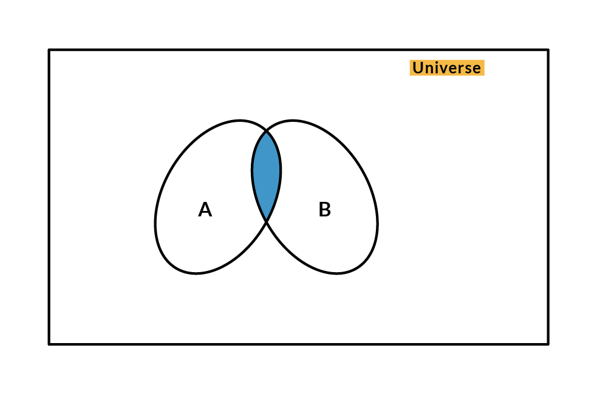
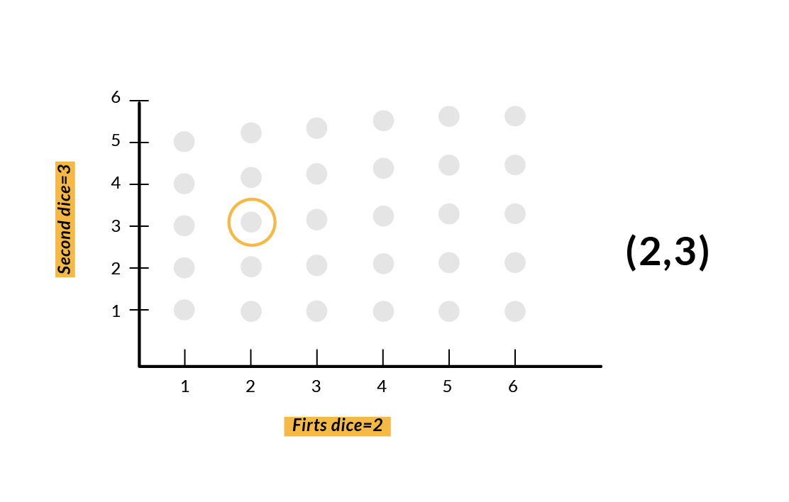

# Probability

### Mathematical Background

**Sets**

A Set is a collection of different elements. We have some elements and we put them together; this collection is called a Set.

There are two types of sets:

1. Finite sets: It has a finite number of elements. For example, a set that includes numbers between 10 and 20.
2. Infinite set: For example, a set of all real numbers.

Everything outside the Set A we call it the complement of Set A. An element x belongs to the complement of A if x is an element of our universal set, and also does not belong to A.

Now when we have two sets A and B, we can talk about their union and intersections.

The **union** of the two sets consists of all elements that belong to one set or the other, or both. So, an element belongs to the union if and only if this element belongs to one of the sets, or it belongs to the other one of the sets.

The **intersection** of two sets is the collection of elements that belong to both of the sets. So, an element belongs to the intersection of two sets if and only if that element belongs to both of them.

**Sequences**

A sequence is a collection of elements that are coming out of some set and that collection is indexed by the natural numbers. 
We mean that we have $i$ and $ai$ where $i$ is an index that runs over the natural numbers, which is the set of positive integers, and each $ai$ is an element of some set. Formally, a sequence is a function that, to any natural number, associates an element of $S$. We normally care about whether a sequence converges to some number $a$. The limit as $i$ goes to infinity of $ai$ is equal to a certain number, $a$.

But what exactly does it mean for a sequence to converge?

No matter what kind of band I take around my limit $a$, eventually, the sequence will be inside this band and will stay inside there. For example, if a certain sequence converges to a number a and another sequence converges to a number $b$, we will have that $ai + bi$ (which is another sequence) will converge to $a+b$.

But, how can we tell whether a given sequence converges or not?

We have 2 cases:

1. The first one, when we have a sequence of numbers that keep increasing. Those numbers may go up forever without any bound. In that case we say that the sequence converges to infinity. 
2. But if it does not converge to infinity, which means that the entries of the sequence are bounded, then in that case, the sequence will converge to a certain number.

**Infinite series**

We have a sequence of numbers $ai$, indexed by $i$, where $i$ ranges from $1$ to infinity. Then we have an infinite sequence. We want to add the terms of that sequence together. 

So, what is an infinite series?

The infinite series is defined as the limit, as $n$ goes to infinity, of the finite series in which we add only the first $n$ terms in the series. The situation is more complicated if the terms $ai$ can have different signs. In that case, it's possible that the limit does not exist, and so the series is not well defined.

**Countable vs Uncountable sets**

Probability models often involve infinite sample sets. Some sets are discrete, which we call countable, and some are continuous and we call them uncountable.
A set will be called countable if we look at its elements, and we take one element. We call it the first element. We take another element, we call it the second element, and so on. This way, we will eventually exhaust all of the elements of the set, so that each one corresponds to a positive integer.

What would be an uncountable set?

An uncountable set is a set that is not countable. Whenever we have a unit interval or any other interval that has a positive length, that interval is an uncountable set. And the same is true if instead of an interval, we look at the entire real line or two or three or more dimensional spaces. So all the usual sets that we think of as continuous sets turn out to be uncountable.

### Probability

Nowadays, there is not much we can understand about what goes on around us unless we understand uncertainty. It is easy to formulate propositions without uncertainty, but problems appear when uncertainty reveals itself.

Probability finds out the likeliness that something will happen by providing a way to summarize the uncertainty that comes from laziness and ignorance. So life is uncertain but we need to make predictions and decisions under uncertainty.

A probabilistic model is a model of a random experiment and it can help you analyze uncertain situations no matter what your unique background is. 
We first describe the possible outcomes of the experiment and then we describe the likelihood of the different possible outcomes. This combination is called the probability space, which is the pairing $(S, P)$ where $S$ is the sample space and $P$ is the probability distribution.

Let's imagine we flip a coin. The probability space is $(S, P)$. We make a SET of the possible outcomes. That set is called the **sample space** of all elementary events. Its **probability distribution** means assigning a real number $p(x)$ to every elementary event $X$ such that its probability is between $0$ and $1$ and the sum of all these probabilities is equal to $1$.

$S = {Heads, Tails}$ where $S$ can either be heads or tails, therefore the probability is $P(Heads) = P(Tails) = 1/2$

The probability for heads is the same as the probability for tails which is the same as $0.5$. So if you flip a coin there is an even chance of getting heads or of getting tails.

Now let's imagine we have a fair roll dice. We have $6$ possible outcomes if we roll a dice : { 1, 2, 3, 4, 5, 6}
If it is a fair roll dice, then each of those possible outcomes has the same probability, which would be: 

number of possibilities that meet my condition / number of equally likely possibilities

$P(1) = 1/6$

$P(1 or 6) = 2/6$

$p(2 and 3) = 0/6$ ------> getting a $2$ or a $3$ are mutually exclusive events. They can not happen at the same time.

A probability distribution is considered uniform if every outcome is equally as likely.

Sample spaces are sets, and a set can be discrete, finite, infinite, continuous, and so on. Let's have an example of a simple discrete and finite sample space. We will roll a dice twice. We are not dealing with two probabilistic experiments. We are dealing with a single experiment that involves two rolls of the die. We take note of the first result, and then take note of the second result and this gives us a pair of numbers and graph it as follows.

### Why Probability?

In many cases, it is more practical to use a simple but uncertain rule rather than a complex but certain one, even if the true rule is deterministic and our modeling system has the fidelity to accommodate a complex rule.

For example, the simple rule "Most birds fly" is **cheap** to develop and is broadly useful, while a rule of the form "Birds fly, except for very young birds that have not yet learned to fly, sick or injured birds that have lost the ability to fly, flightless species of birds including the cassowary, ostrich, and kiwi..." is **expensive** to develop, maintain and communicate and, after all this effort, is still **fragile** and prone to **failure**.

Probability can be seen as the extension of logic to deal with uncertainty.

Probability theory provides a set of formal rules for determining the likelihood of a proposition being true given the likelihood of other propositions.

### Types of Probability

**Frequentist Probability:**

•	Frequency of events -Example: The chance of drawing a certain hand in poker 

•	Fixed model, different data (We run the same experiments each time with different data)

**Bayesian Probability:**

•	A degree of belief, for example, a doctor saying a patient has a 40 percent chance of having the flu.

•	Fixed data and different models (We use the same belief to check the uncertainty of different models and update our beliefs) -Based on Bayes Rule.

**Differences between Bayesian and frequentist statistics.**

Both attempt to estimate a population parameter based on a sample of data.

Frequentists treat the data as random and the statistic as fixed. Inferences are based on long-run infinite sampling, and estimates of the parameter come in the form of point estimates or confidence intervals.

Bayesians treat the population parameter as random and the data as fixed. Bayesian statistics allows us to make informed guesses about the value of the parameter in the form of prior distributions. Estimates of the parameter come in the form of posterior distributions.

### Events

An event is a set of outcomes of an experiment in probability. In Bayesian probability, an event is defined as describing the next possible state space using knowledge from the current state.

Events can be :

•	Independent - each event is not affected by previous or future events. 

•	Dependent - an event is affected by other events. 

•	Mutually exclusive - events can't happen at the same time.

The complement of an event is all the other outcomes of an event. For example, if the event is Tails, the complement is Heads. If you know the probability of $p(x)$ you can find the complement by doing $1 - p(x)$. Sometimes it is easier to work out the complement first before the actual probability.

### Conditional Probability

The conditional probability of an event $B$ is the probability that the event will occur given that event $A$ has already occurred.
If $A$ and $B$ are two events, then the conditional probability can be designated as $P(A given B)$ or $P(A|B)$. Conditional probability can be calculated from the joint probability $(A | B) = P(A, B) / P(B)$ The conditional probability is not symmetrical; 

For example $P(A | B) != P(B | A)$

Other ways of calculating conditional probability includes using the other conditional probability, i.e.

$P(A|B) = P(B|A) * P(A) / P(B)$ ----->Bayes Theorem

Reverse is also used:

$P(B|A) = P(A|B) * P(B) / P(A)$

This way of calculation is useful when it is challenging to calculate the joint probability. Else, when the reverse conditional probability is available, calculation through this becomes easy.
This alternate calculation of conditional probability is referred to as the Bayes Rule or Bayes Theorem.

**Bayes Theorem**

Bayes’ theorem is a simple mathematical formula used for calculating conditional probabilities. This theorem states that:

$P(A|B) = P(B|A) * P(A) / P(B)$

Bayes’s theorem is used for the calculation of a conditional probability where intuition often fails. Although widely used in probability, the theorem is being applied in the machine learning field too. Its use in machine learning includes the fitting of a model to a training dataset and developing classification models.

It is always possible to answer conditional probability questions by Bayes Therorem. It tells us the probability of event A given some new evidence B, but if you forgot it you can always grow stories with trimed trees.

Example:

Dangerous fires are rare (1%) But smoke is fairly common (10%) due to barbecues, And 90% of dangerous fires make smoke
What is the probability of a dangerous Fire when there is Smoke?

Calculation

$P(Fire|Smoke) =P(Fire) P(Smoke|Fire)/P(Smoke)$

= 1% x 90%/10%

= 9%

**Bayes Theorem in Machine Learning**

Bayes theorem can be used both in regression and classification.

Generally, in Supervised Machine Learning, when we want to train a model the main building blocks are:

- A set of data points that contain features (the attributes that define such data points)
- The labels of such data point (the numeric or categorical tag which we later want to predict on new data points)
- A hypothesis function that links such features with their corresponding labels.
- We also have a loss function, which is the difference between the predictions of the model and the real labels which we want to reduce to achieve the best possible results.

References:

https://medium.com/brandons-computer-science-notes/an-introdcution-to-probability-45a64aee7606

https://discovery.cs.illinois.edu/learn/Prediction-and-Probability/Conditional-Probability/

https://www.upgrad.com/blog/bayes-theorem-explained-with-example-complete-guide/

https://www.edx.org/es/micromasters/mitx-statistics-and-data-science

https://towardsdatascience.com/bayes-theorem-clearly-explained-with-visualization-5083ea5e9b14

