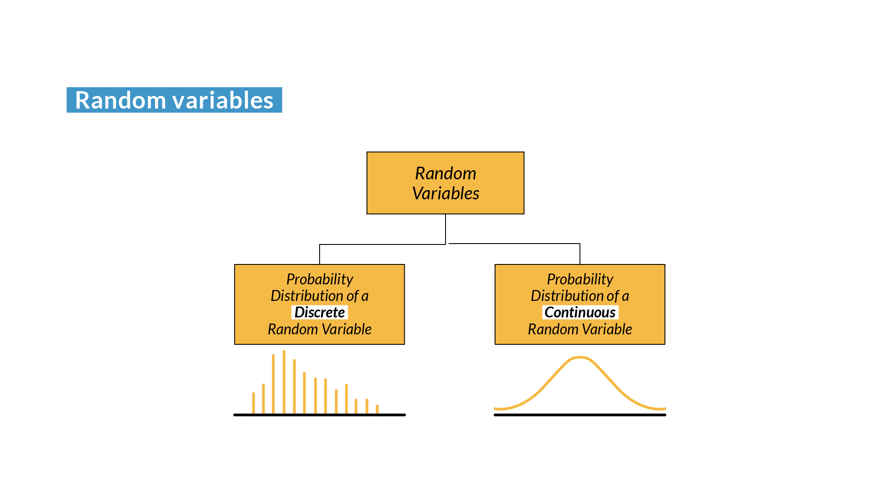
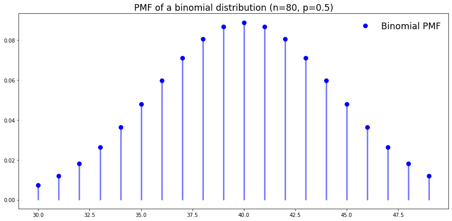
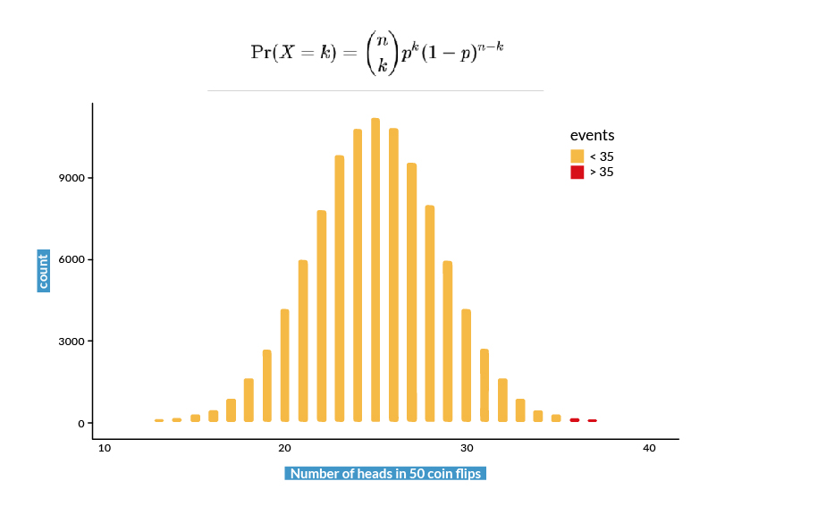
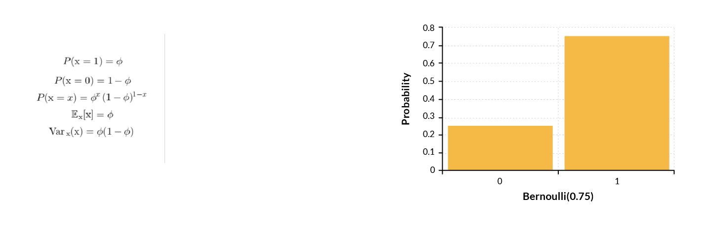
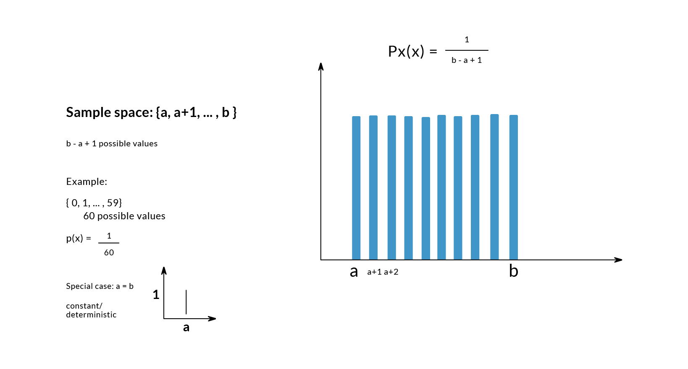
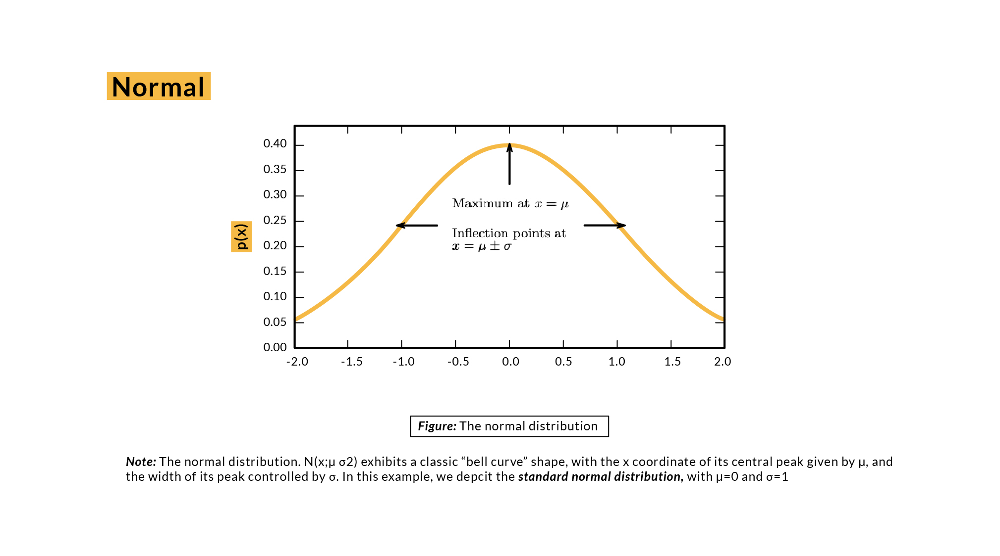
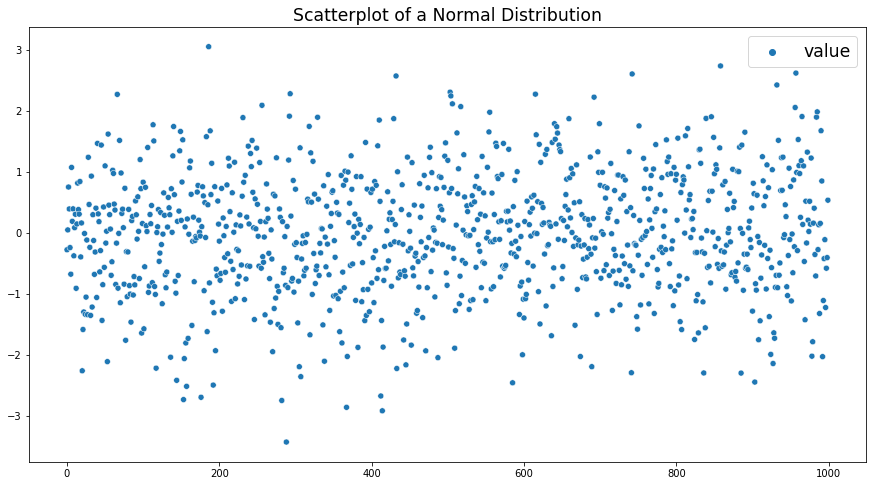
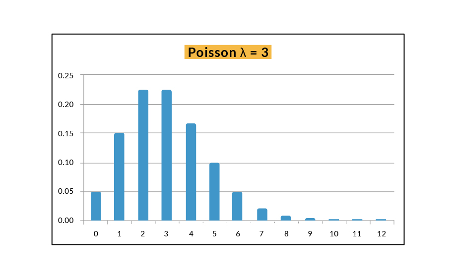
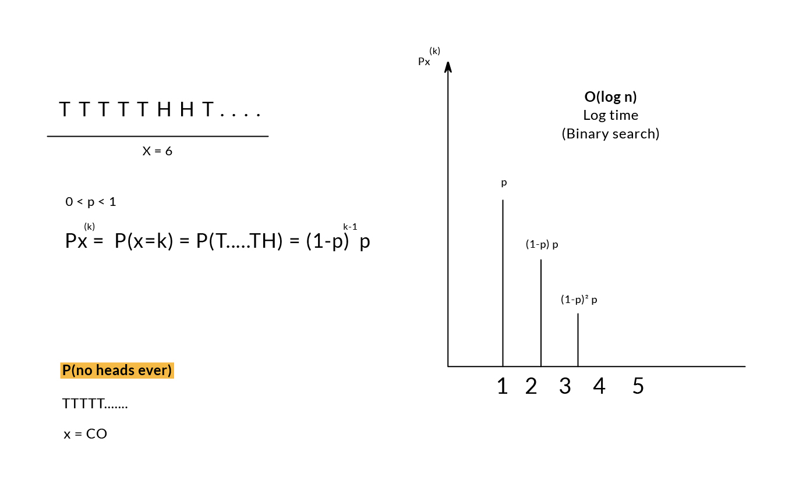
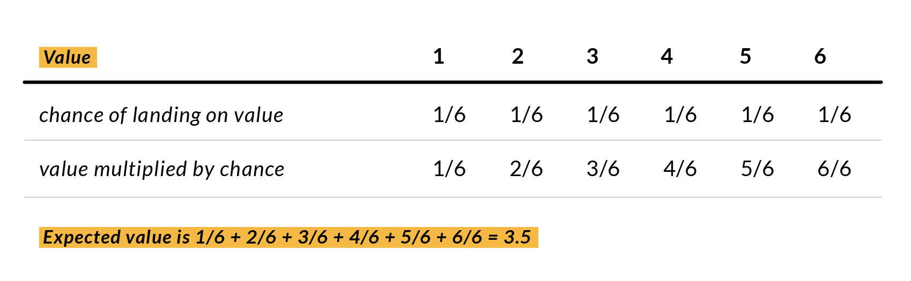

# Variables Aleatorias

Una variable aleatoria es una variable que puede tomar diferentes valores aleatoriamente.

Por sí misma, una variable aleatoria es solo una descripción de los estados que son posibles; debe ir acompañado de una distribución de probabilidad que especifique la probabilidad de cada uno de estos estados. Una variable aleatoria $X$ es una función que asigna eventos a números reales.

Las variables aleatorias pueden ser discretas o continuas.

1. Una variable discreta es aquella que tiene un número finito o contablemente infinito de estados. Tenga en cuenta que estos estados no son necesariamente los números enteros. También pueden ser simplemente estados nombrados que no se considera que tengan ningún valor numérico.

2. Una variable continua está asociada a un valor real, por lo que puede tomar un número incontable de valores.

### Tipos de variables aleatorias


**Variable aleatoria discreta:**

-Tiene un número finito de estados, no necesariamente números enteros. También pueden ser estados con nombre que no se considera que tengan ningún valor numérico. Ejemplo: lanzamiento de una moneda (2 estados), lanzamiento de un dado (6 estados), extracción de una carta de una baraja de cartas (52 estados), etc.

**Variable aleatoria continua:**

-Debe estar asociado a un valor real. Ejemplo: precipitación de un día determinado (en centímetros), precio de las acciones de una empresa, temperatura de un día determinado.



En estadística representamos una distribución de variables discretas con PMF's (Funciones de Masa de Probabilidad). El PMF define la probabilidad de todos los valores posibles $x$ de la variable aleatoria. Representamos distribuciones de variables continuas con PDF's (Funciones de Densidad de Probabilidad).

Las CDF (Funciones de Distribución Acumulativas) representan la probabilidad de que la variable aleatoria $X$ tenga un resultado menor o igual al valor $x$. Los CDF se utilizan tanto para distribuciones discretas como continuas.

### Función de masa de probabilidad (PMF)

Visualicemos la función y la gráfica de la PMF de una distribución binomial:


```python


import numpy as np
import matplotlib.pyplot as plt
from scipy.stats import binom

n = 80
p = 0.5

x = np.arange(binom.ppf(0.01, n, p), binom.ppf(0.99, n, p))

fig, ax = plt.subplots(1, 1, figsize=(15,7))

ax.plot(x, binom.pmf(x, n, p), 'bo', ms=8, label='Binomial PMF')
ax.vlines(x, 0, binom.pmf(x, n, p), colors='b' , lw=3, alpha=0.5)

rv = binom(n, p)

ax.legend(loc='best', frameon=False, fontsize='xx-large')
plt.title('PMF of a binomial distribution (n=80, p=0.5)', fontsize='xx-large')
plt.show()
```


    

    


### Funciones de densidad de probabilidad (PDF)

La Función de Densidad de Probabilidad es lo mismo que una Función de Masa de Probabilidad, pero para variables continuas. Se puede decir que la distribución tiene un número infinito de valores posibles.

Visualicemos la función y la gráfica para la PDF de una distribución normal:


```python
from scipy.stats import binom

mu = 0
variance = 1
sigma = sqrt(variance)
x = np.linspace(mu - 3*sigma, mu + 3*sigma, 100)
plt.figure(figsize=(16,5))
plt.plot(x, stats.norm.pdf(x, mu, sigma), label='Normal Distribution')
plt.title('Normal Distribution with mean = 0 and std = 1')
plt.legend(fontsize='xx-large')
plt.show()
```


    

    


### Función de distribución acumulativa

La CDF mapea la probabilidad de que una variable aleatoria $X$ tome un valor menor o igual a un valor $x$ $(P(X ≤ x))$. En esta sección visualizaremos sólo el caso continuo. La CDF acumula todas las probabilidades, por lo tanto, está limitada entre $0 ≤ x ≤ 1$.

Visualicemos la función y gráfica de una CDF de una distribución normal:


```python
# Data
X  = np.arange(-2, 2, 0.01)
Y  = exp(-X ** 2)

# Normalize data
Y = Y / (0.01 * Y).sum()

# Plot the PDF and CDF
plt.figure(figsize=(15,5))
plt.title('Continuous Normal Distributions', fontsize='xx-large')
plot(X, Y, label='Probability Density Function (PDF)')
plot(X, np.cumsum(Y * 0.01), 'r', label='Cumulative Distribution Function (CDF)')
plt.legend(fontsize='xx-large')
plt.show()
```


    

    


# Distribuciones de probabilidad


Una distribución de probabilidad es la descripción de la probabilidad de que una variable aleatoria o un set de variables aleatorias adopten cada uno de sus estados posibles. La forma en que describimos las distribuciones de probabilidad depende de si las variables son discretas o continuas.

**Binomial Random Variable**

La *Distribución Binomial* con parámetros $n$ y $p$ es la distribución de probabilidad discreta del número de éxitos en una secuencia de $n$ experimentos independientes. Se utiliza con frecuencia para modelar el número de éxitos en una muestra de tamaño $n$ extraída con reemplazo de una población de tamaño $N$.

Las distribuciones de probabilidad binomial nos ayudan a comprender la probabilidad de eventos raros y establecer rangos esperados probables.

Las distribuciones binomiales deben cumplir tres criterios:

1. El número de ensayos es fijo.
2. Cada ensayo es independiente.
3. La probabilidad de éxito es exactamente la misma para todas las pruebas.



**Variable aleatoria de Bernoulli**

La distribución de Bernoulli es un caso especial de distribución binomial.

Modela una prueba que resulta en éxito o fracaso. Por ejemplo, cara o cruz. Todos los valores en una distribución de Bernoulli son 0 o 1.

Imaginemos que la moneda que tenemos no es una moneda justa, porque su probabilidad de caer cara es del 70%. La distribución sería la siguiente:

Caras = $1$

$p(heads) = p = 0.7$

Cruces = $0$

$p(tails) = 1 - p = 0.3$

La *Distribución de Bernoulli* es una distribución sobre una única variable aleatoria binaria.

Está controlado por un solo parámetro, que da la probabilidad de que la variable aleatoria sea igual a $1$.

Tiene las siguientes propiedades:



**Variable aleatoria uniforme**

Modelos cuando existe un completo desconocimiento de que un resultado tendría más probabilidad que otros. Así que todos los resultados posibles son igualmente probables. Por lo tanto, la distribución consta de valores aleatorios sin patrones en ellos.

Una distribución uniforme sería la siguiente:



Generemos un diagrama de dispersión con números flotantes aleatorios entre $0$ y $1$:


```python
# Distribución uniforme (entre 0 y 1)

uniform_dist = np.random.random(1000)
uniform_df = pd.DataFrame({'value' : uniform_dist})
uniform_dist = pd.Series(uniform_dist)
```


```python
plt.figure(figsize=(18,5))
sns.scatterplot(data=uniform_df)
plt.legend(fontsize='xx-large')
plt.title('Scatterplot of a Random/Uniform Distribution', fontsize='xx-large')
```


    Text(0.5, 1.0, 'Scatterplot of a Random/Uniform Distribution')


    

    


**Distribución normal**

Finalmente, la distribución más utilizada sobre números reales, también conocida como distribución de Gaussian o curva de campana. Principalmente debido al Teorema del límite central (CLT), que establece que a medida que la cantidad de muestras aleatorias independientes (como múltiples lanzamientos de monedas) tiende al infinito, la distribución de la media muestral tiende a una distribución normal.

Los dos parámetros son $μ$ (mu = media de la población) y $σ$ (sigma = desviación estándar de la población) controlan la distribución normal.

El parámetro $μ$ da la coordenada del pico central, que también es la media de la distribución $E[X] = μ$.

La desviación estándar de la distribución viene dada por $σ$ y la varianza por $σ2$.

La distribución normal codifica la cantidad máxima de incertidumbre sobre los números reales. Por lo tanto, podemos pensar en la distribución normal como aquella que inserta la menor cantidad de conocimiento previo en un modelo.

La siguiente imagen muestra una distribución normal:



Ahora generemos 2 muestras con distribución normal:


```python
# Sample 1 with normal distribution
normal_dist = np.random.randn(1000)
normal_df = pd.DataFrame({'value' : normal_dist})
# Create a Pandas Series for easy sample function
normal_dist = pd.Series(normal_dist)

# Sample 2 with normal distribution
normal_dist2 = np.random.randn(1000)
normal_df2 = pd.DataFrame({'value' : normal_dist2})
# Create a Pandas Series for easy sample function
normal_dist2 = pd.Series(normal_dist)

normal_df_total = pd.DataFrame({'value1' : normal_dist, 'value2' : normal_dist2})
```

Primero, veremos la distribución con una curva de campana:


```python
# Normal Distribution as a Bell Curve
plt.figure(figsize=(18,5))
sns.distplot(normal_df)
plt.title('Normal distribution (n=1000)', fontsize='xx-large')
```

    C:\Users\danie\AppData\Local\Programs\Python\Python310\lib\site-packages\seaborn\distributions.py:2619: FutureWarning: `distplot` is a deprecated function and will be removed in a future version. Please adapt your code to use either `displot` (a figure-level function with similar flexibility) or `histplot` (an axes-level function for histograms).
      warnings.warn(msg, FutureWarning)


    Text(0.5, 1.0, 'Normal distribution (n=1000)')


    

    


Ahora veamos la distribución normal con un diagrama de dispersión:


```python
# Normal distribution as a scatterplot
plt.figure(figsize=(15,8))
sns.scatterplot(data=normal_df)
plt.legend(fontsize='xx-large')
plt.title('Scatterplot of a Normal Distribution', fontsize='xx-large')
```


    Text(0.5, 1.0, 'Scatterplot of a Normal Distribution')


    

    


¿Qué es una distribución de cola larga?

Una distribución de cola larga es aquella en la que hay muchos valores atípicos relativamente extremos, pero únicos. 

Se deben usar técnicas especiales, como agrupar en clústeres en la cola cuando se trabaja con DataSets de cola larga para aprovecharlos y entrenar la clasificación u otros modelos predictivos.

**Distribución de Poisson (veneno)**

Es una distribución de probabilidad discreta que expresa la probabilidad de que ocurra un número dado de eventos en un intervalo fijo de tiempo o espacio. Toma un valor lambda, que es igual a la media de la distribución.

El proceso de Poisson es una versión de tiempo continuo del proceso de Bernoulli.

**¿En qué tipo de situaciones aparece el proceso de Poisson?**

En general, aparece siempre que tenemos eventos como llegadas que son algo raros y suceden de una manera completamente descoordinada para que puedan presentarse de cualquier manera en particular.

Algunos ejemplos que pueden seguir una distribución de Poisson son:

1. Número de llamadas telefónicas recibidas por un centro de llamadas por hora.

2. Número de pacientes que llegan a urgencias entre las 10pm y las 11pm.




**Variables Aleatorias Geométricas**

La distribución geométrica es una distribución de probabilidad que describe el número de veces que se debe realizar una prueba de Bernoulli para obtener el primer éxito después de una cantidad consecutiva de fallas.

Espacio muestral: conjunto de secuencias infinitas de caras y cruces.

Variable aleatoria $X$: número de lanzamientos hasta el primer "Cara".

Modelo de: tiempos de espera, número de intentos hasta un éxito



### VALOR ESPERADO

El valor esperado es exactamente lo que parece, ¿cuál espera que sea el valor? El valor esperado es la media de una variable aleatoria.

Puede usar esto para calcular el puntaje promedio de una tirada de dados en 6 tiradas.



Dados los resultados=$(1, 2)$ y las probabilidades=$(1/8, 1/4)$, el valor esperado $E[x]$ es: $E[x]$ = $1(1/8 ) + 2(1/4) = 0,625$.

Interpretación: media en gran número de repeticiones independientes.
    
Precaución: si tenemos una suma infinita, debe estar bien definida.

**Normas**

-Linealidad del valor esperado.

$E[F+G] = E[F] + E[G]$.

-Regla de multiplicación del valor esperado.

$E[F x G]$ does not equal $E[F] * E[G]$

Referencias: 

https://www.kaggle.com/code/carlolepelaars/statistics-tutorial/notebook

