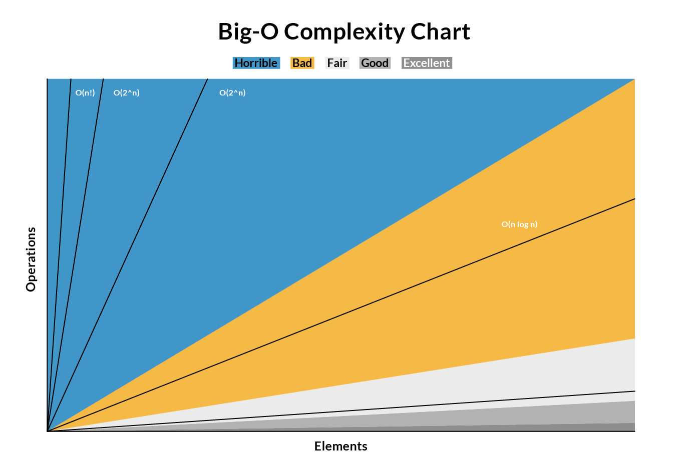
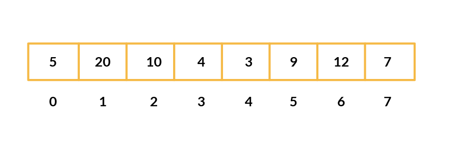
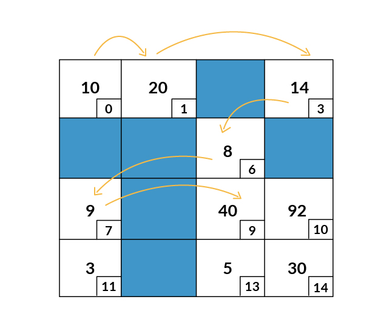
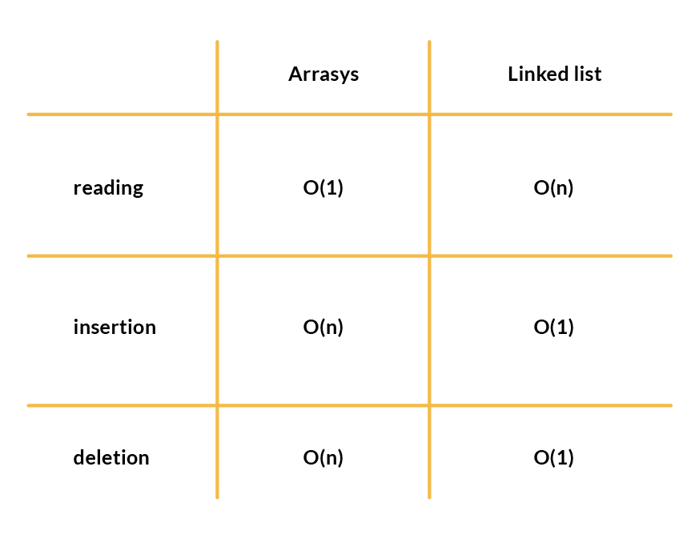
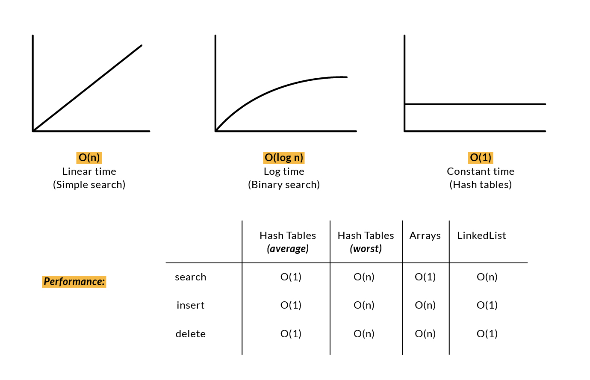
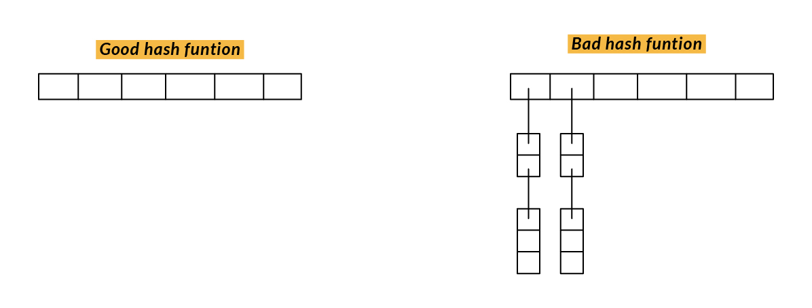
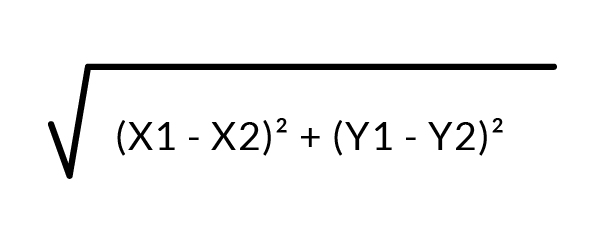

# ALGORITHMS AND DATA STRUCTURES

## What is an algorithm?

Algorithms are more simple than we think. Since we are kids we are taught how to complete day to day tasks.
An algorithm is a set of instructions followed to achieve a goal or to produce an output, for example learning to walk, tie your shoes or preparing a cake. All these processes are taught to us using a step to step procedure.
Let's see an example of a very simple algorithm, the steps to prepare some brownies:

```py
function PrepareBrownies(flavor){

 1. Heat Oven to 350 F
 2. Mix flour, baking powder, salt in a bowl
 3. Mix melted butter with "+ flavor +" chips in another bowl
 4. Mix eggs with sugar in a different bowl
 5. First combine the butter bowl with the eggs bowl.
 6. Add the flour bowl to the previous mix.
 7  Mix. 
 8. Put in pan
 9. Bake for 30 minutes

}

PrepareBrownies('chocolate')
```

## Data Structures

Most of the problems in computer science have some sort of data associated with, which we have to use to solve the problem and come up with a conclusion. So, a data structure is  a way to organize and manage that data at memory level such that we can effectively and efficiently do operation on that data.

To have a clear difference between algorithms and data structures we can say that the algorithms would act like the verbs, and data structures would be the nouns.

## What is time complexity?

A simple problem can be solved using many different algorithms. Some solutions just take less time and space than others.
But how do we know which solutions are more efficient?

Time complexity in programming it's most commonly used in the design of algorithms. It means how long an algorithm with a given number of inputs (n) will take to complete its task. It is usually defined using Big-O notation. Analyze time complexity all times you try to solve a problem. It will make you a better developer.

Let's look at some time complexities and its definitions:

**O(1) - Constant time:** Given an input of size n, it only takes a single step for the algorithm to accomplish the task.

**O(log n) - Logarithmic time:** given an input of size n, the number of steps it takes to accomplish the task are decreased by some factor with each step.

**O(n) - Linear time:** Given an input of size n, the number of steps required is directly related (1 to 1).

**O(n^2) - Quadratic time:** Given an input of size n, the number of steps it takes to accomplish a task is square of n.

**O(C^n) - Exponential time:** Given an input of size n, the number of steps it takes to accomplish a task is a constant to the n power (pretty large number).


 

Let's use n=16 to understand time complexity with an example.


```python
let n = 16:
    
    
O(1) = 1 step

O(log n) = 4 steps -- assuming base 2

O(n) = 16 steps

O(n^2) = 256 steps

O(2^n) = 65,356 steps
```



## Understanding algorithms and data structures

### 1. First algorithm:  Binary Search 

Suppose you’re searching for a word in a dictionary, and it starts with K. You could start at the beginning and keep flipping pages until you get to the Ks. But you’re more likely to start at a page in the middle, because you know the Ks are going to be near the middle of the dictionary. This is a search problem. And all these cases use the same algorithm to solve the problem: binary search.

For any list of n, binary search will take log2n steps to run in the worst case.

Retunring to our initial example we can say that:

To look in a 240,000 words dictionary with binary search, you cut the number of words in half until you are left with one word. The result at the worst case would be 18 steps, while a simple search would have taken 240,000 steps.

**Time complexity:** 

-A normal search runs in linear time O(n).

-A binary search runs in log time (logarithmic time) O(log n).

- The constant almost never matters for simple search vs binary search, because O(logn) is so much faster than O(n) when your list gets big.

### 2. Second Algorithm: Selection Sort

#### Arrays vs LinkedList  (Data structures)

Sometimes you need to store a list of elements in memory. Suppose you have a list of tasks to do today. Let's store it in an array first. That means all your tasks will be stored right next to each other in memory.

10 is at index 2

  

Now let's suppose after adding the first four tasks, you want to add a fifth one but the next space is occupied. With linked lists your tasks can be anywhere in memory. 

Elements aren't next to each other so you can't instantly calculate the position, you have to go to the first element to get the adress of the second element. Then go to the second element to get the adress of the third element. The blue squares are memory in use by someone else, you can't add data there because it is already occupied.



Suppose you do your spend list of the month . At the end of the month you check how much you spent in that month. 
That means you are having a lot of Inserts and a few Reads. Should you use an array or a list?

-Arrays  have fast reads and slow inserts.

-Linked Lists have slow reads and fast inserts.

It would make more sense to use a Linked List because you will be inserting more often than reading your spend list. Also, they only have slow reads if you are accesing random elements of the list but you are accesing all. Another important fact is that to add an item in the middle of an ordered list, also linked lists will be better because you just have to change what the previous element points to.

What if I want to delete an element from the list?

Again, lists are better because you just need to change what the previous element points to.


Which are used more? It depends on the case!

-Arrays are more used because they allow random access.

-Linked list can only do sequential access (reading elements one by one), but they are good for inserts/deletes

When you want to store multiple elements, should you use an array or a list?

-In an array the elements would be stored right next to each other. It allows fast reads.
*All elements in the array should be the same type.*

-In a list, elements would be stores all over, one element stores the adress of the next one. It allows fast insert and deletes.


**Time complexity:** 

**Best practice: Keep track of first and last items in a linked list so it only takes O(1)**



#### Selection Sort Algorithm

Remember O(n) time means you touch every element in a list once.

Example: 

You have a list of songs with the count of times you have played them. To sort the list of songs and see which one is your favorite you have to check each item in the list to find the one with the highest play count.
This takes O(n) time  and you have to do it n times.


```python
#Find the smallest element in an array and use it to write selection sort

def findsmallest(arr):
    smallest = arr[0] ----> stores smallest value
    smallest_index = 0 -----> stores index of the smallest value
    for i in range(1, len(arr)):
        if arr[i] < smallest:
            smallest = arr[i]
            smallest_index = i
    return smallest_index

#Now let's write the Selection Sort:

def SelectionSort(arr):   ------> sorts an array
    newArr = []
    for i in range(len(arr)):
        smallest = findSmallest(arr)   ----->finds the smallest and adds it to the new array.
        newArr.append(arr.pop(smallest))
    return newArr
```

### 3. Recursion

Recursion means breaking down a problem into a base case and a recursive case.

Recursion is where a function calls itself. Because a recursive function calls itself, it is easy to write a function incorrectly that ends up in an infinite loop.
If that happens you need to press **CTRL + C** to kill your script.
That is why every recursive function has 2 parts:

1. Base case (when it does not call itself again)
2. Recursive case (when it calls itself)

There is no performance benefit of using recursion, in fact, sometimes loops are better.

"Loops may achieve a performance gain for your program. Recursion may achieve a performance gain for the programmer"


Remember ! Recursion keeps track of the state. 
TIP: When we are dealing with a recursive function involving an array, the base case is often an empty array or an array with one element.
If we are stuck, we should try that first.

Why not use a loop?

Because this is a sneak peek into functional programming. 
Functional programming languages like Haskell don't have loops.

sum[ ] = 0   --->  base case

sum(x; xs) = x + sum(xs)  --->  recursive case

Let's see an example:


```python
# 1. Earlier sum function

def sum(list):
    if list == []:
        return 0
    return list[0] + sum(list[1:])

# 2. Recursive function to count number of items in a list:

def count(list):
    if list == []:
        return 0
    return 1 + count(list[1:])

# 3. Find the maximum number in a list

def max(list):
    if len(list) == 2:
        return list[0] if list[0] > list[1] else list[1]
    submax = max(list[1:])
    return list[0] if list[0] > submax else submax
```

#### The stack (data structure)

The stack is a simple data structure.
Remember when we talked about arrays and lists? We had a task list. We could add task items anywhere in the list or delete random items. Now, let's imagine we have that same task list but now in the form of a stack of sticky notes. This is much simpler because when we insert an item, it gets added to the top of the list. When we read an item, we only read the most recent  top item and it's taken off the list. Now our task list only has two actions: 

1. Push (insert, add a new item to the top)
2. Pop (remove the topmost item and read it)

In our computer, all the function calls go into the call stack.
The call stack can get very large, which takes up a lot of memory.

### 4. Third Algorithm: QuickSort

Divide and conquer, a well known recursive technique for solving problems, and a good example of elegant code.

Remember Recursion? In the case of QuickSort, we choose a pivot (1 element from the array)

Let's find the elements smaller than the pivot and the elements larger than the pivot. This is called partitioning.


You just got a sneak peek that your algorithm works!

Let's see an example of code for QuickSort:


```python
def quicksort(array):
    if len(array) < 2:
        return array    #---> base case: arrays with 0 or 1 element are already sorted
    else:
        pivot = array[0]  #---> recursive case
        less = [ i for i in array[1: ] if i <= pivot]   #----> subarray of elements less than pivot
        greater = [ i for i in array[1: ] if i > pivot]   #---> subarray of elements greater than pivot
        
        return quicksort(less) + [pivot] + quicksort(greater)
    
    print(quicksort([10,5,2,3]))
```

-Divide & conquer works breaking a problem into smaller and smaller pieces.

-If you use QuickSort, choose a random element as the pivot.

-The average runtime of QuickSort is 0(nlogn).

-The constant in Big O notation can matter sometimes, that is why quicksort is faster than mergesort.

### 5. Hash Tables (Data structure)

A hash function is where you put in a string and you get a number.
They are great when you want to create a mapping from one thing to another thing or when you want to look something up.

In Python we call hash tables : dictionaries

dict() ---> shortcut in Python = { }

The 'get' function returns the value if for example 'Maria' is in the hash table.

Let's see an example to see if a person has already picked up their cash prize:


```python
picked = {}

def check_picked_prize(name):
    if picked.get(name):
        print('Kick them out')
    else:
        picked[name] = True
        print('Let them pick up their cash prize')
```

If this would be a list, this function would become really slow eventually, but because we are storing them in a hash table, it instantly tells us if the name is in the hash table or not. Here, checking if there are duplicates is very fast.

Let's see some code for caching:


```python
cache = {}

def get_page(url):
    if cache.get(url):
        return cache[url]
    else:
        data = get_data_from_server(url)
        cache[url] = data 
        return data  
```

Hashes are good for modeling relationships from one thing to another thing, for filtering duplicates, for caching/memorizing data instead of making our server do the work.


**Collisions:** They happen when two keys have been assigned the same slot.

Hash tables work with constant time O(1) (not mean instant time)



Let's try not to hit the worst case performance with hash tables. To do that, we need to avoid collisions. How do we do that? Using low load factor and using a good hash function.

**What is the load factor of a hash table?**

It is the number of items in the hash table divided by the total number of slots.


When the load factor starts to grow > 1 it is time to resize. When we are running out of space, we create a new array that is bigger.

**Rule:** Make an array that is twice the size.

We should also resize when our load factor is greater than 0.7, because resizing is expensive and we don't want to resize too often.



**Important facts:**

-We will almost never have to implement a hash table ourselves, because the programming language should have one and we can assume that we will get the average case performance: constant time.

-We can make a hash table by combining a hash function with an array.

-Collisions are bad so we should minimize them.


### 6. Breadth-first Search

Bread-first search tells us if there is a path from A to B, and if there is a path, bread-first will find the shortest path.
If we find a problem like 'Find the shortest path', we should try modeling our problem as a graph and use breadth-first search to solve it.

**Important facts about Breadth-first search:

-A directed graph has arrows and the relationship follows the direction of the arrow.

-Undirected graphs don't have arrows and the relationship goes both ways.

-Queues are FIFO (first in, first out)

-Stocks are LIFO (last in, first out)

-We need to check items in the order they were added to the search list, so the search list needs to be a queue. Otherwise, we won't get the shortest path. Once we check some item, we need to make sure we don't check it again. Otherwise, we might end up in an infinite loop.

### 7. Dijkstra 's algorithm

While Breadth-first search is used to calculate the shortest path for an unweighted, Dijkstra's algorithm is used to calculate the shortest path for a weighted graph.

Negative weight edges break the algorithm so we can not use negative weight edges with Dijkstra's algorithm. In that case, there is an algorithm for that called Bellman Ford algorithm.

### 8. Greedy Algorithm

How to tackle the impossible: problems that have no fast algorithmic solution (NP-complete problems). 

How to identify such problems?

It would be better if we identify them when we see them, so we don't waste time trying to find a fast algorithm for them.
Approximation algorithms exist, and they are useful to find an approximate solution to an NP-complete problem quickly. This algorithms are judged by how fast they are, and how close they are to the optimal solution.

**Greedy strategy:** A very simple problem-solving strategy.

A greedy algorithm is simple. At each step, pick the optimal move. They are easy to write and fast to run, so they make good approximation algorithm. They optimize locally, hoping to end up with a global optimum.

There is no easy way to tell if the problem we are working on is NP-complete. Here are some giveaways:

-Our algorithm runs quickly with a handful of items but really slows down with more items.

-'All combinations of X' usually point to an NP-complete problem.

-Do we need to calculate 'every possible version of X' because we can't break it down into smaller sub-problems? Then it might be NP-complete.

-If our problem involves a set or if it involves a sequence and its hard to solve, it might be NP-complete.

-NP-complete problems have no known fast solution.

### 9. Dynamic Programming

It is useful when you are trying to optimize something given a constraint. You can use dynamic programming when the problem can  be broken into discrete subproblems, and they don't depend on each other.

**General tips:**

-Every dynamic programming solution involves a grid.

-The values in the cell are usually what we are trying to optimize.

-Each cell is a subproblem, so let's think about how can we divide our problem into subproblems. That will help us figure out what the axes are.

**Examples of use of Dynamic Programming:**

-Biologists use the longest common subsequence to find similarities in DNA strands, to tell how similar two animals or two diseases are. It is being used to find a cure for multiple sclerosis.

-When we use Git diff to tell the difference between two files, it is Dynamic programming!


### 10. K-Nearest Neighbors (KNN)

It's simple but useful. If you are trying to classify something, you might want to try KNN first.

**Building a recommendation system**

Suppose we are Netflix. Users are plotted by similarity. If we want to recommend movies for Maria, we can find the five users closest to her. So whatever movies they like, Maria will probably like them too.

---> But how do we figure out how similar two users are?

**Feature extraction**

Feature extraction means converting an item (like a user) into a list of numbers that can be compared.
If we have five features for each user in Netflix, for example Romance, Comedy, Horror, Science-fiction, Religious. To find the distance between two points we use the Pythagorean formula:



A mathematician would say we are now calculating the distance in five dimensions, but the distance formula remains the same:


So for example, if John and Maria are 18 apart, and Lucas and Maria are 3 apart, then if Lucas likes a movie, we will recommend it to Maria. We just built a recommendation system!

But not all users rate movies the same way. Two users may have the same taste for movies but one of them may be more conservative at the time of ranking a movie. They are well matched but according to the distance algorithm they wouldn't be neighbors. How to solve this?

Normalization! ----> We look at the average rating for each user and use it to scale their ratings, and then we can compare their ratings on the same scale.

How do we know if the number of neighbors we are using is the correct one?

A good rule of thumb is : If you have N users, look at sqrt(N).

KNN can be used for classification for categorizing into a group, and regression to predict a response like a number.

When we work with KNN it is really important to pick the right features:

-Features that directly correlate to what you try to recommend.

-Features that don't have a bias (for example if we only ask users to rate romance movies)

There is no right answer when it comes to picking good features. We have to think about all the different things we need to consider.

Source:
    
https://www.freecodecamp.org/news/time-is-complex-but-priceless-f0abd015063c/

https://www.bigocheatsheet.com/

Book: 

Grooking Algorithms - Aditya Y. Bhargava
(free download: https://github.com/cjbt/Free-Algorithm-Books/blob/master/book/Grokking%20Algorithms%20-%20An%20illustrated%20guide%20for%20programmers%20and%20other%20curious%20people.pdf)
