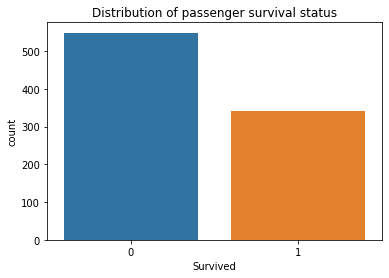
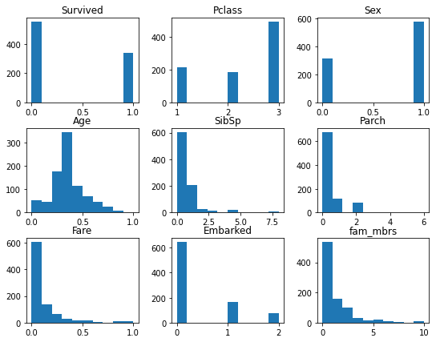
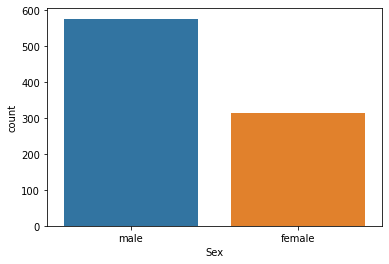
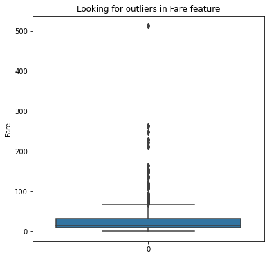
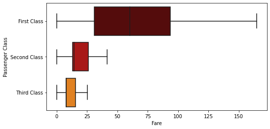
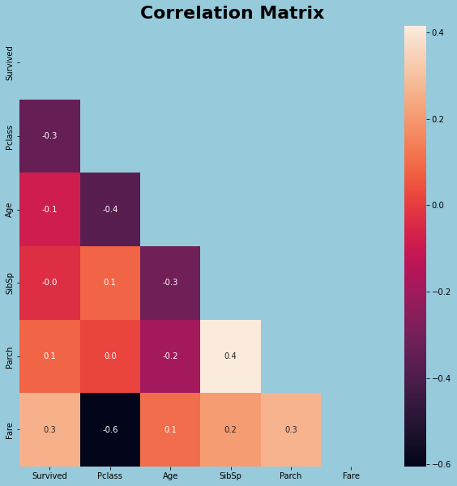

# Exploratory Data Analysis

Exploratory data analysis is the first step towards solving any data science or machine learning problem. It refers to the critical process of performing initial investigations on the data we have available and getting familiar with it. EDA makes a thorough examination on our dataset to find trends, patterns, and relationships between features within the data with the help of graphs and plots using libraries like Matplotlib and Seaborn. We will also be using the Pandas library. Pandas makes importing, analysing and visualizing much easier.
In this section, we will use the Titanic dataset, a popular introductory dataset, to learn the step by step exploratory data analysis process. The purpose is to bring the reader in the position of going on with its own ideas, and by the end of this course searching for a dataset with a subject of its own interest to explore.

### Understanding the problem statement

Before we begin to solve the problem, we need to make sure we understand the problem statement very well. 

Problem definition: 

The sinking of the Titanic resulted in the death of 1502 out of 2224 passengers and crew. While there was some element of luck involved in surviving, it seems some groups of people were more likely to survive than others. Apparently there were some patterns in the people who died and the people who survived. The problem here is that we are given certain data with specific characteristics of each passenger and the data is already labeled which let us know if the passenger lived or died. We have also been given a test dataset with more Titanic passengers and their characteristics but this dataset is not labeled, so we don't know who lived and who died. 

We need to build a predictive model that answers the question: “what sorts of people were more likely to survive?” using passenger data (ie name, age, gender, socio-economic class, etc). To be able to predict which passengers were more likely to survive we will use a couple of algorithms to train the first dataset and when we decide which one is the best, we will use it to predict what passengers in the unlabeled dataset survived.

For this specific section, we will focus on the Titanic exploratory data analysis only.


-If you want to read the complete problem statement and data description, it can be found here:

https://www.kaggle.com/competitions/titanic/

-Please download the data directly from the following link:

https://github.com/4GeeksAcademy/machine-learning-content/tree/master/05-3d-data/assets

### Importing libraries and reading the dataset

Our next step is to read in the data and do some preliminary exploration. This will help us figure out how we want to approach creating groups and finding patterns. In order to do that we need to import some necessary libraries (for this example). In case any of them does not appear, make sure to install it.


```python
#Importing necessary libraries

import pandas as pd 
import numpy as np 
import matplotlib.pyplot as plt  
import seaborn as sns
```

The data is stored as a comma-separated values, or csv file, where each row is separated by a new line, and each column by a comma (,). In order to read in the data, we’ll need to use the pandas.read_csv function. This function will take in a csv file and return a DataFrame.


```python
#Reading the train and test data and assign to a variable

train_data = pd.read_csv('https://raw.githubusercontent.com/4GeeksAcademy/machine-learning-content/master/assets/titanic_train.csv')
test_data = pd.read_csv('https://raw.githubusercontent.com/4GeeksAcademy/machine-learning-content/master/assets/titanic_test.csv')
```

### Finding dimensions, shape, size of the dataframe using Pandas

After reading the dataframes available, we will analyze their shape, size and the kind of data available.
We will do this for both train and test dataset. It is important to also write observations at the end of each step. 
In this initial data exploration we will use:

-data.head() returns the first 5 rows of the dataframe

-data.shape displays the number of rows and number of columns of the dataframe

-data.info() prints a concise summary with the index dtype, column dtypes, non-null values and memory usage.


```python
#Let's see how many rows and columns does my train_data has.
train_data.shape
```


    (891, 12)


```python
#Looking at the first rows of our train_data. If we want to see more than 5 rows, we just have to add the number of rows as parameter.
train_data.head()
```


<div>
<style scoped>
    .dataframe tbody tr th:only-of-type {
        vertical-align: middle;
    }

    .dataframe tbody tr th {
        vertical-align: top;
    }

    .dataframe thead th {
        text-align: right;
    }
</style>
<table border="1" class="dataframe">
  <thead>
    <tr style="text-align: right;">
      <th></th>
      <th>PassengerId</th>
      <th>Survived</th>
      <th>Pclass</th>
      <th>Name</th>
      <th>Sex</th>
      <th>Age</th>
      <th>SibSp</th>
      <th>Parch</th>
      <th>Ticket</th>
      <th>Fare</th>
      <th>Cabin</th>
      <th>Embarked</th>
    </tr>
  </thead>
  <tbody>
    <tr>
      <th>0</th>
      <td>1</td>
      <td>0</td>
      <td>3</td>
      <td>Braund, Mr. Owen Harris</td>
      <td>male</td>
      <td>22.0</td>
      <td>1</td>
      <td>0</td>
      <td>A/5 21171</td>
      <td>7.2500</td>
      <td>NaN</td>
      <td>S</td>
    </tr>
    <tr>
      <th>1</th>
      <td>2</td>
      <td>1</td>
      <td>1</td>
      <td>Cumings, Mrs. John Bradley (Florence Briggs Th...</td>
      <td>female</td>
      <td>38.0</td>
      <td>1</td>
      <td>0</td>
      <td>PC 17599</td>
      <td>71.2833</td>
      <td>C85</td>
      <td>C</td>
    </tr>
    <tr>
      <th>2</th>
      <td>3</td>
      <td>1</td>
      <td>3</td>
      <td>Heikkinen, Miss. Laina</td>
      <td>female</td>
      <td>26.0</td>
      <td>0</td>
      <td>0</td>
      <td>STON/O2. 3101282</td>
      <td>7.9250</td>
      <td>NaN</td>
      <td>S</td>
    </tr>
    <tr>
      <th>3</th>
      <td>4</td>
      <td>1</td>
      <td>1</td>
      <td>Futrelle, Mrs. Jacques Heath (Lily May Peel)</td>
      <td>female</td>
      <td>35.0</td>
      <td>1</td>
      <td>0</td>
      <td>113803</td>
      <td>53.1000</td>
      <td>C123</td>
      <td>S</td>
    </tr>
    <tr>
      <th>4</th>
      <td>5</td>
      <td>0</td>
      <td>3</td>
      <td>Allen, Mr. William Henry</td>
      <td>male</td>
      <td>35.0</td>
      <td>0</td>
      <td>0</td>
      <td>373450</td>
      <td>8.0500</td>
      <td>NaN</td>
      <td>S</td>
    </tr>
  </tbody>
</table>
</div>


```python
#Let's look at some information aboyt data types and null values.
train_data.info()
```

    <class 'pandas.core.frame.DataFrame'>
    RangeIndex: 891 entries, 0 to 890
    Data columns (total 12 columns):
     #   Column       Non-Null Count  Dtype  
    ---  ------       --------------  -----  
     0   PassengerId  891 non-null    int64  
     1   Survived     891 non-null    int64  
     2   Pclass       891 non-null    int64  
     3   Name         891 non-null    object 
     4   Sex          891 non-null    object 
     5   Age          714 non-null    float64
     6   SibSp        891 non-null    int64  
     7   Parch        891 non-null    int64  
     8   Ticket       891 non-null    object 
     9   Fare         891 non-null    float64
     10  Cabin        204 non-null    object 
     11  Embarked     889 non-null    object 
    dtypes: float64(2), int64(5), object(5)
    memory usage: 83.7+ KB


Observations: 

-We can see that our train_data has 891 rows and 12 columns.

-Our data has 7 numerical features and 5 categorical features.

-Feature 'Age' has 714 non-null values from a total of 891 rows, which means that our 'Age' column has 177 null values.
The same happens with our 'Cabin' feature having 687 null values, and 'Embarked' feature with 2 null values.

Now, we will do the same analysis for our test_data:


```python
#Let's see how many rows and columns does my test_data has.
test_data.shape
```


    (418, 11)


```python
#Let's look at the first 3 rows of our test_data
test_data.head(3)
```


<div>
<style scoped>
    .dataframe tbody tr th:only-of-type {
        vertical-align: middle;
    }

    .dataframe tbody tr th {
        vertical-align: top;
    }

    .dataframe thead th {
        text-align: right;
    }
</style>
<table border="1" class="dataframe">
  <thead>
    <tr style="text-align: right;">
      <th></th>
      <th>PassengerId</th>
      <th>Pclass</th>
      <th>Name</th>
      <th>Sex</th>
      <th>Age</th>
      <th>SibSp</th>
      <th>Parch</th>
      <th>Ticket</th>
      <th>Fare</th>
      <th>Cabin</th>
      <th>Embarked</th>
    </tr>
  </thead>
  <tbody>
    <tr>
      <th>0</th>
      <td>892</td>
      <td>3</td>
      <td>Kelly, Mr. James</td>
      <td>male</td>
      <td>34.5</td>
      <td>0</td>
      <td>0</td>
      <td>330911</td>
      <td>7.8292</td>
      <td>NaN</td>
      <td>Q</td>
    </tr>
    <tr>
      <th>1</th>
      <td>893</td>
      <td>3</td>
      <td>Wilkes, Mrs. James (Ellen Needs)</td>
      <td>female</td>
      <td>47.0</td>
      <td>1</td>
      <td>0</td>
      <td>363272</td>
      <td>7.0000</td>
      <td>NaN</td>
      <td>S</td>
    </tr>
    <tr>
      <th>2</th>
      <td>894</td>
      <td>2</td>
      <td>Myles, Mr. Thomas Francis</td>
      <td>male</td>
      <td>62.0</td>
      <td>0</td>
      <td>0</td>
      <td>240276</td>
      <td>9.6875</td>
      <td>NaN</td>
      <td>Q</td>
    </tr>
  </tbody>
</table>
</div>


```python
#Let's see the data types and which features have null values in our test_data
test_data.info()
```

    <class 'pandas.core.frame.DataFrame'>
    RangeIndex: 418 entries, 0 to 417
    Data columns (total 11 columns):
     #   Column       Non-Null Count  Dtype  
    ---  ------       --------------  -----  
     0   PassengerId  418 non-null    int64  
     1   Pclass       418 non-null    int64  
     2   Name         418 non-null    object 
     3   Sex          418 non-null    object 
     4   Age          332 non-null    float64
     5   SibSp        418 non-null    int64  
     6   Parch        418 non-null    int64  
     7   Ticket       418 non-null    object 
     8   Fare         417 non-null    float64
     9   Cabin        91 non-null     object 
     10  Embarked     418 non-null    object 
    dtypes: float64(2), int64(4), object(5)
    memory usage: 36.0+ KB


Observations:

-We can see that our test_data has 418 rows and 11 columns. There is one column less than our train_data because this new dataset is not labeled so we don't have the column that indicates whether the passenger died or survived.

-Our test_data has the same data types as our train_data for each feature.

-This time the 'Age' feature has 86 null values, and our 'Cabin' feature has 327 null values from the 418 total number of rows.

### Exploring relevant data columns

Now we need to find some insights from the dataset to see if there is any kind of hidden pattern or relationship between columns.
We will start with the 'Survived' column which seems to be our target variable as it is not given to us in the test dataset.

**Target variable**


```python
#Let's first visualize the distribution of our target variable.

sns.countplot(x=train_data['Survived'])
plt.title('Distribution of passenger survival status')
plt.show()
```


    

    


```python
train_data['Survived'].value_counts()
```


    0    549
    1    342
    Name: Survived, dtype: int64


Observations: As our target variable is supposed to classify passengers in 1 or 0, whether they survive or not, we used a countplot to see if the data is balanced. We also used the method value_counts() to see exactly how many people survived(1) and how many did not survived(0) in our train_data. It is balanced and we know for a fact that the sinking ok Titanic resulted in the death of most of its passengers.

**Using histograms to visualize all features**


```python
train_data.hist(bins=10,figsize=(9,7),grid=False);
```


    

    


**Countplot for categorical variables**


```python
#Let's check the categories in each of our object type features

def countplot_features(feature):
    plot=sns.countplot(x=feature,data=train_data)
    plt.show()

def countplot_targetvsfeature(feature,y):
    fig = plt.figure(figsize=(15,10))
    plot=sns.countplot(x=feature,data=train_data,hue=y)
    plt.show()    
```


```python
countplot_features('Sex')
```


    

    


```python
countplot_targetvsfeature('Sex','Survived')

```


    

    


Observations: 

Most of our data passengers were male, but from male, most of them did not survive. On the other side, even though there were less female passengers, most of them survived.


```python
countplot_features('Embarked')
```


    

    


```python
countplot_targetvsfeature('Embarked','Survived')
```


    

    


Observations: 

Most of our Titanic passengers embarked by the Southampton station.


```python
countplot_features('Pclass')
```


    

    


```python
countplot_targetvsfeature('Pclass','Survived')
```


    

    


Observations: Most of the passengers were travelling in the third class, but most of them did not survive. However, in the first class, most of the passengers survived.

**Distribution Plots for Continuous variables**


```python
#Let's plot the Probability Density Function (PDF) of Age of 891 passengers traveling in the Titanic.

sns.distplot(train_data['Age'])
```

    /home/gitpod/.pyenv/versions/3.8.13/lib/python3.8/site-packages/seaborn/distributions.py:2619: FutureWarning: `distplot` is a deprecated function and will be removed in a future version. Please adapt your code to use either `displot` (a figure-level function with similar flexibility) or `histplot` (an axes-level function for histograms).
      warnings.warn(msg, FutureWarning)


    <AxesSubplot:xlabel='Age', ylabel='Density'>


    

    


```python
#View if there is a linear relation between continuous numerical variable Age & target variable Survived.

sns.regplot(x = "Age", y = "Survived", data = train_data)
plt.ylim(0,)
```


    (0.0, 1.05)


    

    


Observations:

There is clear negative linear relation between Age and our target variable. This makes sense considering that children was one of the groups who had preference in using the boats to survive (Survive = 1).


```python
#Let's plot the Probability Density Function (PDF) of Fare paid by 891 passengers traveling in the Titanic.
sns.distplot(train_data['Fare'])
```

    /home/gitpod/.pyenv/versions/3.8.13/lib/python3.8/site-packages/seaborn/distributions.py:2619: FutureWarning: `distplot` is a deprecated function and will be removed in a future version. Please adapt your code to use either `displot` (a figure-level function with similar flexibility) or `histplot` (an axes-level function for histograms).
      warnings.warn(msg, FutureWarning)


    <AxesSubplot:xlabel='Fare', ylabel='Density'>


    

    


Observations: From the above plotted PDF of Fare we can see that a majority of points in distribution lie between 0 to 100


```python
# View if there is a linear relation between continuous numerical variable Fare & target variable Survived.

sns.regplot(x = "Fare", y = "Survived", data = train_data)
plt.ylim(0,)
```


    (0.0, 2.1616921754597285)


    

    


Observations: 

Yes, there is a positive linear relation between 'Fare' and 'Survived' feature which means that people who paid a more expensive fare had more probabilities to survive (Survive = 1).

### Eliminating duplicated data

Duplicates are entries that represent the same sample point multiple times. For example, if a measurement or record was registered twice by two different people. Detecting such duplicates is not always easy, as each dataset might have a unique identifier (e.g. an index number or an ID that is unique to each new sample). If we are not sure yet about which is the column that identifies each unique sample, we might want to ignore them first. And once we are aware about the number of duplicates in our dataset, we can simply drop them with drop_duplicates().

In the case of our dataset, it is not difficult to find that unique identifier column because it's column name is very clear: PassengerId.


```python
train_duplicates = train_data['PassengerId'].duplicated().sum()

print(f'It seems that there are {train_duplicates} duplicated passenger according to the PassengerId feature')
```

    It seems that there are 0 duplicated passenger according to the PassengerId feature


```python
test_duplicates = test_data['PassengerId'].duplicated().sum()

print(f'It seems that there are {test_duplicates} duplicated passenger according to the PassengerId feature')
```

    It seems that there are 0 duplicated passenger according to the PassengerId feature


### Eliminating irrelevant data

The following columns will not be useful for prediction, so we will eliminate them, in train and test datasets.


```python
#Drop irrelevant columns in train data

drop_cols = ['PassengerId','Cabin', 'Ticket', 'Name']
train_data.drop(drop_cols, axis = 1, inplace = True)
```


```python
#Drop same irrelevant columns in test data

test_data.drop(drop_cols, axis = 1, inplace = True)
```

**Pandas drop_duplicates() Function Syntax:**

DataFrame.drop_duplicates(subset=None, keep=’first’, inplace=False)

**Pandas drop_duplicates() Function Parameters:**

subset: Subset takes a column or list of column label for identifying duplicate rows. By default, all the columns are used to find the duplicate rows.

keep: allowed values are {‘first’, ‘last’, False}, default ‘first’. If ‘first’, duplicate rows except the first one is deleted. If ‘last’, duplicate rows except the last one is deleted. If False, all the duplicate rows are deleted.

inplace: if True, the source DataFrame itself is changed. By default, source DataFrame remains unchanged and a new DataFrame instance is returned.

### Plotting different features against one other using heatmaps

Correlations between variables can be found using pandas “.corr()” function and visualized with a matrix by using a heatmap in seaborn.
The following heatmap shows some strong and weak correlations between variables. Dark shades represent negative correlation while lighter shades represent positive correlation.


```python
#Plotting a heatmap to find relations between features

plt.figure(figsize=(12, 8))
sns.heatmap(train_data.corr(), annot=True, cmap='viridis')
```


    <AxesSubplot:>


    

    


Observations:

Here you can infer that there is a strong negative relation between Fare and PClass. This is totally understandable because if a passenger instead of buying a ticket in 1st class (PClass = 1), decided to buy a ticket in 3rd class (PClass = 3), the ticket fare would certainly decrease.

There is also a negative relation between the passenger class (pclass) and the age of the passenger. That means that 3rd class (Pclass = 3) had younger passengers than the 1st class (Pclass = 1).

Also, we can see that Pclass is very related to the target variable 'Survived'. So the better passenger class, more probabilities to survive. We can confirm this relationship with the following graph.


```python
#Checking correlation between Pclass and Fare:
plt.figure(figsize = (8, 4))
sns.boxplot(y = train_data.Pclass, x = train_data.Fare, orient = 'h', showfliers = False, palette = 'gist_heat')
plt.ylabel('Passenger Class')
plt.yticks([0,1,2], ['First Class','Second Class', 'Third Class'])
plt.show()
```


    

    


>The parameter showfliers = False is ignoring the outliers. But if we do not establish that parameter, we can use boxplots to view outliers.


There are different ways of visualizing relationships:


```python
#Using seaborn.pairplot for a grid visualization of every relationship

sns.pairplot(data=train_data)
```


    <seaborn.axisgrid.PairGrid at 0x21db6e55db0>


    

    


```python
#Correlation of features with target

train_data.corr()["Survived"]
```


    Survived    1.000000
    Pclass     -0.334068
    Sex        -0.545899
    Age        -0.067081
    SibSp      -0.033395
    Parch       0.082157
    Fare        0.261742
    Embarked    0.102964
    fam_mbrs    0.018211
    Name: Survived, dtype: float64


```python
#Using transpose

train_data_corr = train_data.corr().transpose()
train_data_corr
```


<div>
<style scoped>
    .dataframe tbody tr th:only-of-type {
        vertical-align: middle;
    }

    .dataframe tbody tr th {
        vertical-align: top;
    }

    .dataframe thead th {
        text-align: right;
    }
</style>
<table border="1" class="dataframe">
  <thead>
    <tr style="text-align: right;">
      <th></th>
      <th>Survived</th>
      <th>Pclass</th>
      <th>Age</th>
      <th>SibSp</th>
      <th>Parch</th>
      <th>Fare</th>
    </tr>
  </thead>
  <tbody>
    <tr>
      <th>Survived</th>
      <td>1.000000</td>
      <td>-0.338481</td>
      <td>-0.077221</td>
      <td>-0.035322</td>
      <td>0.081629</td>
      <td>0.257307</td>
    </tr>
    <tr>
      <th>Pclass</th>
      <td>-0.338481</td>
      <td>1.000000</td>
      <td>-0.369226</td>
      <td>0.083081</td>
      <td>0.018443</td>
      <td>-0.549500</td>
    </tr>
    <tr>
      <th>Age</th>
      <td>-0.077221</td>
      <td>-0.369226</td>
      <td>1.000000</td>
      <td>-0.308247</td>
      <td>-0.189119</td>
      <td>0.096067</td>
    </tr>
    <tr>
      <th>SibSp</th>
      <td>-0.035322</td>
      <td>0.083081</td>
      <td>-0.308247</td>
      <td>1.000000</td>
      <td>0.414838</td>
      <td>0.159651</td>
    </tr>
    <tr>
      <th>Parch</th>
      <td>0.081629</td>
      <td>0.018443</td>
      <td>-0.189119</td>
      <td>0.414838</td>
      <td>1.000000</td>
      <td>0.216225</td>
    </tr>
    <tr>
      <th>Fare</th>
      <td>0.257307</td>
      <td>-0.549500</td>
      <td>0.096067</td>
      <td>0.159651</td>
      <td>0.216225</td>
      <td>1.000000</td>
    </tr>
  </tbody>
</table>
</div>


```python
# Using a different way of correlation matrix

background_color = "#97CADB"

fig = plt.figure(figsize=(10,10))
gs = fig.add_gridspec(1,1)
gs.update(wspace=0.3, hspace=0.15)
ax0 = fig.add_subplot(gs[0,0])
fig.patch.set_facecolor(background_color) 
ax0.set_facecolor(background_color) 

# train_data_corr = train_data[['Age', 'Fare', 'SibSp', 'Parch', 'Pclass','Survived']].corr().transpose()
mask = np.triu(np.ones_like(train_data_corr))
ax0.text(2,-0.1,"Correlation Matrix",fontsize=22, fontweight='bold', fontfamily='cursive', color="#000000")
sns.heatmap(train_data_corr,mask=mask,fmt=".1f",annot=True)
plt.show()
```


    

    


**End of Day 1!**

Now, let's do a lot of exploratory data analysis on this module's project!

# DAY 2: FEATURE ENGINEERING

To read about what exactly are features and why should we do feature engineering, click on the following link: https://github.com/4GeeksAcademy/machine-learning-content/blob/master/05-3d-data/feature-engineering.ipynb

The first process we will learn in our Titanic feature engineering will be how to find and deal with extreme values (outliers).

### OUTLIERS

**FINDING OUTLIERS**

In statistics, an outlier is an observation point that is distant from other observations. In data, it means that our dataframe feature has some extreme values which we need to analyse further. Those extreme values may be typing errors, or they may be extreme values but considered normal in the population we are studying. In the case our outliers are typing errors we need to decide if we are going to eliminate them or replace them with another value. In the case a feature's outliers are considered normal and part of the population, it may be better if we keep them because it will give important information to our model. 

How important we consider the feature for our model will influence in our decision about what to do with outliers.

Pandas describe() method is used to view some basic statistical details like percentile, mean, std, etc. of a data frame or a series of numeric values. In the case we would like to see the object type features using describe(), this should be entered as 'dataframe.describe(include='O')' and it will show us the most frequent value and how many times it appears.

Syntax: 

DataFrame.describe(percentiles=None, include=None, exclude=None)

Parameters:

percentile: list like data type of numbers between 0-1 to return the respective percentile

include: List of data types to be included while describing dataframe. Default is None

exclude: List of data types to be Excluded while describing dataframe. Default is None

Return type: Statistical summary of data frame.


```python
#Let's use the describe method to see the statistics on our numerical features

train_data.describe()
```


<div>
<style scoped>
    .dataframe tbody tr th:only-of-type {
        vertical-align: middle;
    }

    .dataframe tbody tr th {
        vertical-align: top;
    }

    .dataframe thead th {
        text-align: right;
    }
</style>
<table border="1" class="dataframe">
  <thead>
    <tr style="text-align: right;">
      <th></th>
      <th>Survived</th>
      <th>Pclass</th>
      <th>Age</th>
      <th>SibSp</th>
      <th>Parch</th>
      <th>Fare</th>
    </tr>
  </thead>
  <tbody>
    <tr>
      <th>count</th>
      <td>891.000000</td>
      <td>891.000000</td>
      <td>714.000000</td>
      <td>891.000000</td>
      <td>891.000000</td>
      <td>891.000000</td>
    </tr>
    <tr>
      <th>mean</th>
      <td>0.383838</td>
      <td>2.308642</td>
      <td>29.699118</td>
      <td>0.523008</td>
      <td>0.381594</td>
      <td>32.204208</td>
    </tr>
    <tr>
      <th>std</th>
      <td>0.486592</td>
      <td>0.836071</td>
      <td>14.526497</td>
      <td>1.102743</td>
      <td>0.806057</td>
      <td>49.693429</td>
    </tr>
    <tr>
      <th>min</th>
      <td>0.000000</td>
      <td>1.000000</td>
      <td>0.420000</td>
      <td>0.000000</td>
      <td>0.000000</td>
      <td>0.000000</td>
    </tr>
    <tr>
      <th>25%</th>
      <td>0.000000</td>
      <td>2.000000</td>
      <td>20.125000</td>
      <td>0.000000</td>
      <td>0.000000</td>
      <td>7.910400</td>
    </tr>
    <tr>
      <th>50%</th>
      <td>0.000000</td>
      <td>3.000000</td>
      <td>28.000000</td>
      <td>0.000000</td>
      <td>0.000000</td>
      <td>14.454200</td>
    </tr>
    <tr>
      <th>75%</th>
      <td>1.000000</td>
      <td>3.000000</td>
      <td>38.000000</td>
      <td>1.000000</td>
      <td>0.000000</td>
      <td>31.000000</td>
    </tr>
    <tr>
      <th>max</th>
      <td>1.000000</td>
      <td>3.000000</td>
      <td>80.000000</td>
      <td>8.000000</td>
      <td>6.000000</td>
      <td>512.329200</td>
    </tr>
  </tbody>
</table>
</div>


We can see that the 891 records contain data in each and every column left.


```python
#Now, let's modify its parameters to be able to see some statistics on our categorical features.

train_data.describe(include=['O'])
```


<div>
<style scoped>
    .dataframe tbody tr th:only-of-type {
        vertical-align: middle;
    }

    .dataframe tbody tr th {
        vertical-align: top;
    }

    .dataframe thead th {
        text-align: right;
    }
</style>
<table border="1" class="dataframe">
  <thead>
    <tr style="text-align: right;">
      <th></th>
      <th>Sex</th>
      <th>Embarked</th>
    </tr>
  </thead>
  <tbody>
    <tr>
      <th>count</th>
      <td>891</td>
      <td>889</td>
    </tr>
    <tr>
      <th>unique</th>
      <td>2</td>
      <td>3</td>
    </tr>
    <tr>
      <th>top</th>
      <td>male</td>
      <td>S</td>
    </tr>
    <tr>
      <th>freq</th>
      <td>577</td>
      <td>644</td>
    </tr>
  </tbody>
</table>
</div>


**WHY IS THIS USEFUL TO FIND OUTLIERS?**

In the numerical features, we can look at the min and max value for a especific feature, and compare it to its 25% and 75% percentile. We can also compare the mean to the 50% percentile and confirm if there is any extreme high or low value making my mean go up or down, much more than the 50% percentile.

Once we suspect there are outliers, we can use a boxplot for that feature to have a better visualization of outliers.

Observations: According to our statistics dataframe, everything seems normal except for the 'Fare' column which has a mean of 32.20 but its 50% percentile is 14, and its max value is 512. We could say 512 seems to be an outlier but it could be a typing error. It is also possible that the most expensive ticket had that price. It would be useful if we do some research and confirm that information.

Let's see how to write the code for a boxplot in order to visualize outliers.
A box plot shows the distribution of quantitative data in a way that facilitates comparisons between variables.The box shows the quartiles of the dataset while the whiskers extend to show the rest of the distribution.


```python
#Let's evaluate our 'Fare' variable.

plt.figure(figsize=(6,6))
sns.boxplot(data=train_data['Fare'])
plt.title('Looking for outliers in Fare feature')
plt.ylabel('Fare')
```


    Text(0, 0.5, 'Fare')


    

    


Observations: 

-It looks like the ticket fare of 512 is not very common. We should establish some upper and lower bounds to determine whether a data point should be considered or not an outlier. There are a couple of ways to determine this and we will learn about them in the data cleaning process, on how to deal with outliers.

**HOW TO DEAL WITH OUTLIERS**

To learn about the types of outliers and different methods to deal with them, read the information from the following link:

https://github.com/4GeeksAcademy/machine-learning-content/blob/master/05-3d-data/how-to-deal-with-outliers.ipynb


We will apply one of those methods by defining upper and lower bounds. Let's see how is it implemented:


```python
fare_stat = train_data['Fare'].describe()
print(fare_stat)
```

    count    891.000000
    mean      32.204208
    std       49.693429
    min        0.000000
    25%        7.910400
    50%       14.454200
    75%       31.000000
    max      512.329200
    Name: Fare, dtype: float64


```python
IQR = fare_stat['75%']-fare_stat['25%']
upper = fare_stat['75%'] + 1.5*IQR
lower = fare_stat['25%'] - 1.5*IQR
print('The upper & lower bounds for suspected outliers are {} and {}.'.format(upper,lower))
```

    The upper & lower bounds for suspected outliers are 65.6344 and -26.724.


Based on this results, we should drop Fare values above 65. However, our criteria is very important here, and based on the prices we saw in the boxplot the most extreme values are above 300. Let's see how many values represent that extreme value of 512 and drop them.


```python
#visualizing data with fare above 300

train_data[train_data['Fare'] > 300]
```


<div>
<style scoped>
    .dataframe tbody tr th:only-of-type {
        vertical-align: middle;
    }

    .dataframe tbody tr th {
        vertical-align: top;
    }

    .dataframe thead th {
        text-align: right;
    }
</style>
<table border="1" class="dataframe">
  <thead>
    <tr style="text-align: right;">
      <th></th>
      <th>Survived</th>
      <th>Pclass</th>
      <th>Sex</th>
      <th>Age</th>
      <th>SibSp</th>
      <th>Parch</th>
      <th>Fare</th>
      <th>Embarked</th>
    </tr>
  </thead>
  <tbody>
    <tr>
      <th>258</th>
      <td>1</td>
      <td>1</td>
      <td>female</td>
      <td>35.0</td>
      <td>0</td>
      <td>0</td>
      <td>512.3292</td>
      <td>C</td>
    </tr>
    <tr>
      <th>679</th>
      <td>1</td>
      <td>1</td>
      <td>male</td>
      <td>36.0</td>
      <td>0</td>
      <td>1</td>
      <td>512.3292</td>
      <td>C</td>
    </tr>
    <tr>
      <th>737</th>
      <td>1</td>
      <td>1</td>
      <td>male</td>
      <td>35.0</td>
      <td>0</td>
      <td>0</td>
      <td>512.3292</td>
      <td>C</td>
    </tr>
  </tbody>
</table>
</div>


Observations: The three individuals who payed a fare of '512.3292' did survive. Should we drop them? Or can they bring valuable information to our model?

We'll learn how to drop rows with values bigger than certain value. But you are welcome to investigate more about Titanic fares and decide if keeping them or not.


```python
#Dropping data with fare above 300

train_data.drop(train_data[(train_data['Fare'] > 300)].index, inplace=True)
```


```python
#Confirm there are three rows less.

train_data.shape
```


    (888, 8)


We confirm that we have eliminated those 3 outliers!

### MISSING VALUES

**FINDING MISSING OR NULL VALUES**

Most of the machine learning algorithms are not able to handle missing values. Having some missing values is normal and we should decide if eliminating them or replacing them with other values. What we want to identify at this stage are big holes in the dataset with features that have a lot of missing values.

We begin by separating our features into numerical and categorical columns. We do this because the method to handle missing values, later, will be different for these two data types.


```python
# Separate numerical and categorical variables.

num_vars = train_data.columns[train_data.dtypes != 'object']
cat_vars = train_data.columns[train_data.dtypes == 'object']

print("Numerical variables:", num_vars)
print("Categorical variables:", cat_vars)
```

    Numerical variables: Index(['Survived', 'Pclass', 'Age', 'SibSp', 'Parch', 'Fare'], dtype='object')
    Categorical variables: Index(['Sex', 'Embarked'], dtype='object')


We will use the pandas “isnull()” function to find out all the fields which have missing values. This will return True if a field has missing values and false if the field does not have missing values. 
To get how many missing values are in each column we use sum() along with isnull(). This will sum up all the True’s in each column. 


```python
train_data[num_vars].isnull().sum()
```


    Survived      0
    Pclass        0
    Age         177
    SibSp         0
    Parch         0
    Fare          0
    dtype: int64


```python
train_data[cat_vars].isnull().sum()
```


    Sex         0
    Embarked    2
    dtype: int64


Now, sort_values() will sort the missing values in ascending order. It is always a good practice to sort them in descending order so we can see the columns that have the highest number of missing values first.


```python
train_data[num_vars].isnull().sum().sort_values(ascending=False)
```


    Age         177
    Survived      0
    Pclass        0
    SibSp         0
    Parch         0
    Fare          0
    dtype: int64


```python
train_data[cat_vars].isnull().sum().sort_values(ascending=False)
```


    Embarked    2
    Sex         0
    dtype: int64


Finally , we can divide that result by the length of our dataframe (the number of rows) in order to get the percentage of missing values in each column. Missing values are usually represented in the form of Nan, null or None in the dataset.


```python
train_data[num_vars].isnull().sum().sort_values(ascending=False)/len(train_data)
```


    Age         0.199324
    Survived    0.000000
    Pclass      0.000000
    SibSp       0.000000
    Parch       0.000000
    Fare        0.000000
    dtype: float64


```python
train_data[cat_vars].isnull().sum().sort_values(ascending=False)/len(train_data)
```


    Embarked    0.002252
    Sex         0.000000
    dtype: float64


```python
# How many null values should I deal with in the test data?

test_data.isnull().sum()
```


    Pclass       0
    Sex          0
    Age         86
    SibSp        0
    Parch        0
    Fare         1
    Embarked     0
    dtype: int64


**HOW TO DEAL WITH MISSING VALUES**
 
To learn about the techniques on how to deal with missing values, read the information from the following link:

https://github.com/4GeeksAcademy/machine-learning-content/blob/master/05-3d-data/how-to-deal-with-missing-values.ipynb


```python
# Handling Missing Values in train_data

## Fill missing AGE with Median
train_data['Age'].fillna(train_data['Age'].median(), inplace=True)

## Fill missing EMBARKED with Mode
train_data['Embarked'].fillna(train_data['Embarked'].mode()[0], inplace=True)
```

The notation '[0]' means that the thing before it (mode() in this case) is a collection, a list, an array, ..., and you are taking the first element.

The mode() returns 2 values, first is mode value, second is count. So 'train_data['Embarked'].mode()[0]' means we get the mode value of 'train_data['Embarked']'.

Feel free to use scikit-learn instead.

Let's verify there were no missing values left:


```python
train_data.isnull().sum()
```


    Survived    0
    Pclass      0
    Sex         0
    Age         0
    SibSp       0
    Parch       0
    Fare        0
    Embarked    0
    dtype: int64


Now let's also handle the missing values in our test data:


```python
# Handling Missing Values in test data

## Fill missing AGE and FARE with Median

test_data['Age'].fillna(test_data['Age'].median(), inplace=True)
test_data['Fare'].fillna(test_data['Fare'].median(), inplace=True)
```


```python
test_data.isnull().sum()
```


    Pclass      0
    Sex         0
    Age         0
    SibSp       0
    Parch       0
    Fare        0
    Embarked    0
    dtype: int64


### Creating new features from the ones available in our dataset

As part of the feature engineering and before encoding our label variables, we will learn how to create new features based on the existing ones. Let's look how is our dataset so far by taking a look at the first 10 rows.


```python
train_data.head(10)
```


```python
# We will create a new column to show how many family members of each passenger were in the Titanic.
# We will calculate it based on the sum of SibSp (siblings and spouse) and Parch  (parents and children)

print(train_data)

train_data["fam_mbrs"] = train_data["SibSp"] + train_data["Parch"]

print(train_data)
```

         Survived  Pclass     Sex   Age  SibSp  Parch     Fare Embarked
    0           0       3    male  22.0      1      0   7.2500        S
    1           1       1  female  38.0      1      0  71.2833        C
    2           1       3  female  26.0      0      0   7.9250        S
    3           1       1  female  35.0      1      0  53.1000        S
    4           0       3    male  35.0      0      0   8.0500        S
    ..        ...     ...     ...   ...    ...    ...      ...      ...
    886         0       2    male  27.0      0      0  13.0000        S
    887         1       1  female  19.0      0      0  30.0000        S
    888         0       3  female  28.0      1      2  23.4500        S
    889         1       1    male  26.0      0      0  30.0000        C
    890         0       3    male  32.0      0      0   7.7500        Q
    
    [888 rows x 8 columns]
         Survived  Pclass     Sex   Age  SibSp  Parch     Fare Embarked  fam_mbrs
    0           0       3    male  22.0      1      0   7.2500        S         1
    1           1       1  female  38.0      1      0  71.2833        C         1
    2           1       3  female  26.0      0      0   7.9250        S         0
    3           1       1  female  35.0      1      0  53.1000        S         1
    4           0       3    male  35.0      0      0   8.0500        S         0
    ..        ...     ...     ...   ...    ...    ...      ...      ...       ...
    886         0       2    male  27.0      0      0  13.0000        S         0
    887         1       1  female  19.0      0      0  30.0000        S         0
    888         0       3  female  28.0      1      2  23.4500        S         3
    889         1       1    male  26.0      0      0  30.0000        C         0
    890         0       3    male  32.0      0      0   7.7500        Q         0
    
    [888 rows x 9 columns]


```python
#Repeat process in test data

test_data["fam_mbrs"] = test_data["SibSp"] + test_data["Parch"]
```

### FEATURE ENCODING FOR CATEGORICAL VARIABLES

Feature encoding is the process of turning categorical data in a dataset into numerical data. It is essential that we perform feature encoding because most machine learning models can only interpret numerical data and not data in text form.

To read about the different methods of feature encoding go to following link: https://github.com/4GeeksAcademy/machine-learning-content/blob/master/05-3d-data/feature-encoding-for-categorical-variables.ipynb

To add some additional information, here we will use a different and short method on how to apply specific numbers directly to our label features, so we are manually encoding our categorical features, but you are free to use Scikit learn or Pandas.


```python
# One-hot encoding multiple columns

from sklearn.preprocessing import OneHotEncoder
from sklearn.compose import make_column_transformer

transformer = make_column_transformer(
    (OneHotEncoder(), ['Embarked', 'Sex']),
    remainder='passthrough')

transformed = transformer.fit_transform(train_data)
transformed_df = pd.DataFrame(transformed, columns=transformer.get_feature_names())
print(transformed_df.head())
```

       onehotencoder__x0_C  onehotencoder__x0_Q  onehotencoder__x0_S  \
    0                  0.0                  0.0                  1.0   
    1                  1.0                  0.0                  0.0   
    2                  0.0                  0.0                  1.0   
    3                  0.0                  0.0                  1.0   
    4                  0.0                  0.0                  1.0   
    
       onehotencoder__x1_female  onehotencoder__x1_male  Survived  Pclass   Age  \
    0                       0.0                     1.0       0.0     3.0  22.0   
    1                       1.0                     0.0       1.0     1.0  38.0   
    2                       1.0                     0.0       1.0     3.0  26.0   
    3                       1.0                     0.0       1.0     1.0  35.0   
    4                       0.0                     1.0       0.0     3.0  35.0   
    
       SibSp  Parch     Fare  fam_mbrs  
    0    1.0    0.0   7.2500       1.0  
    1    1.0    0.0  71.2833       1.0  
    2    0.0    0.0   7.9250       0.0  
    3    1.0    0.0  53.1000       1.0  
    4    0.0    0.0   8.0500       0.0  


    c:\Users\danie\AppData\Local\Programs\Python\Python310\lib\site-packages\sklearn\utils\deprecation.py:87: FutureWarning: Function get_feature_names is deprecated; get_feature_names is deprecated in 1.0 and will be removed in 1.2. Please use get_feature_names_out instead.
      warnings.warn(msg, category=FutureWarning)


```python
#Changing to more friendly names

transformed_df = transformed_df.rename(columns = {'onehotencoder__x0_C':'Embarked_C',
                                                  'onehotencoder__x0_Q':'Embarked_Q',
                                                  'onehotencoder__x0_S':'Embarked_S',
                                                  'onehotencoder__x1_female':'Female',
                                                  'onehotencoder__x1_male':'Male'
                                                  })
```


```python
#verifying my final train dataframe

transformed_df.head()
```


<div>
<style scoped>
    .dataframe tbody tr th:only-of-type {
        vertical-align: middle;
    }

    .dataframe tbody tr th {
        vertical-align: top;
    }

    .dataframe thead th {
        text-align: right;
    }
</style>
<table border="1" class="dataframe">
  <thead>
    <tr style="text-align: right;">
      <th></th>
      <th>Embarked_C</th>
      <th>Embarked_Q</th>
      <th>Embarked_S</th>
      <th>Female</th>
      <th>Male</th>
      <th>Survived</th>
      <th>Pclass</th>
      <th>Age</th>
      <th>SibSp</th>
      <th>Parch</th>
      <th>Fare</th>
      <th>fam_mbrs</th>
    </tr>
  </thead>
  <tbody>
    <tr>
      <th>0</th>
      <td>0.0</td>
      <td>0.0</td>
      <td>1.0</td>
      <td>0.0</td>
      <td>1.0</td>
      <td>0.0</td>
      <td>3.0</td>
      <td>22.0</td>
      <td>1.0</td>
      <td>0.0</td>
      <td>7.2500</td>
      <td>1.0</td>
    </tr>
    <tr>
      <th>1</th>
      <td>1.0</td>
      <td>0.0</td>
      <td>0.0</td>
      <td>1.0</td>
      <td>0.0</td>
      <td>1.0</td>
      <td>1.0</td>
      <td>38.0</td>
      <td>1.0</td>
      <td>0.0</td>
      <td>71.2833</td>
      <td>1.0</td>
    </tr>
    <tr>
      <th>2</th>
      <td>0.0</td>
      <td>0.0</td>
      <td>1.0</td>
      <td>1.0</td>
      <td>0.0</td>
      <td>1.0</td>
      <td>3.0</td>
      <td>26.0</td>
      <td>0.0</td>
      <td>0.0</td>
      <td>7.9250</td>
      <td>0.0</td>
    </tr>
    <tr>
      <th>3</th>
      <td>0.0</td>
      <td>0.0</td>
      <td>1.0</td>
      <td>1.0</td>
      <td>0.0</td>
      <td>1.0</td>
      <td>1.0</td>
      <td>35.0</td>
      <td>1.0</td>
      <td>0.0</td>
      <td>53.1000</td>
      <td>1.0</td>
    </tr>
    <tr>
      <th>4</th>
      <td>0.0</td>
      <td>0.0</td>
      <td>1.0</td>
      <td>0.0</td>
      <td>1.0</td>
      <td>0.0</td>
      <td>3.0</td>
      <td>35.0</td>
      <td>0.0</td>
      <td>0.0</td>
      <td>8.0500</td>
      <td>0.0</td>
    </tr>
  </tbody>
</table>
</div>


```python
#Repeating transformation in test dataframe

transformed_test = transformer.fit_transform(test_data)
transformed_test_df = pd.DataFrame(transformed_test, columns=transformer.get_feature_names())
```

    c:\Users\danie\AppData\Local\Programs\Python\Python310\lib\site-packages\sklearn\utils\deprecation.py:87: FutureWarning: Function get_feature_names is deprecated; get_feature_names is deprecated in 1.0 and will be removed in 1.2. Please use get_feature_names_out instead.
      warnings.warn(msg, category=FutureWarning)


```python
#Changing to more friendly names in test dataframe

transformed_test_df = transformed_test_df.rename(columns = {'onehotencoder__x0_C':'Embarked_C',
                                                            'onehotencoder__x0_Q':'Embarked_Q',
                                                            'onehotencoder__x0_S':'Embarked_S',
                                                            'onehotencoder__x1_female':'Female',
                                                            'onehotencoder__x1_male':'Male'
                                                            })
```


```python
# Verifying new test dataframe

transformed_test_df.head()
```


<div>
<style scoped>
    .dataframe tbody tr th:only-of-type {
        vertical-align: middle;
    }

    .dataframe tbody tr th {
        vertical-align: top;
    }

    .dataframe thead th {
        text-align: right;
    }
</style>
<table border="1" class="dataframe">
  <thead>
    <tr style="text-align: right;">
      <th></th>
      <th>Embarked_C</th>
      <th>Embarked_Q</th>
      <th>Embarked_S</th>
      <th>Female</th>
      <th>Male</th>
      <th>Pclass</th>
      <th>Age</th>
      <th>SibSp</th>
      <th>Parch</th>
      <th>Fare</th>
      <th>fam_mbrs</th>
    </tr>
  </thead>
  <tbody>
    <tr>
      <th>0</th>
      <td>0.0</td>
      <td>1.0</td>
      <td>0.0</td>
      <td>0.0</td>
      <td>1.0</td>
      <td>3.0</td>
      <td>34.5</td>
      <td>0.0</td>
      <td>0.0</td>
      <td>7.8292</td>
      <td>0.0</td>
    </tr>
    <tr>
      <th>1</th>
      <td>0.0</td>
      <td>0.0</td>
      <td>1.0</td>
      <td>1.0</td>
      <td>0.0</td>
      <td>3.0</td>
      <td>47.0</td>
      <td>1.0</td>
      <td>0.0</td>
      <td>7.0000</td>
      <td>1.0</td>
    </tr>
    <tr>
      <th>2</th>
      <td>0.0</td>
      <td>1.0</td>
      <td>0.0</td>
      <td>0.0</td>
      <td>1.0</td>
      <td>2.0</td>
      <td>62.0</td>
      <td>0.0</td>
      <td>0.0</td>
      <td>9.6875</td>
      <td>0.0</td>
    </tr>
    <tr>
      <th>3</th>
      <td>0.0</td>
      <td>0.0</td>
      <td>1.0</td>
      <td>0.0</td>
      <td>1.0</td>
      <td>3.0</td>
      <td>27.0</td>
      <td>0.0</td>
      <td>0.0</td>
      <td>8.6625</td>
      <td>0.0</td>
    </tr>
    <tr>
      <th>4</th>
      <td>0.0</td>
      <td>0.0</td>
      <td>1.0</td>
      <td>1.0</td>
      <td>0.0</td>
      <td>3.0</td>
      <td>22.0</td>
      <td>1.0</td>
      <td>1.0</td>
      <td>12.2875</td>
      <td>2.0</td>
    </tr>
  </tbody>
</table>
</div>


### FEATURE SCALING

So now that we have all our features converted into numbers, are they ready for modeling? It depends if all our features are on the same scale or not. To read what does it mean to have different scales and the methods to standarize them, go to the following link: https://github.com/4GeeksAcademy/machine-learning-content/blob/master/05-3d-data/feature-scaling.ipynb

After reading it we decide to implement the StandardScaler, but you are free to find reasons to scale your dataframe in a different way. 


```python
# import module
from sklearn.preprocessing import MinMaxScaler

scaler = MinMaxScaler()

train_scaler = scaler.fit(transformed_df[['Age', 'Fare']])
transformed_df[['Age', 'Fare']] = train_scaler.transform(transformed_df[['Age', 'Fare']])

test_scaler = scaler.fit(transformed_test_df[['Age', 'Fare']])
transformed_test_df[['Age', 'Fare']] = test_scaler.transform(transformed_test_df[['Age', 'Fare']])
```


```python
#Verifying

transformed_df.head()
```


<div>
<style scoped>
    .dataframe tbody tr th:only-of-type {
        vertical-align: middle;
    }

    .dataframe tbody tr th {
        vertical-align: top;
    }

    .dataframe thead th {
        text-align: right;
    }
</style>
<table border="1" class="dataframe">
  <thead>
    <tr style="text-align: right;">
      <th></th>
      <th>Embarked_C</th>
      <th>Embarked_Q</th>
      <th>Embarked_S</th>
      <th>Female</th>
      <th>Male</th>
      <th>Survived</th>
      <th>Pclass</th>
      <th>Age</th>
      <th>SibSp</th>
      <th>Parch</th>
      <th>Fare</th>
      <th>fam_mbrs</th>
    </tr>
  </thead>
  <tbody>
    <tr>
      <th>0</th>
      <td>0.0</td>
      <td>0.0</td>
      <td>1.0</td>
      <td>0.0</td>
      <td>1.0</td>
      <td>0.0</td>
      <td>3.0</td>
      <td>0.271174</td>
      <td>1.0</td>
      <td>0.0</td>
      <td>0.027567</td>
      <td>1.0</td>
    </tr>
    <tr>
      <th>1</th>
      <td>1.0</td>
      <td>0.0</td>
      <td>0.0</td>
      <td>1.0</td>
      <td>0.0</td>
      <td>1.0</td>
      <td>1.0</td>
      <td>0.472229</td>
      <td>1.0</td>
      <td>0.0</td>
      <td>0.271039</td>
      <td>1.0</td>
    </tr>
    <tr>
      <th>2</th>
      <td>0.0</td>
      <td>0.0</td>
      <td>1.0</td>
      <td>1.0</td>
      <td>0.0</td>
      <td>1.0</td>
      <td>3.0</td>
      <td>0.321438</td>
      <td>0.0</td>
      <td>0.0</td>
      <td>0.030133</td>
      <td>0.0</td>
    </tr>
    <tr>
      <th>3</th>
      <td>0.0</td>
      <td>0.0</td>
      <td>1.0</td>
      <td>1.0</td>
      <td>0.0</td>
      <td>1.0</td>
      <td>1.0</td>
      <td>0.434531</td>
      <td>1.0</td>
      <td>0.0</td>
      <td>0.201901</td>
      <td>1.0</td>
    </tr>
    <tr>
      <th>4</th>
      <td>0.0</td>
      <td>0.0</td>
      <td>1.0</td>
      <td>0.0</td>
      <td>1.0</td>
      <td>0.0</td>
      <td>3.0</td>
      <td>0.434531</td>
      <td>0.0</td>
      <td>0.0</td>
      <td>0.030608</td>
      <td>0.0</td>
    </tr>
  </tbody>
</table>
</div>


```python
#Verifying

transformed_test_df.head()
```


<div>
<style scoped>
    .dataframe tbody tr th:only-of-type {
        vertical-align: middle;
    }

    .dataframe tbody tr th {
        vertical-align: top;
    }

    .dataframe thead th {
        text-align: right;
    }
</style>
<table border="1" class="dataframe">
  <thead>
    <tr style="text-align: right;">
      <th></th>
      <th>Embarked_C</th>
      <th>Embarked_Q</th>
      <th>Embarked_S</th>
      <th>Female</th>
      <th>Male</th>
      <th>Pclass</th>
      <th>Age</th>
      <th>SibSp</th>
      <th>Parch</th>
      <th>Fare</th>
      <th>fam_mbrs</th>
    </tr>
  </thead>
  <tbody>
    <tr>
      <th>0</th>
      <td>0.0</td>
      <td>1.0</td>
      <td>0.0</td>
      <td>0.0</td>
      <td>1.0</td>
      <td>3.0</td>
      <td>0.452723</td>
      <td>0.0</td>
      <td>0.0</td>
      <td>0.015282</td>
      <td>0.0</td>
    </tr>
    <tr>
      <th>1</th>
      <td>0.0</td>
      <td>0.0</td>
      <td>1.0</td>
      <td>1.0</td>
      <td>0.0</td>
      <td>3.0</td>
      <td>0.617566</td>
      <td>1.0</td>
      <td>0.0</td>
      <td>0.013663</td>
      <td>1.0</td>
    </tr>
    <tr>
      <th>2</th>
      <td>0.0</td>
      <td>1.0</td>
      <td>0.0</td>
      <td>0.0</td>
      <td>1.0</td>
      <td>2.0</td>
      <td>0.815377</td>
      <td>0.0</td>
      <td>0.0</td>
      <td>0.018909</td>
      <td>0.0</td>
    </tr>
    <tr>
      <th>3</th>
      <td>0.0</td>
      <td>0.0</td>
      <td>1.0</td>
      <td>0.0</td>
      <td>1.0</td>
      <td>3.0</td>
      <td>0.353818</td>
      <td>0.0</td>
      <td>0.0</td>
      <td>0.016908</td>
      <td>0.0</td>
    </tr>
    <tr>
      <th>4</th>
      <td>0.0</td>
      <td>0.0</td>
      <td>1.0</td>
      <td>1.0</td>
      <td>0.0</td>
      <td>3.0</td>
      <td>0.287881</td>
      <td>1.0</td>
      <td>1.0</td>
      <td>0.023984</td>
      <td>2.0</td>
    </tr>
  </tbody>
</table>
</div>


Before showing you some feature selection techniques, let's save our clean train and test datasets.


```python
# Save transformed train_data as clean_titanic_train

transformed_df.to_csv('assets/processed/clean_titanic_train.csv')
```


```python
# Save transformed test_data as clean_titanic_test

transformed_test_df.to_csv('assets/processed/clean_titanic_test.csv')
```

**End of Day 2!**

Now let's clean our project dataset and leave it almost ready for modeling!

# Day 3: FEATURE SELECTION

Go to the following link https://github.com/4GeeksAcademy/machine-learning-content/blob/master/05-3d-data/feature-selection.ipynb to read the information about when is it neccesary to make feature selection and what are the existing methods to do it.

How to retrieve the 5 right informative features in the Titanic dataset?


```python
transformed_df.head()
```


<div>
<style scoped>
    .dataframe tbody tr th:only-of-type {
        vertical-align: middle;
    }

    .dataframe tbody tr th {
        vertical-align: top;
    }

    .dataframe thead th {
        text-align: right;
    }
</style>
<table border="1" class="dataframe">
  <thead>
    <tr style="text-align: right;">
      <th></th>
      <th>Embarked_C</th>
      <th>Embarked_Q</th>
      <th>Embarked_S</th>
      <th>Female</th>
      <th>Male</th>
      <th>Survived</th>
      <th>Pclass</th>
      <th>Age</th>
      <th>SibSp</th>
      <th>Parch</th>
      <th>Fare</th>
      <th>fam_mbrs</th>
    </tr>
  </thead>
  <tbody>
    <tr>
      <th>0</th>
      <td>0.0</td>
      <td>0.0</td>
      <td>1.0</td>
      <td>0.0</td>
      <td>1.0</td>
      <td>0.0</td>
      <td>3.0</td>
      <td>0.271174</td>
      <td>1.0</td>
      <td>0.0</td>
      <td>0.027567</td>
      <td>1.0</td>
    </tr>
    <tr>
      <th>1</th>
      <td>1.0</td>
      <td>0.0</td>
      <td>0.0</td>
      <td>1.0</td>
      <td>0.0</td>
      <td>1.0</td>
      <td>1.0</td>
      <td>0.472229</td>
      <td>1.0</td>
      <td>0.0</td>
      <td>0.271039</td>
      <td>1.0</td>
    </tr>
    <tr>
      <th>2</th>
      <td>0.0</td>
      <td>0.0</td>
      <td>1.0</td>
      <td>1.0</td>
      <td>0.0</td>
      <td>1.0</td>
      <td>3.0</td>
      <td>0.321438</td>
      <td>0.0</td>
      <td>0.0</td>
      <td>0.030133</td>
      <td>0.0</td>
    </tr>
    <tr>
      <th>3</th>
      <td>0.0</td>
      <td>0.0</td>
      <td>1.0</td>
      <td>1.0</td>
      <td>0.0</td>
      <td>1.0</td>
      <td>1.0</td>
      <td>0.434531</td>
      <td>1.0</td>
      <td>0.0</td>
      <td>0.201901</td>
      <td>1.0</td>
    </tr>
    <tr>
      <th>4</th>
      <td>0.0</td>
      <td>0.0</td>
      <td>1.0</td>
      <td>0.0</td>
      <td>1.0</td>
      <td>0.0</td>
      <td>3.0</td>
      <td>0.434531</td>
      <td>0.0</td>
      <td>0.0</td>
      <td>0.030608</td>
      <td>0.0</td>
    </tr>
  </tbody>
</table>
</div>


```python
#Separate features from target

X = transformed_df.drop("Survived",axis=1)
y = transformed_df["Survived"]
```


```python
from sklearn.feature_selection import SelectKBest
from sklearn.feature_selection import chi2

mdlsel = SelectKBest(chi2, k=5) 
mdlsel.fit(X,y)
ix = mdlsel.get_support() 
data2 = pd.DataFrame(mdlsel.transform(X), columns = X.columns.values[ix])

data2.head(n=5)
```


<div>
<style scoped>
    .dataframe tbody tr th:only-of-type {
        vertical-align: middle;
    }

    .dataframe tbody tr th {
        vertical-align: top;
    }

    .dataframe thead th {
        text-align: right;
    }
</style>
<table border="1" class="dataframe">
  <thead>
    <tr style="text-align: right;">
      <th></th>
      <th>Embarked_C</th>
      <th>Female</th>
      <th>Male</th>
      <th>Pclass</th>
      <th>Fare</th>
    </tr>
  </thead>
  <tbody>
    <tr>
      <th>0</th>
      <td>0.0</td>
      <td>0.0</td>
      <td>1.0</td>
      <td>3.0</td>
      <td>0.027567</td>
    </tr>
    <tr>
      <th>1</th>
      <td>1.0</td>
      <td>1.0</td>
      <td>0.0</td>
      <td>1.0</td>
      <td>0.271039</td>
    </tr>
    <tr>
      <th>2</th>
      <td>0.0</td>
      <td>1.0</td>
      <td>0.0</td>
      <td>3.0</td>
      <td>0.030133</td>
    </tr>
    <tr>
      <th>3</th>
      <td>0.0</td>
      <td>1.0</td>
      <td>0.0</td>
      <td>1.0</td>
      <td>0.201901</td>
    </tr>
    <tr>
      <th>4</th>
      <td>0.0</td>
      <td>0.0</td>
      <td>1.0</td>
      <td>3.0</td>
      <td>0.030608</td>
    </tr>
  </tbody>
</table>
</div>


It gives me the 5 most important features according to the Chi-square method.

This is just to show you how to apply one of the feature selection methods in the Titanic dataset in order to reduce the number of features before modeling, however, Titanic is a short dataset so you should evaluate if doing feature selection or not. 

There are algorithms that include feature selection in their modeling process( for example Lasso modeling).

This process is very related to the modeling process, because, in order to verify if we are doing a good feature selection, sometimes is necessary to do some modeling with different feature groups to find out the accuracy achieved.

Now go ahead and analyse your project dataframe! 


Source:

https://www.dataquest.io/blog/pandas-python-tutorial/

https://www.kdnuggets.com/2020/07/exploratory-data-analysis-steroids.html

https://www.dataquest.io/blog/pandas-tutorial-python-2/

https://medium.com/analytics-vidhya/introduction-to-exploratory-data-analysis-for-image-text-based-data-1179e194df3f#:~:text=Exploratory%20data%20analysis%20is%20the%20first%20step%20towards,the%20closer%20you%20get%20to%20solving%20the%20problem.

https://medium.com/epfl-extension-school/advanced-exploratory-data-analysis-eda-with-python-536fa83c578a
