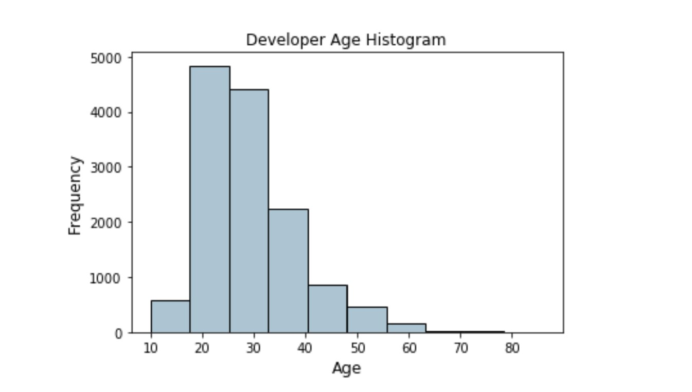

# Feature Engineering

Feature engineering is an essential part of building any intelligent system. This is the reason Data Scientists and Machine learning engineers often spend 70% of their time in the data preparation phase before modeling. 


*A standard machine learning pipeline (source: Practical Machine Learning with Python, Apress/Springer)*

Specifically, we’ll learn how to modify dataset variables to extract meaningful information in order to capture as much insight as possible, leaving datasets and their variables ready to be used in machine learning algorithms.

**What is a feature?**

A feature is typically a specific representation on top of raw data, which is an individual, measurable attribute, typically depicted by a column in a dataset. Considering a generic two-dimensional dataset, each observation is depicted by a row and each feature by a column, which will have a specific value for an observation. That said, a feature is a variable, which we can explain as any characteristic, number, or quantity that can be measured or counted. We call them variables because the values they take may vary.

Examples of variables may be:

Age ( 10,15,17,21,30,...)

Country (USA, Thailand, Japan, Argentina,...)

Energy usage (220, 50, 130, 88,...)

We classify variables in a dataset into one of these major types:

-Numerical variables

-Categorical variables

-Datetime variables

-Mixed variables


Features can be of two major types based on the dataset. Inherent raw features are obtained directly from the dataset with no extra data manipulation or engineering. Derived features are usually obtained from feature engineering, where we extract features from existing data attributes. A simple example would be creating a new feature “BMI” from an employee dataset containing “Weight” and "Height" by just using the formula with weight and height.

**What is feature engineering?**

Feature engineering is the process of using data domain knowledge to create and transform features or variables that make machine learning algorithms work more efficiently. It’s a fundamental task for improving machine learning model performance and prediction accuracy.

Feature engineering can be very time consuming because it includes a number of processes, like:

-Filling missing values within a variable

-Creating or extracting new features from the ones available in your dataset

-Encoding categorical variables into numbers

-Variable transformation


**Why do we need to do feature engineering?**

Every time we start a new machine learning project, whether we receive a raw dataset or we do web scraping to obtain the data, data will most certainly be messy and not suitable for training a model. We need to always perform some data exploration at the beginning to find empty values, outliers, data types, relationships,etc. After we understand better the data we have, we can start doing feature engineering tasks to build high performance models. The succeess of an algorithm can often hinge on how we engineer the input features.

**Do not confuse feature engineering with feature selection**. Feature selection allows us to select features from the feature pool (including any newly-engineered ones) that will help machine learning models make predictions on target variables more efficiently. In a typical machine learning pipeline, we perform feature selection after completing feature engineering.

### Feature Engineering on numeric data

Even though numeric data can be directly fed into machine learning models, we still need to engineer features which are relevant to the problem, before building a model.

A form of raw measures include features which represent frequencies, counts or occurrences of specific attributes.

Now if I’m building a recommendation system for song recommendations, I would just want to know if a person is interested or has listened to a particular song. This doesn’t require the number of times a song has been listened to since I am more concerned about the various songs he\she has listened to.  In this case, a binary feature is preferred as opposed to a count based feature.

The problem of working with raw, continuous numeric features is that often the distribution of values in these features will be skewed. This signifies that some values will occur quite frequently while some will be quite rare.

Binning, also known as quantization is used for transforming continuous numeric features into discrete ones (categories). These discrete values or numbers can be thought of as categories or bins into which the raw, continuous numeric values are binned or grouped into. Each bin represents a specific degree of intensity and hence a specific range of continuous numeric values fall into it.

An example of this would be to create bins by age groups, like the following example:



The above histogram depicting developer ages is slightly right skewed as expected (lesser aged developers).

Example code:

```py
data = pd.DataFrame({'Age':[0,2,4,13,35,-1,54]})
​
bins= [0,2,4,13,20,110]
labels = ['Infant','Toddler','Kid','Teen','Adult']
data['AgeGroup'] = pd.cut(data['Age'], bins=bins, labels=labels, right=False)
print (data)
```

### Feature engineering on categorical data

Typically, any data attribute which is categorical in nature represents discrete values which belong to a specific finite set of categories or classes. These discrete values can be text or numeric in nature (or even unstructured data like images!). There are two major classes of categorical data, nominal and ordinal.

-Consider a simple example of colour categories. Let's say we have five major classes or categories in this particular scenario without any concept or notion of order (yellow doesn’t always occur before red nor is it smaller or bigger than red). As there is no concept of ordering, this would be a nominal categorical attribute.

-Ordinal categorical attributes have some sense or notion of order amongst its values. Sizes, education level and employment roles are some other examples of ordinal categorical attributes.

Normally, categorical features have to be converted into numbers for the machine learning model to understand it. We will see about label encoding techniques in a specific lesson. 

If we want to see the list of unique labels in any categorical feature, we can use the following code:

```py
music_genres = np.unique(df['Genre'])
music_genres
```

or we can do it directly in our dataframe like this:

```py
df.column.unique()
```


### What are some naive feature engineering techniques that improve model efficacy?

1. Summary statistics (mean, median, mode, min, max, std) for each group of similar records. For example, all female customers between the age 34 and 45 would get their own set of summary statistics.

2. Interactions or ratios between features. For example, var1 * var2.

3. Summaries of features. For example, the number of purchases a customer made in the last 30 days (raw features may be last 10 purchase dates).

4. Splitting feature information manually. For example, customers taller than 1.80cm would be a critical piece of information when recommending car vs SUV.

5. KNN using records in the training set to produce a KNN feature that is fed into another model.

Source:

https://towardsdatascience.com/understanding-feature-engineering-part-1-continuous-numeric-data-da4e47099a7b

https://towardsdatascience.com/understanding-feature-engineering-part-2-categorical-data-f54324193e63

https://medium.com/@mxcsyounes/hands-on-with-feature-engineering-techniques-broad-introduction-def389c1fc25
