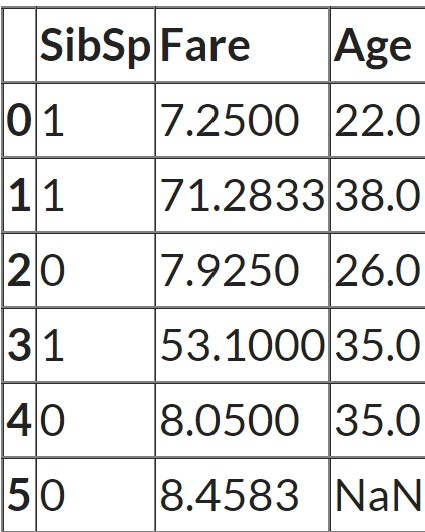

# Cómo lidiar con los valores faltantes

¿Por qué necesitamos completar los valores que faltan?

Porque la mayoría de los modelos de Machine Learning que queremos usar proporcionarán un error si le pasamos valores de NaN. Sin embargo, algoritmos como K-nearest y Naive Bayes admiten datos con valores faltantes. La forma más fácil es llenarlos con 0, pero esto puede reducir significativamente la precisión de nuestro modelo.

Antes de comenzar a eliminar o imputar valores faltantes, debemos comprender los datos para elegir el mejor método para tratar los valores faltantes. Puedes terminar creando un modelo de Machine Learning sesgado que conducirá a resultados incorrectos si los valores faltantes no se manejan correctamente.

Como vimos en el análisis exploratorio de datos, podemos encontrar valores faltantes usando la función info() y observando cuántos valores no nulos hay en cada columna. Otra forma es usar la función isnull().

### Tipos de valores perdidos

**1. Falta completamente al azar**

Los valores perdidos son completamente independientes de otros datos. No hay patrón. Por ejemplo, supongamos que en una biblioteca hay algunos libros vencidos. Faltan algunos valores de libros vencidos en el sistema informático. El motivo podría ser un error humano, como que el bibliotecario se olvidó de escribir los valores. Por lo tanto, los valores faltantes de los libros vencidos no están relacionados con ninguna otra variable/dato en el sistema.

No debe asumirse ya que es un caso raro. La ventaja de tales datos es que el análisis estadístico permanece imparcial.

**2. Falta al azar**

El motivo de los valores faltantes puede explicarse por las variables sobre las que tienes información completa, ya que existe alguna relación entre los datos faltantes y otros valores/datos. Solo falta dentro de las submuestras de los datos y existe algún patrón en los valores faltantes.

Por ejemplo, en una encuesta, puedes encontrar que todas las personas respondieron su 'Género' pero los valores de 'Edad' faltan en su mayoría para las personas que respondieron su 'Género' como 'femenino'. (La razón es que la mayoría de las mujeres no quieren revelar su edad).

Entonces, la probabilidad de que falten datos depende solo de los datos observados.

Supongamos que se realiza una encuesta sobre los libros vencidos de una biblioteca. En la encuesta se pregunta el género y el número de libros vencidos. Supongamos que la mayoría de las mujeres responden la encuesta y es menos probable que los hombres respondan. Entonces, por qué faltan los datos puede explicarse por otro factor que es el género.

En este caso, el análisis estadístico podría resultar en sesgo.

**3. Falta no al azar**

Los valores perdidos dependen de los datos no observados. Si hay algún patrón en los datos que faltan y otros datos observados no pueden explicarlo, entonces es Falta no al azar.

Puede suceder debido a la renuencia de las personas a proporcionar la información requerida. Es posible que un grupo específico de personas no responda algunas preguntas en una encuesta. Por ejemplo, es menos probable que las personas con más libros vencidos respondan la encuesta sobre la cantidad de libros vencidos. Otro ejemplo sería que las personas que tienen menos ingresos pueden negarse a compartir esa información en una encuesta.

En este caso, el análisis estadístico podría resultar en sesgo.

### Métodos para tratar con valores faltantes

**1. Eliminar la columna que tiene valores faltantes**

Solo debe usarse cuando hay muchos valores nulos en la columna. Podemos hacer esto usando dataframe.dropna(axis=1) o usando drop() y especificando la columna que queremos soltar. El problema con este método es que podemos perder información valiosa sobre esa característica, ya que la hemos eliminado por completo debido a algunos valores nulos. Dado que estamos trabajando con conjuntos de entrenamiento y validación, tenemos cuidado de colocar las mismas columnas en ambos DataFrames.

```py
#Code to drop a certain column
df2 = df.drop(['column_to_drop'],axis=1)
```

**2. Eliminar filas que tienen valores faltantes**

Podemos eliminar solo las filas que tienen valores faltantes usando la función dropna() nuevamente. Esta vez usaremos axis=0 como parámetro porque en lugar de buscar columnas con valores faltantes, estamos buscando filas con valores faltantes.

Si una fila tiene muchos valores faltantes, puedes optar por descartar toda la fila. Si a cada fila le falta algún valor (columna), es posible que termine eliminando todos los datos.

```py
# Descartar todas las filas que tienen un valor nulo
df2 = df.dropna(axis=0)
```

Podemos agregar un 'umbral' a nuestra función. De esa manera, la eliminación de filas cumplirá primero con las condiciones del umbral. Por ejemplo si escribimos la siguiente función:

```py
# Mantendrá las filas con al menos 2 valores no NA
df2=df.dropna (axis = 0, thresh=2) 
```

Esto también se puede usar en porcentajes.

```py
# Eliminará todas las filas con valores nulos, excepto las que tengan al menos el 65% de los datos completos (valores no nulos).
df2=df.dropna (axis = 0, thresh= 0.65 * len(df))
```

El umbral se puede usar en filas, así como en columnas usando el eje = 1.

**3. Relleno de valores faltantes - Imputación**

En este método llenamos los valores nulos con un cierto valor. Aunque es simple, completar el valor medio generalmente funciona bastante bien. Si bien los estadísticos han experimentado con formas más complejas de determinar los valores imputados (como la imputación de regresión, por ejemplo), las estrategias complejas generalmente no brindan ningún beneficio adicional una vez que conecta los resultados en modelos sofisticados de Machine Learning.

Hay algunas formas de imputar valores perdidos:

- Imputación media

Si es una característica numérica, podemos reemplazar los valores que faltan con la media, pero asegúrate de que la característica específica no tenga valores extremos para que la media aún pueda representar una tendencia central.

Ejemplo:

```py
# Reemplazando los valores nulos de una columna con la media de la columna
df['column_to_impute'] = df['column_to_impute'].fillna(df['column_to_impute'].mean())

# Imputando valores nulos usando scikit learn SimpleImputer
from sklearn.impute import SimpleImputer
my_imputer = SimpleImputer(strategy = 'mean')
new_df = my_imputer.fit_transform(df)
```

- Mediana

Si es una característica numérica y la característica tiene valores extremos, que habíamos decidido mantener, esos valores atípicos empujarán la media hacia los extremos y ya no representará una tendencia central. En ese caso, deberíamos considerar usar la mediana en su lugar.

Ejemplo:

```py

df.fillna(df.median())

# Imputando valores nulos usando scikit learn SimpleImputer
from sklearn.impute import SimpleImputer
my_imputer = SimpleImputer(strategy = 'median')
new_df = my_imputer.fit_transform(df)
```

- Moda

Otra técnica es la 'mode imputation' en la que los valores que faltan se reemplazan con el valor de modo o el valor más frecuente de toda la columna de características. Cuando los datos están sesgados, es bueno considerar el uso de valores de moda para reemplazar los valores que faltan. Para puntos de datos como el campo Embarcado, puede considerar usar la moda para reemplazar los valores. Ten en cuenta que la imputación de datos faltantes con valores de moda se puede hacer con datos numéricos y categóricos.

Ejemplo:


```py

df['column_to_impute'] = df['column_to_impute'].fillna(df['column_to_impute'].mode()[0])

# Imputación de valores nulos con scikit learn SimpleImputer
from sklearn.impute import SimpleImputer
imputer = SimpleImputer(strategy='most_frequent')
imputer.fit_transform(X)
```

- Crear una nueva categoría para características categóricas

Impute el valor "faltante", que lo trata como una categoría separada para reemplazar valores nulos en una característica categórica.

Ejemplo:

```py
# Creando una nueva categoría llamada 'faltante' para reemplazar valores nulos
imputer = SimpleImputer(strategy='constant', fill_value='missing')
imputer.fit_transform(X)
```

- Nuevo valor 

Rellenando el valor numérico con 0 o -999, o algún otro número que no aparecerá en los datos. Esto se puede hacer para que la máquina pueda reconocer que los datos no son reales o son diferentes.

Ejemplo:

```py
# Reemplaza el valor faltante con '0' usando el método 'fiilna'
df['column_to_impute'] = df['column_to_impute'].fillna(0)
```

- Otros métodos de imputación

En un enfoque multivariante, se tiene en cuenta más de una característica. Hay dos formas de imputar valores faltantes considerando el enfoque multivariante. Usando las clases KNNImputer o IterativeImputer. Para explicarlos, haremos suposiciones utilizando el ejemplo del Titanic.




- imputación iterativa

Supongamos que la característica 'Age' está bien correlacionada con la característica 'Fare', de modo que las personas con tarifas más bajas también son más jóvenes y las personas con tarifas más altas también son mayores.

En ese caso, tendría sentido imputar una edad baja para valores de tarifas bajos y una edad alta para valores de tarifas altos. Así que aquí estamos tomando en cuenta múltiples características siguiendo un enfoque multivariante.

```py
cols = ['SibSp', 'Fare', 'Age']
X = df[cols]

from sklearn.experimental import enable_iterative_imputer
from sklearn.impute import IterativeImputer
impute_it = IterativeImputer()
impute_it.fit_transform(X)
```

En este caso, los valores nulos en una columna se completan ajustando un modelo de regresión usando otras columnas en el conjunto de datos. Para todas las filas, en las que no falta 'Age', scikit learn ejecuta un modelo de regresión. Y luego, para todas las filas en las que falta 'Age', hace predicciones para 'Age' pasando 'Sib sp' y 'Fare' al modelo de entrenamiento. Entonces, en realidad construye un modelo de regresión con dos características y un objetivo y luego hace predicciones en cualquier lugar donde falten valores. Y esas predicciones son los valores imputados.

- Imputaciones de Vecinos más Cercanos (KNNImputer)

Los valores faltantes se imputan mediante el método de k-vecinos más cercanos, en el que se utiliza una distancia euclidiana para encontrar los vecinos más cercanos.

```py
cols = ['SibSp', 'Fare', 'Age']
X = df[cols]

from sklearn.impute import KNNImputer
impute_knn = KNNImputer(n_neighbors=2)
impute_knn.fit_transform(X)
```

Veamos los datos de nuevo:


Como n_neighbors = 2, scikit learn encuentra las dos filas más similares medidas por qué tan cerca están los valores 'Sib sp' y 'Fare' de la fila que tiene valores faltantes. En este caso, la última fila tiene un valor faltante. Y la tercera fila y la quinta fila tienen los valores más cercanos para las otras dos características. Entonces, el promedio de la característica 'Age' de estas dos filas se toma como el valor imputado.

Fuente: 

https://www.analyticsvidhya.com/blog/2021/05/dealing-with-missing-values-in-python-a-complete-guide/

https://www.analyticsvidhya.com/blog/2021/10/handling-missing-value/

https://vitalflux.com/pandas-impute-missing-values-mean-median-mode/#:~:text=entire%20feature%20column.-,When%20the%20data%20is%20skewed%2C%20it%20is%20good%20to%20consider,with%20numerical%20and%20categorical%20data.
