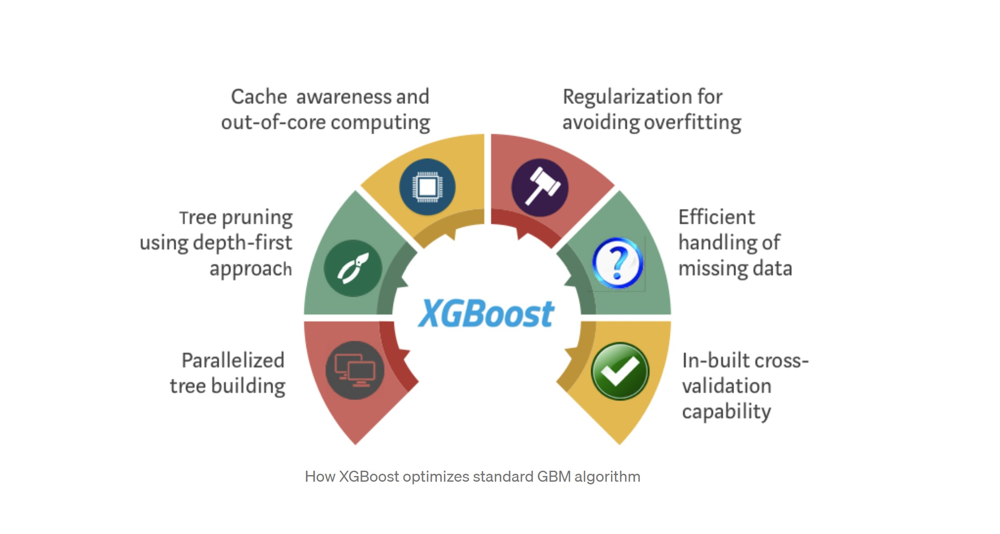
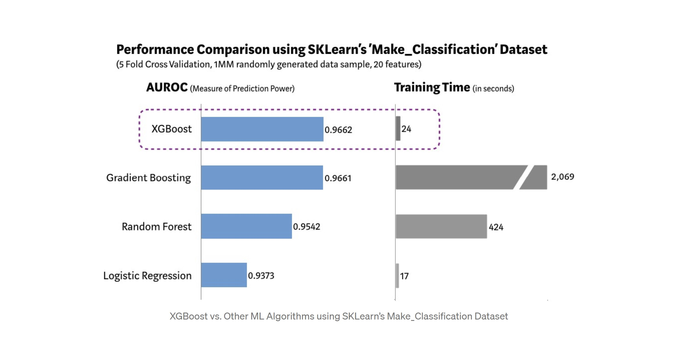

# Boosting Algorithms

We already mentioned the meaninng of ensemble learning, which in general, is a model that makes predictions based on a number of different models. In the last lesson we talked about bagging, a technique that trains a bunch of individual models in a parallel way with random subsets of the data. In this lesson we will learn the boosting technique. 

**What does boosting mean?**

Training a bunch of individual models in a **sequential** way. Each individual model learns from mistakes made by the previous model.

## Gradient Boosting

Gradient Boosting learns from the mistake or residual error directly, rather than update the weights of data points.

Steps of a gradient boosting algorithm:

- Step 1: Train a decision tree

- Step 2: Apply the decision tree just trained to predict

- Step 3: Calculate the residual of this decision tree, Save residual errors as the new y

- Step 4: Repeat Step 1 (until the number of trees we set to train is reached)

- Step 5: Make the final prediction

**How does gradient boosting machines differ from traditional decision tree algorithms?**

Gradient boosting involves using multiple weak predictors (decision trees) to create a strong predictor. Specifically, it includes a loss function that calculates the gradient of the error with regard to each feature and then iteratively creates new decision trees that minimize the current error. More and more trees are added to the current model to continue correcting error until improvements fall below some minimum threshold or a pre-decided number of trees have been created.

## What hyperparameters can be tuned in gradient boosting in addition to each individual tree's hyperparameters?**

The main hyperparameters that can be tuned with GBM models are:

- Loss function - loss function to calculate gradient of error

- Learning rate - the rate at which new trees correct/modify the existing predictor

- Num estimators - the total number of trees to produce for the final predictor

Additional hyperparameters specific to the loss function 

Some specific implementations, for example stochastic gradient boosting, may have additional hyperparameters such as subsample size (subsample size affects the randomization in stochastic variations).

Scikit learn's documentation on Gradient Boosting for classification: https://scikit-learn.org/stable/modules/generated/sklearn.ensemble.GradientBoostingClassifier.html

Scikit learn's documentation on Gradient Boosting for regression: https://scikit-learn.org/stable/modules/generated/sklearn.ensemble.GradientBoostingRegressor.html

**How can we reduce overfitting when doing gradient boosting?**

Reducing the learning rate or reducing the maximum number of estimators are the two easiest ways to deal with gradient boosting models that overfit the data.

With stochastic gradient boosting, reducing subsample size is an additional way to combat overfitting.

Boosting algorithms tend to be vulnerable to overfitting, so knowing how to reduce overfitting is important.

## Implementation in Scikit Learn

Let's imagine we already have our data split in train and test datasets:

```py

# Load Libraries

from sklearn.metrics import accuracy_score
from sklearn.model_selection import train_test_split
from sklearn.tree import DecisionTreeClassifier
from sklearn.ensemble import RandomForestClassifier,GradientBoostingClassifier

# Fit a Decision Tree model as comparison

clf = DecisionTreeClassifier()
clf.fit(X_train, y_train)
y_pred = clf.predict(X_test)
accuracy_score(y_test, y_pred)

OUTPUT: 0.756

# Fit a Random Forest model

clf = RandomForestClassifier(n_estimators=100, max_features="auto",random_state=0)
clf.fit(X_train, y_train)
y_pred = clf.predict(X_test)
accuracy_score(y_test, y_pred)

OUTPUT: 0.797

# Step 6: Fit a Gradient Boosting model

clf = GradientBoostingClassifier(n_estimators=100)
clf.fit(X_train, y_train)
y_pred = clf.predict(X_test)
accuracy_score(y_test, y_pred)

OUTPUT:0.834
```

> n_estimators stands for how many tree we want to grow

## What is XGBoost?

XGBoost is a decision-tree-based ensemble Machine Learning algorithm that uses a gradient boosting framework.

Think of XGBoost as gradient boosting on ‘steroids’, it is also called ‘Extreme Gradient Boosting. A perfect combination of software and hardware optimization techniques to yield superior results using less computing resources in the shortest amount of time.

**Why does it perform so well?**

Let's look at the following image to understand the reasons why it performs so well.



(Image from towardsdatascience.com)

Now, let's see the following comparison. XGBoost model has the best combination of prediction performance and processing time compared to other algorithms.



(Image from towardsdatascience.com)

Setting the optimal hyperparameters of any ML model can be a challenge. So why not let Scikit Learn do it for you? 

For XGBoost to be able to handle our data, we’ll need to transform it into a specific format called DMatrix. Let's see an example on how to define an XGBoost model:

```py
from sklearn.model_selection import train_test_split

X_train, X_test, Y_train, Y_test = train_test_split(X, y, test_size=0.2)

D_train = xgb.DMatrix(X_train, label=Y_train)
D_test = xgb.DMatrix(X_test, label=Y_test)

param = {
    'eta': 0.3, 
    'max_depth': 3,  
    'objective': 'multi:softprob',  
    'num_class': 3} 

steps = 20  # The number of training iterations

model = xgb.train(param, D_train, steps)

```

How would we combine Scikit Learn’s grid search with an XGBoost classifier?

>Only do that on a big dataset if you have time to kill — doing a grid search is essentially training an ensemble of decision trees many times over!

```py

from sklearn.model_selection import GridSearchCV

clf = xgb.XGBClassifier()
parameters = {
     "eta"    : [0.05, 0.10, 0.15, 0.20, 0.25, 0.30 ] ,
     "max_depth"        : [ 3, 4, 5, 6, 8, 10, 12, 15],
     "min_child_weight" : [ 1, 3, 5, 7 ],
     "gamma"            : [ 0.0, 0.1, 0.2 , 0.3, 0.4 ],
     "colsample_bytree" : [ 0.3, 0.4, 0.5 , 0.7 ]
     }

grid = GridSearchCV(clf,
                    parameters, n_jobs=4,
                    scoring="neg_log_loss",
                    cv=3)

grid.fit(X_train, Y_train)

```

The full list of possible parameters is available on the official XGBoost website: https://xgboost.readthedocs.io/en/latest/parameter.html 


Ensemble learning is very powerful and can be used not only for classification but regression also. Even though they generally work mostly in tree methods, they can also be applied in linear and svm models within the bagging or boosting ensembles, to lead to better performance. But remember, picking the right algorithm is not enough. We must also choose the right configuration of the algorithm for a dataset by tuning the hyper-parameters. 


Source:

https://towardsdatascience.com/basic-ensemble-learning-random-forest-adaboost-gradient-boosting-step-by-step-explained-95d49d1e2725

https://medium.com/@aravanshad/gradient-boosting-versus-random-forest-cfa3fa8f0d80

https://towardsdatascience.com/https-medium-com-vishalmorde-xgboost-algorithm-long-she-may-rein-edd9f99be63d