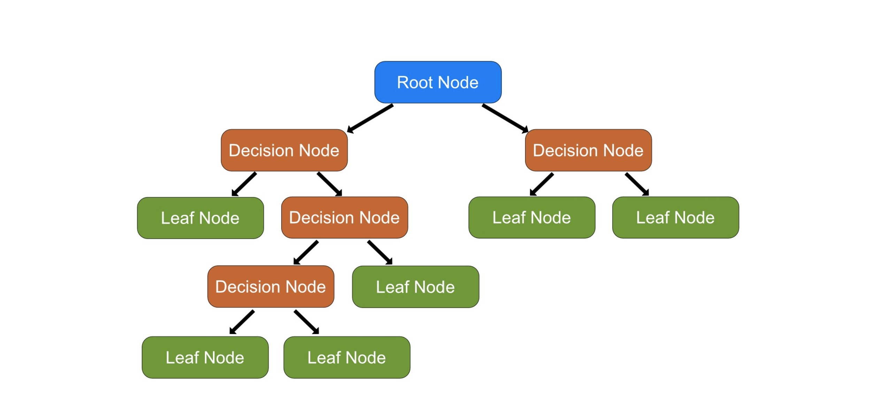
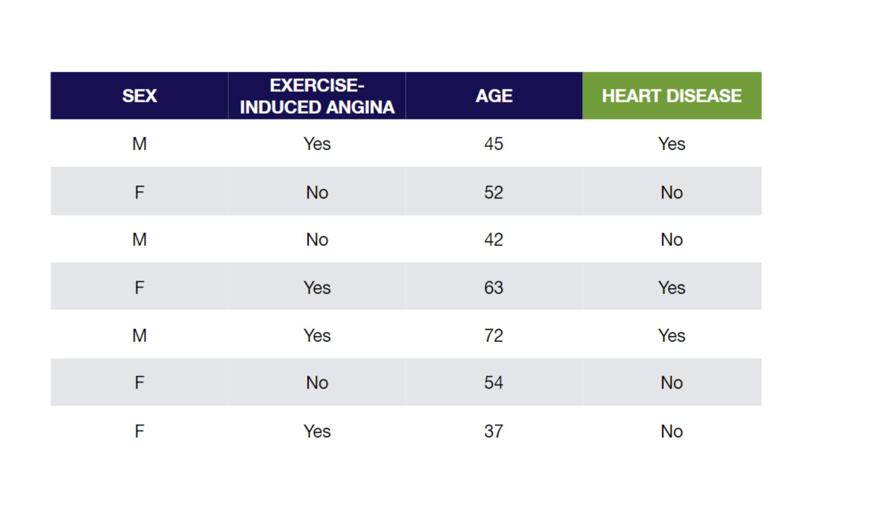

### Árboles de decisión

Los árboles de decisión pertenecen a una clase de algoritmos de machine learning supervisado, que se utilizan tanto en el modelado predictivo de clasificación (predice resultados discretos) como en la regresión (predice resultados numéricos continuos). Se construyen a partir de solo dos elementos: nodos y ramas.

**¿Los árboles de decisión son modelos paramétricos o no paramétricos?**

No paramétrico. El número de parámetros del modelo no se determina antes de crear el modelo.

## ¿Qué son los árboles de decisión?

Los árboles de decisión son una secuencia de condiciones que nos permiten dividir los datos de manera iterativa (un nodo tras otro, esencialmente) hasta que podamos asignar cada dato a una etiqueta. Los nuevos datos simplemente seguirán el árbol de decisiones y terminarán en la categoría más adecuada.

Se utilizan para clasificación, regresión, para medir la importancia de las características y para la selección de características.

Veamos una estructura de árbol de decisión:

- Root node - nodo en la parte superior del árbol. Contiene una función que divide mejor los datos (una función única que por sí sola clasifica la variable de destino con mayor precisión)

- Decision nodes — nodos donde se evalúan las variables. Estos nodos tienen flechas que apuntan hacia ellos y hacia afuera.

- Leaf nodes — nodos finales en los que se realiza la predicción.

Según el tamaño del conjunto de datos (tanto en filas como en columnas), probablemente haya miles o millones de formas en que se pueden organizar los nodos y sus condiciones. Veamos un pequeño ejemplo:

Ahora veamos una forma posible de construir el árbol de decisión:

Las hojas que contienen una mezcla de personas que tienen y no tienen enfermedades del corazón se llaman impuras. Podemos cuantificar la impureza usando Gini Impureza, Entropía y Ganancia de información. Cuanto mayor es la impureza de Gini, más impuras son las hojas. Así que queremos que el valor sea lo más bajo posible. Primero calculamos la impureza de Gini de cada una de las hojas, luego calculamos la impureza de Gini total de la división. La fórmula para calcular la impureza de Gini de las hojas es:

Impureza de Gini de una hoja: 1 - (probabilidad de 'sí')^2 - (probabilidad de 'no')^2

Un Gini bajo (cerca de 0) significa que la mayoría de los registros de la muestra están en la misma clase. Un Gini alto (máximo de 1 o menos, según el número de clases) significa que los registros de la muestra se distribuyen uniformemente entre las clases.

Encontrar la impureza de Gini para variables continuas es un poco más complicado. Primero, debemos ordenar la columna de menor a mayor, luego calcular el promedio para las filas adyacentes. Estos valores promedio serán nuestros candidatos para los umbrales del nodo raíz. Por último, calculamos los valores de impureza de Gini para cada valor promedio.

El árbol anterior se denomina Árbol de clasificación, ya que el objetivo es clasificar si un paciente puede tener una enfermedad cardíaca o no, en función del género. Los árboles de regresión se representan de la misma manera, solo que predicen valores continuos como el precio de una casa.

**Entre varias funciones, ¿cómo sabemos qué función debe ser el nodo raíz?**

Necesitamos verificar cómo cada característica de entrada clasifica la variable de destino de forma independiente. Si ninguna de las características por sí sola es 100% correcta en la clasificación, podemos considerar estas características impuras.

La impureza de Gini se calcula para todos los candidatos de nodo raíz, el que tenga la impureza de Gini más baja será nuestro nodo raíz.

Para decidir aún más cuál de las características impuras es más pura, podemos usar la métrica de Entropía, cuyo valor varía de 0 (mejor) a 1 (peor). La variable con la entropía más baja se utiliza como nodo raíz.

Para comenzar a entrenar el clasificador del árbol de decisión, debemos determinar el nodo raíz. Luego, para cada división individual, se calcula la métrica de ganancia de información. Representa un promedio de todos los valores de entropía basados ​​en una división específica. Cuanto mayor sea la ganancia, mejor será la división de decisión.

Luego, el algoritmo realiza una búsqueda codiciosa que revisa todas las características de entrada y sus valores únicos, calcula la ganancia de información para cada combinación y guarda la mejor característica dividida y el umbral para cada nodo.

De esta forma, el árbol se construye recursivamente. El proceso de recurrencia podría continuar para siempre, por lo que tendremos que especificar algunas condiciones de salida manualmente. Los más comunes son la profundidad máxima y las muestras mínimas en el nodo.

## Optimización del árbol de decisión

Como un problema generalmente tiene un gran conjunto de características, da como resultado una gran cantidad de divisiones, lo que a su vez da como resultado un árbol enorme. Dichos árboles son complejos y pueden dar lugar a un sobreajuste. Entonces, necesitamos saber cuándo parar.

Una forma de hacerlo es establecer un número mínimo de entradas de entrenamiento para usar en cada hoja. Por ejemplo, podemos usar un mínimo de 3 pacientes para tomar una decisión (enfermedad cardíaca o no), e ignorar cualquier hoja que tome menos de 3 pacientes.

Otra forma es establecer la profundidad máxima de su modelo. La profundidad máxima se refiere a la longitud del camino más largo desde una raíz hasta una hoja.

El rendimiento de un árbol se puede aumentar aún más mediante la **poda**. Implica eliminar las ramas que hacen uso de características que tienen poca importancia. De esta manera, reducimos la complejidad del árbol y, por lo tanto, aumentamos su poder predictivo al reducir el sobreajuste.

**¿Cuáles son algunas formas de reducir el sobreajuste con árboles de decisión?**

- Reducir la profundidad máxima.

- Aumentar la división de muestras mínimas.

- Equilibrar los datos para evitar el sesgo hacia las clases dominantes.

- Aumentar el número de muestras.

- Disminuir el número de funciones.

**¿Cuáles son los principales hiperparámetros que puedes ajustar para los árboles de decisión?**

En términos generales, los árboles de decisión tienen los siguientes parámetros:

- Max depth - profundidad máxima del árbol.

- Min samples split - número mínimo de muestras para dividir un nodo.

- Min samples leaf - número mínimo de muestras para cada nodo hoja.

- Max leaf nodes - el número máximo de nodos hoja en el árbol.

- Max features - número máximo de características que se evalúan para la división en cada nodo (solo válido para algoritmos que aleatorizan las características consideradas en cada división).

El árbol de decisión tradicional es codicioso y analiza todas las funciones en cada punto de división, pero muchas implementaciones modernas permiten dividir en funciones aleatorias (como se ve en scikit learn), por lo que las funciones máximas pueden o no ser un hiperparámetro ajustable.

Como siempre, el mejor lugar para saber qué otros hiperparámetros se pueden ajustar es la documentación de scikit learn sobre árboles de decisión, ya sea para clasificación o regresión: https://scikit-learn.org/stable/modules/tree.html

**¿Cómo se evalúa la importancia de las características en los modelos basados ​​en árboles de decisión?**

Las características que se dividen con mayor frecuencia y que están más cerca de la parte superior del árbol, lo que afecta a la mayor cantidad de muestras, se consideran las más importantes.

**¿Cómo afecta cada hiperparámetro a la capacidad de aprendizaje del modelo?**

- Max depth: aumentando la profundidad máxima disminuirá el sesgo y aumentará la varianza.

- Min samples split: aumentando la división de muestras mínimas aumenta el sesgo y disminuye la varianza.

- Min samples leaf: el aumento de la hoja de muestras mínimas aumenta el sesgo y disminuye la varianza.

- Max leaf nodes: la disminución del nodo de hoja máxima aumenta el sesgo y disminuye la varianza.

- Max features: la disminución de las características máximas aumenta el sesgo y disminuye la varianza.

Puede haber casos en los que cambiar los hiperparámetros no tenga efecto en el modelo.

## Ventajas y desventajas de los árboles de decisión

**Ventajas:**

- Fácil de entender, interpretar, visualizar.

- Los árboles de decisión llevan a cabo de forma implícita el cribado de variables o la selección de características.

- Puede manejar datos numéricos y categóricos. También puede manejar problemas de múltiples salidas.

- Los árboles de decisión requieren relativamente poco esfuerzo por parte de los usuarios para la preparación de datos.

- Las relaciones no lineales entre parámetros no afectan el rendimiento del árbol.

**Desventajas:**

- Sobreajuste. Los árboles de decisión se sobreajustan muy rápidamente. Si los deja crecer sin un mecanismo de parada o un mecanismo de corrección después de que el árbol haya sido entrenado, pueden dividirse tantas veces que cada hoja es una muestra. Esto significa que literalmente aprendieron cómo se ve el conjunto de datos de entrenamiento y sufren una gran variación (generalizar mal a datos novedosos). Consulte el capítulo siguiente para obtener consejos prácticos sobre cómo corregir el sobreajuste.

- No robusto a los cambios de datos de entrada. Un pequeño cambio en los datos de entrenamiento puede resultar en un árbol completamente diferente. La precisión general aún puede ser alta, pero las divisiones de decisión específicas serán totalmente diferentes.

- biased hacia la clase dominante. Los árboles de decisión de clasificación tienden a favorecer la predicción de la clase dominante en conjuntos de datos con desequilibrio de clases.

Fuente:

https://pythonkai.org/2021/12/20/machine-learning-for-beginners-project-4-decision-tree-classifier/

https://towardsdatascience.com/master-machine-learning-decision-trees-from-scratch-with-python-de75b0494bcd

https://www.w3schools.com/python/python_ml_decision_tree.asp

https://towardsdatascience.com/master-machine-learning-decision-trees-from-scratch-with-python-de75b0494bcd

https://pub.towardsai.net/decision-tree-classification-explain-it-to-me-like-im-10-59a53c0b338f