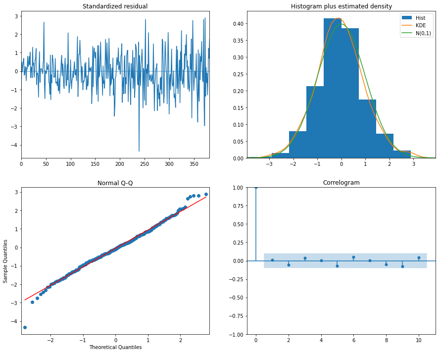

# Exploring Time Series

## Time Series Manipulation using Pandas


```python
# Creating a date range with hourly frequency

import pandas as pd
from datetime import datetime
import numpy as np

date_rng = pd.date_range(start='1/1/2018', end='1/08/2018', freq='H')
```


```python
date_rng
```


    DatetimeIndex(['2018-01-01 00:00:00', '2018-01-01 01:00:00',
                   '2018-01-01 02:00:00', '2018-01-01 03:00:00',
                   '2018-01-01 04:00:00', '2018-01-01 05:00:00',
                   '2018-01-01 06:00:00', '2018-01-01 07:00:00',
                   '2018-01-01 08:00:00', '2018-01-01 09:00:00',
                   ...
                   '2018-01-07 15:00:00', '2018-01-07 16:00:00',
                   '2018-01-07 17:00:00', '2018-01-07 18:00:00',
                   '2018-01-07 19:00:00', '2018-01-07 20:00:00',
                   '2018-01-07 21:00:00', '2018-01-07 22:00:00',
                   '2018-01-07 23:00:00', '2018-01-08 00:00:00'],
                  dtype='datetime64[ns]', length=169, freq='H')


```python
type(date_rng[0])
```


    pandas._libs.tslibs.timestamps.Timestamp


Now let´s create an example dataframe with the timestamp data we just created


```python
df = pd.DataFrame(date_rng, columns=['date'])
df['data'] = np.random.randint(0,100,size=(len(date_rng)))

df.head()
```


<div>
<style scoped>
    .dataframe tbody tr th:only-of-type {
        vertical-align: middle;
    }

    .dataframe tbody tr th {
        vertical-align: top;
    }

    .dataframe thead th {
        text-align: right;
    }
</style>
<table border="1" class="dataframe">
  <thead>
    <tr style="text-align: right;">
      <th></th>
      <th>date</th>
      <th>data</th>
    </tr>
  </thead>
  <tbody>
    <tr>
      <th>0</th>
      <td>2018-01-01 00:00:00</td>
      <td>23</td>
    </tr>
    <tr>
      <th>1</th>
      <td>2018-01-01 01:00:00</td>
      <td>73</td>
    </tr>
    <tr>
      <th>2</th>
      <td>2018-01-01 02:00:00</td>
      <td>3</td>
    </tr>
    <tr>
      <th>3</th>
      <td>2018-01-01 03:00:00</td>
      <td>10</td>
    </tr>
    <tr>
      <th>4</th>
      <td>2018-01-01 04:00:00</td>
      <td>44</td>
    </tr>
  </tbody>
</table>
</div>


If we want to do time series manipulation, we’ll need to have a date time index so that our data frame is indexed on the timestamp.


```python
#Convert the dataframe index to a datetime index 

df['datetime'] = pd.to_datetime(df['date'])
df = df.set_index('datetime')
df.drop(['date'], axis=1, inplace=True)
df.head()

```


<div>
<style scoped>
    .dataframe tbody tr th:only-of-type {
        vertical-align: middle;
    }

    .dataframe tbody tr th {
        vertical-align: top;
    }

    .dataframe thead th {
        text-align: right;
    }
</style>
<table border="1" class="dataframe">
  <thead>
    <tr style="text-align: right;">
      <th></th>
      <th>data</th>
    </tr>
    <tr>
      <th>datetime</th>
      <th></th>
    </tr>
  </thead>
  <tbody>
    <tr>
      <th>2018-01-01 00:00:00</th>
      <td>23</td>
    </tr>
    <tr>
      <th>2018-01-01 01:00:00</th>
      <td>73</td>
    </tr>
    <tr>
      <th>2018-01-01 02:00:00</th>
      <td>3</td>
    </tr>
    <tr>
      <th>2018-01-01 03:00:00</th>
      <td>10</td>
    </tr>
    <tr>
      <th>2018-01-01 04:00:00</th>
      <td>44</td>
    </tr>
  </tbody>
</table>
</div>


```python
# Example on how to filter data with only day 2.

df[df.index.day == 2]
```


<div>
<style scoped>
    .dataframe tbody tr th:only-of-type {
        vertical-align: middle;
    }

    .dataframe tbody tr th {
        vertical-align: top;
    }

    .dataframe thead th {
        text-align: right;
    }
</style>
<table border="1" class="dataframe">
  <thead>
    <tr style="text-align: right;">
      <th></th>
      <th>data</th>
    </tr>
    <tr>
      <th>datetime</th>
      <th></th>
    </tr>
  </thead>
  <tbody>
    <tr>
      <th>2018-01-02 00:00:00</th>
      <td>27</td>
    </tr>
    <tr>
      <th>2018-01-02 01:00:00</th>
      <td>80</td>
    </tr>
    <tr>
      <th>2018-01-02 02:00:00</th>
      <td>9</td>
    </tr>
    <tr>
      <th>2018-01-02 03:00:00</th>
      <td>67</td>
    </tr>
    <tr>
      <th>2018-01-02 04:00:00</th>
      <td>26</td>
    </tr>
    <tr>
      <th>2018-01-02 05:00:00</th>
      <td>13</td>
    </tr>
    <tr>
      <th>2018-01-02 06:00:00</th>
      <td>22</td>
    </tr>
    <tr>
      <th>2018-01-02 07:00:00</th>
      <td>68</td>
    </tr>
    <tr>
      <th>2018-01-02 08:00:00</th>
      <td>48</td>
    </tr>
    <tr>
      <th>2018-01-02 09:00:00</th>
      <td>75</td>
    </tr>
    <tr>
      <th>2018-01-02 10:00:00</th>
      <td>93</td>
    </tr>
    <tr>
      <th>2018-01-02 11:00:00</th>
      <td>80</td>
    </tr>
    <tr>
      <th>2018-01-02 12:00:00</th>
      <td>36</td>
    </tr>
    <tr>
      <th>2018-01-02 13:00:00</th>
      <td>67</td>
    </tr>
    <tr>
      <th>2018-01-02 14:00:00</th>
      <td>54</td>
    </tr>
    <tr>
      <th>2018-01-02 15:00:00</th>
      <td>66</td>
    </tr>
    <tr>
      <th>2018-01-02 16:00:00</th>
      <td>54</td>
    </tr>
    <tr>
      <th>2018-01-02 17:00:00</th>
      <td>9</td>
    </tr>
    <tr>
      <th>2018-01-02 18:00:00</th>
      <td>38</td>
    </tr>
    <tr>
      <th>2018-01-02 19:00:00</th>
      <td>36</td>
    </tr>
    <tr>
      <th>2018-01-02 20:00:00</th>
      <td>19</td>
    </tr>
    <tr>
      <th>2018-01-02 21:00:00</th>
      <td>19</td>
    </tr>
    <tr>
      <th>2018-01-02 22:00:00</th>
      <td>30</td>
    </tr>
    <tr>
      <th>2018-01-02 23:00:00</th>
      <td>88</td>
    </tr>
  </tbody>
</table>
</div>


```python
# Filtering data between two dates

df['2018-01-04':'2018-01-06']
```


<div>
<style scoped>
    .dataframe tbody tr th:only-of-type {
        vertical-align: middle;
    }

    .dataframe tbody tr th {
        vertical-align: top;
    }

    .dataframe thead th {
        text-align: right;
    }
</style>
<table border="1" class="dataframe">
  <thead>
    <tr style="text-align: right;">
      <th></th>
      <th>data</th>
    </tr>
    <tr>
      <th>datetime</th>
      <th></th>
    </tr>
  </thead>
  <tbody>
    <tr>
      <th>2018-01-04 00:00:00</th>
      <td>61</td>
    </tr>
    <tr>
      <th>2018-01-04 01:00:00</th>
      <td>62</td>
    </tr>
    <tr>
      <th>2018-01-04 02:00:00</th>
      <td>24</td>
    </tr>
    <tr>
      <th>2018-01-04 03:00:00</th>
      <td>76</td>
    </tr>
    <tr>
      <th>2018-01-04 04:00:00</th>
      <td>41</td>
    </tr>
    <tr>
      <th>...</th>
      <td>...</td>
    </tr>
    <tr>
      <th>2018-01-06 19:00:00</th>
      <td>44</td>
    </tr>
    <tr>
      <th>2018-01-06 20:00:00</th>
      <td>14</td>
    </tr>
    <tr>
      <th>2018-01-06 21:00:00</th>
      <td>45</td>
    </tr>
    <tr>
      <th>2018-01-06 22:00:00</th>
      <td>45</td>
    </tr>
    <tr>
      <th>2018-01-06 23:00:00</th>
      <td>63</td>
    </tr>
  </tbody>
</table>
<p>72 rows × 1 columns</p>
</div>


We could take the min, max, average, sum, etc., of the data at a daily frequency instead of an hourly frequency as per the example below where we compute the daily average of the data:


```python
df.resample('D').mean()
```


<div>
<style scoped>
    .dataframe tbody tr th:only-of-type {
        vertical-align: middle;
    }

    .dataframe tbody tr th {
        vertical-align: top;
    }

    .dataframe thead th {
        text-align: right;
    }
</style>
<table border="1" class="dataframe">
  <thead>
    <tr style="text-align: right;">
      <th></th>
      <th>data</th>
    </tr>
    <tr>
      <th>datetime</th>
      <th></th>
    </tr>
  </thead>
  <tbody>
    <tr>
      <th>2018-01-01</th>
      <td>45.083333</td>
    </tr>
    <tr>
      <th>2018-01-02</th>
      <td>46.833333</td>
    </tr>
    <tr>
      <th>2018-01-03</th>
      <td>48.333333</td>
    </tr>
    <tr>
      <th>2018-01-04</th>
      <td>52.625000</td>
    </tr>
    <tr>
      <th>2018-01-05</th>
      <td>47.791667</td>
    </tr>
    <tr>
      <th>2018-01-06</th>
      <td>37.333333</td>
    </tr>
    <tr>
      <th>2018-01-07</th>
      <td>45.666667</td>
    </tr>
    <tr>
      <th>2018-01-08</th>
      <td>68.000000</td>
    </tr>
  </tbody>
</table>
</div>


```python
# Example on how to get the sum of the last three values.

df['rolling_sum'] = df.rolling(3).sum()
df.head(10)
```


<div>
<style scoped>
    .dataframe tbody tr th:only-of-type {
        vertical-align: middle;
    }

    .dataframe tbody tr th {
        vertical-align: top;
    }

    .dataframe thead th {
        text-align: right;
    }
</style>
<table border="1" class="dataframe">
  <thead>
    <tr style="text-align: right;">
      <th></th>
      <th>data</th>
      <th>rolling_sum</th>
    </tr>
    <tr>
      <th>datetime</th>
      <th></th>
      <th></th>
    </tr>
  </thead>
  <tbody>
    <tr>
      <th>2018-01-01 00:00:00</th>
      <td>23</td>
      <td>NaN</td>
    </tr>
    <tr>
      <th>2018-01-01 01:00:00</th>
      <td>73</td>
      <td>NaN</td>
    </tr>
    <tr>
      <th>2018-01-01 02:00:00</th>
      <td>3</td>
      <td>99.0</td>
    </tr>
    <tr>
      <th>2018-01-01 03:00:00</th>
      <td>10</td>
      <td>86.0</td>
    </tr>
    <tr>
      <th>2018-01-01 04:00:00</th>
      <td>44</td>
      <td>57.0</td>
    </tr>
    <tr>
      <th>2018-01-01 05:00:00</th>
      <td>9</td>
      <td>63.0</td>
    </tr>
    <tr>
      <th>2018-01-01 06:00:00</th>
      <td>73</td>
      <td>126.0</td>
    </tr>
    <tr>
      <th>2018-01-01 07:00:00</th>
      <td>83</td>
      <td>165.0</td>
    </tr>
    <tr>
      <th>2018-01-01 08:00:00</th>
      <td>4</td>
      <td>160.0</td>
    </tr>
    <tr>
      <th>2018-01-01 09:00:00</th>
      <td>95</td>
      <td>182.0</td>
    </tr>
  </tbody>
</table>
</div>


It only starts having valid values when there are three periods over which to look back.

The following is a good chance to see how we can do forward or backfilling of data when working with missing data values.


```python
df['rolling_sum_backfilled'] = df['rolling_sum'].fillna(method='backfill')
df.head()
```


<div>
<style scoped>
    .dataframe tbody tr th:only-of-type {
        vertical-align: middle;
    }

    .dataframe tbody tr th {
        vertical-align: top;
    }

    .dataframe thead th {
        text-align: right;
    }
</style>
<table border="1" class="dataframe">
  <thead>
    <tr style="text-align: right;">
      <th></th>
      <th>data</th>
      <th>rolling_sum</th>
      <th>rolling_sum_backfilled</th>
    </tr>
    <tr>
      <th>datetime</th>
      <th></th>
      <th></th>
      <th></th>
    </tr>
  </thead>
  <tbody>
    <tr>
      <th>2018-01-01 00:00:00</th>
      <td>23</td>
      <td>NaN</td>
      <td>99.0</td>
    </tr>
    <tr>
      <th>2018-01-01 01:00:00</th>
      <td>73</td>
      <td>NaN</td>
      <td>99.0</td>
    </tr>
    <tr>
      <th>2018-01-01 02:00:00</th>
      <td>3</td>
      <td>99.0</td>
      <td>99.0</td>
    </tr>
    <tr>
      <th>2018-01-01 03:00:00</th>
      <td>10</td>
      <td>86.0</td>
      <td>86.0</td>
    </tr>
    <tr>
      <th>2018-01-01 04:00:00</th>
      <td>44</td>
      <td>57.0</td>
      <td>57.0</td>
    </tr>
  </tbody>
</table>
</div>


It’s often useful to be able to fill your missing data with realistic values such as the average of a time period, but always remember that if you are working with a time series problem and want your data to be realistic, you should not do a backfill of your data.

When working with time series data, you may come across time values that are in Unix time. Unix time, also called Epoch time is the number of seconds that have elapsed since 00:00:00 Coordinated Universal Time (UTC), Thursday, 1 January 1970.

**How to convert epoch time to real time?**


```python
epoch_t = 1529272655
real_t = pd.to_datetime(epoch_t, unit='s')
real_t
```


    Timestamp('2018-06-17 21:57:35')


```python
# Now, let's convert it to Pacific time

real_t.tz_localize('UTC').tz_convert('US/Pacific')
```


    Timestamp('2018-06-17 14:57:35-0700', tz='US/Pacific')


## Use case:

In the following example we will only take in data from a uni-variate time series. That means we are only considering the relationship between the y-axis value the x-axis time points. We’re not considering outside factors that may be effecting the time series.

A common mistake beginners make is they immediately start to apply ARIMA forecasting models to data that has many outside factors.


```python
import pandas as pd
data = pd.read_csv('../assets/electric_production.csv', index_col=0)
data.head()
```


<div>
<style scoped>
    .dataframe tbody tr th:only-of-type {
        vertical-align: middle;
    }

    .dataframe tbody tr th {
        vertical-align: top;
    }

    .dataframe thead th {
        text-align: right;
    }
</style>
<table border="1" class="dataframe">
  <thead>
    <tr style="text-align: right;">
      <th></th>
      <th>IPG2211A2N</th>
    </tr>
    <tr>
      <th>DATE</th>
      <th></th>
    </tr>
  </thead>
  <tbody>
    <tr>
      <th>1939-01-01</th>
      <td>3.3335</td>
    </tr>
    <tr>
      <th>1939-02-01</th>
      <td>3.3590</td>
    </tr>
    <tr>
      <th>1939-03-01</th>
      <td>3.4353</td>
    </tr>
    <tr>
      <th>1939-04-01</th>
      <td>3.4607</td>
    </tr>
    <tr>
      <th>1939-05-01</th>
      <td>3.4607</td>
    </tr>
  </tbody>
</table>
</div>


```python
data.tail()
```


<div>
<style scoped>
    .dataframe tbody tr th:only-of-type {
        vertical-align: middle;
    }

    .dataframe tbody tr th {
        vertical-align: top;
    }

    .dataframe thead th {
        text-align: right;
    }
</style>
<table border="1" class="dataframe">
  <thead>
    <tr style="text-align: right;">
      <th></th>
      <th>Energy Production</th>
    </tr>
    <tr>
      <th>DATE</th>
      <th></th>
    </tr>
  </thead>
  <tbody>
    <tr>
      <th>2022-02-01</th>
      <td>114.3064</td>
    </tr>
    <tr>
      <th>2022-03-01</th>
      <td>102.7846</td>
    </tr>
    <tr>
      <th>2022-04-01</th>
      <td>91.4573</td>
    </tr>
    <tr>
      <th>2022-05-01</th>
      <td>95.5598</td>
    </tr>
    <tr>
      <th>2022-06-01</th>
      <td>104.3661</td>
    </tr>
  </tbody>
</table>
</div>


Our index is actually just a list of strings that look like a date so we need to adjust these to be timestamps, that way our forecasting analysis will be able to interpret these values.


```python
data.index = pd.to_datetime(data.index)
```

Let's also rename our IPG2211A2N column with a more friendly name.


```python
data.columns = ['Energy Production']
```


```python
pip install chart_studio cufflinks statsmodels
```

    Collecting plotly
      Downloading plotly-5.9.0-py2.py3-none-any.whl (15.2 MB)
         ━━━━━━━━━━━━━━━━━━━━━━━━━━━━━━━━━━━━━━━━ 15.2/15.2 MB 79.4 MB/s eta 0:00:00m eta 0:00:010:01
    [?25hCollecting tenacity>=6.2.0
      Downloading tenacity-8.0.1-py3-none-any.whl (24 kB)
    Installing collected packages: tenacity, plotly
    Successfully installed plotly-5.9.0 tenacity-8.0.1
    WARNING: There was an error checking the latest version of pip.
    Note: you may need to restart the kernel to use updated packages.


```python
import cufflinks as cf
import plotly.offline as py
import matplotlib.pyplot as plt
```


```python
data.plot(title="Energy Production Jan 1985--Jan 2018", figsize=(15,6))
```


    <AxesSubplot:title={'center':'Energy Production Jan 1985--Jan 2018'}, xlabel='DATE'>


    

    


It looks like the trend in these earlier days is slightly increasing at a higher rate than just linear. Experimenting with additive versus multiplicative methods are made easy in just a few lines of code with statsmodels:


```python
from pylab import rcParams
rcParams['figure.figsize'] = 11, 9

import statsmodels.api as sm
decomposition = sm.tsa.seasonal_decompose(data, model='multiplicative')
fig = decomposition.plot()
plt.show()

```


    

    


We can clearly see the seasonal component of the data, and we can also see the separated upward trend of the data. It makes sense to use a Seasonal ARIMA model. In order to do this we will need to choose p,d,q values for the ARIMA, and P,D,Q values for the Seasonal component.


```python
pip install pmdarima
```

    Collecting pmdarima
      Downloading pmdarima-1.8.5-cp38-cp38-manylinux_2_17_x86_64.manylinux2014_x86_64.manylinux_2_24_x86_64.whl (1.5 MB)
         ━━━━━━━━━━━━━━━━━━━━━━━━━━━━━━━━━━━━━━━━ 1.5/1.5 MB 19.0 MB/s eta 0:00:00m eta 0:00:010:01
    [?25hRequirement already satisfied: setuptools!=50.0.0,>=38.6.0 in /home/gitpod/.pyenv/versions/3.8.13/lib/python3.8/site-packages (from pmdarima) (62.3.2)
    Requirement already satisfied: numpy>=1.19.3 in /home/gitpod/.pyenv/versions/3.8.13/lib/python3.8/site-packages (from pmdarima) (1.23.1)
    Requirement already satisfied: statsmodels!=0.12.0,>=0.11 in /home/gitpod/.pyenv/versions/3.8.13/lib/python3.8/site-packages (from pmdarima) (0.13.2)
    Requirement already satisfied: scikit-learn>=0.22 in /home/gitpod/.pyenv/versions/3.8.13/lib/python3.8/site-packages (from pmdarima) (1.1.1)
    Requirement already satisfied: pandas>=0.19 in /home/gitpod/.pyenv/versions/3.8.13/lib/python3.8/site-packages (from pmdarima) (1.4.3)
    Requirement already satisfied: joblib>=0.11 in /home/gitpod/.pyenv/versions/3.8.13/lib/python3.8/site-packages (from pmdarima) (1.1.0)
    Requirement already satisfied: scipy>=1.3.2 in /home/gitpod/.pyenv/versions/3.8.13/lib/python3.8/site-packages (from pmdarima) (1.8.1)
    Requirement already satisfied: urllib3 in /home/gitpod/.pyenv/versions/3.8.13/lib/python3.8/site-packages (from pmdarima) (1.26.9)
    Requirement already satisfied: Cython!=0.29.18,>=0.29 in /home/gitpod/.pyenv/versions/3.8.13/lib/python3.8/site-packages (from pmdarima) (0.29.30)
    Requirement already satisfied: pytz>=2020.1 in /home/gitpod/.pyenv/versions/3.8.13/lib/python3.8/site-packages (from pandas>=0.19->pmdarima) (2022.1)
    Requirement already satisfied: python-dateutil>=2.8.1 in /home/gitpod/.pyenv/versions/3.8.13/lib/python3.8/site-packages (from pandas>=0.19->pmdarima) (2.8.2)
    Requirement already satisfied: threadpoolctl>=2.0.0 in /home/gitpod/.pyenv/versions/3.8.13/lib/python3.8/site-packages (from scikit-learn>=0.22->pmdarima) (3.1.0)
    Requirement already satisfied: patsy>=0.5.2 in /home/gitpod/.pyenv/versions/3.8.13/lib/python3.8/site-packages (from statsmodels!=0.12.0,>=0.11->pmdarima) (0.5.2)
    Requirement already satisfied: packaging>=21.3 in /home/gitpod/.pyenv/versions/3.8.13/lib/python3.8/site-packages (from statsmodels!=0.12.0,>=0.11->pmdarima) (21.3)
    Requirement already satisfied: pyparsing!=3.0.5,>=2.0.2 in /home/gitpod/.pyenv/versions/3.8.13/lib/python3.8/site-packages (from packaging>=21.3->statsmodels!=0.12.0,>=0.11->pmdarima) (3.0.9)
    Requirement already satisfied: six in /home/gitpod/.pyenv/versions/3.8.13/lib/python3.8/site-packages (from patsy>=0.5.2->statsmodels!=0.12.0,>=0.11->pmdarima) (1.16.0)
    Installing collected packages: pmdarima
    Successfully installed pmdarima-1.8.5
    WARNING: There was an error checking the latest version of pip.
    Note: you may need to restart the kernel to use updated packages.


The pyramid-arima library for Python allows us to quickly perform a grid search and even creates a model object that you can fit to the training data.

This library contains an auto_arima function that allows us to set a range of p,d,q,P,D,and Q values and then fit models for all the possible combinations. Then the model will keep the combination that reported back the best AIC value.


```python
from pmdarima.arima import auto_arima
stepwise_model = auto_arima(data, start_p=1, start_q=1,
                           max_p=3, max_q=3, m=12,
                           start_P=0, seasonal=True,
                           d=1, D=1, trace=True,
                           error_action='ignore',  
                           suppress_warnings=True, 
                           stepwise=True)
print(stepwise_model.aic())
```

    Performing stepwise search to minimize aic
     ARIMA(1,1,1)(0,1,1)[12]             : AIC=4023.136, Time=1.80 sec
     ARIMA(0,1,0)(0,1,0)[12]             : AIC=4583.420, Time=0.11 sec
     ARIMA(1,1,0)(1,1,0)[12]             : AIC=4382.760, Time=0.52 sec
     ARIMA(0,1,1)(0,1,1)[12]             : AIC=4129.116, Time=1.20 sec
     ARIMA(1,1,1)(0,1,0)[12]             : AIC=4340.994, Time=0.34 sec
     ARIMA(1,1,1)(1,1,1)[12]             : AIC=4020.582, Time=2.72 sec
     ARIMA(1,1,1)(1,1,0)[12]             : AIC=4228.529, Time=1.62 sec
     ARIMA(1,1,1)(2,1,1)[12]             : AIC=3982.381, Time=5.49 sec
     ARIMA(1,1,1)(2,1,0)[12]             : AIC=4086.153, Time=4.49 sec
     ARIMA(1,1,1)(2,1,2)[12]             : AIC=3969.042, Time=17.31 sec
     ARIMA(1,1,1)(1,1,2)[12]             : AIC=4009.967, Time=9.90 sec
     ARIMA(0,1,1)(2,1,2)[12]             : AIC=4056.170, Time=13.98 sec
     ARIMA(1,1,0)(2,1,2)[12]             : AIC=4113.543, Time=11.19 sec
     ARIMA(2,1,1)(2,1,2)[12]             : AIC=3970.985, Time=22.43 sec
     ARIMA(1,1,2)(2,1,2)[12]             : AIC=3970.979, Time=15.87 sec
     ARIMA(0,1,0)(2,1,2)[12]             : AIC=4183.409, Time=10.02 sec
     ARIMA(0,1,2)(2,1,2)[12]             : AIC=3992.791, Time=19.49 sec
     ARIMA(2,1,0)(2,1,2)[12]             : AIC=4070.929, Time=11.41 sec
     ARIMA(2,1,2)(2,1,2)[12]             : AIC=3970.372, Time=29.53 sec
     ARIMA(1,1,1)(2,1,2)[12] intercept   : AIC=3971.031, Time=41.57 sec
    
    Best model:  ARIMA(1,1,1)(2,1,2)[12]          
    Total fit time: 221.072 seconds
    3969.042177805799


```python
# Train test ssplit

train = data.loc['1985-01-01':'2017-12-01']
test = data.loc['2018-01-01':]
```


```python
# Train the model

stepwise_model.fit(train)
```


<style>#sk-container-id-2 {color: black;background-color: white;}#sk-container-id-2 pre{padding: 0;}#sk-container-id-2 div.sk-toggleable {background-color: white;}#sk-container-id-2 label.sk-toggleable__label {cursor: pointer;display: block;width: 100%;margin-bottom: 0;padding: 0.3em;box-sizing: border-box;text-align: center;}#sk-container-id-2 label.sk-toggleable__label-arrow:before {content: "▸";float: left;margin-right: 0.25em;color: #696969;}#sk-container-id-2 label.sk-toggleable__label-arrow:hover:before {color: black;}#sk-container-id-2 div.sk-estimator:hover label.sk-toggleable__label-arrow:before {color: black;}#sk-container-id-2 div.sk-toggleable__content {max-height: 0;max-width: 0;overflow: hidden;text-align: left;background-color: #f0f8ff;}#sk-container-id-2 div.sk-toggleable__content pre {margin: 0.2em;color: black;border-radius: 0.25em;background-color: #f0f8ff;}#sk-container-id-2 input.sk-toggleable__control:checked~div.sk-toggleable__content {max-height: 200px;max-width: 100%;overflow: auto;}#sk-container-id-2 input.sk-toggleable__control:checked~label.sk-toggleable__label-arrow:before {content: "▾";}#sk-container-id-2 div.sk-estimator input.sk-toggleable__control:checked~label.sk-toggleable__label {background-color: #d4ebff;}#sk-container-id-2 div.sk-label input.sk-toggleable__control:checked~label.sk-toggleable__label {background-color: #d4ebff;}#sk-container-id-2 input.sk-hidden--visually {border: 0;clip: rect(1px 1px 1px 1px);clip: rect(1px, 1px, 1px, 1px);height: 1px;margin: -1px;overflow: hidden;padding: 0;position: absolute;width: 1px;}#sk-container-id-2 div.sk-estimator {font-family: monospace;background-color: #f0f8ff;border: 1px dotted black;border-radius: 0.25em;box-sizing: border-box;margin-bottom: 0.5em;}#sk-container-id-2 div.sk-estimator:hover {background-color: #d4ebff;}#sk-container-id-2 div.sk-parallel-item::after {content: "";width: 100%;border-bottom: 1px solid gray;flex-grow: 1;}#sk-container-id-2 div.sk-label:hover label.sk-toggleable__label {background-color: #d4ebff;}#sk-container-id-2 div.sk-serial::before {content: "";position: absolute;border-left: 1px solid gray;box-sizing: border-box;top: 0;bottom: 0;left: 50%;z-index: 0;}#sk-container-id-2 div.sk-serial {display: flex;flex-direction: column;align-items: center;background-color: white;padding-right: 0.2em;padding-left: 0.2em;position: relative;}#sk-container-id-2 div.sk-item {position: relative;z-index: 1;}#sk-container-id-2 div.sk-parallel {display: flex;align-items: stretch;justify-content: center;background-color: white;position: relative;}#sk-container-id-2 div.sk-item::before, #sk-container-id-2 div.sk-parallel-item::before {content: "";position: absolute;border-left: 1px solid gray;box-sizing: border-box;top: 0;bottom: 0;left: 50%;z-index: -1;}#sk-container-id-2 div.sk-parallel-item {display: flex;flex-direction: column;z-index: 1;position: relative;background-color: white;}#sk-container-id-2 div.sk-parallel-item:first-child::after {align-self: flex-end;width: 50%;}#sk-container-id-2 div.sk-parallel-item:last-child::after {align-self: flex-start;width: 50%;}#sk-container-id-2 div.sk-parallel-item:only-child::after {width: 0;}#sk-container-id-2 div.sk-dashed-wrapped {border: 1px dashed gray;margin: 0 0.4em 0.5em 0.4em;box-sizing: border-box;padding-bottom: 0.4em;background-color: white;}#sk-container-id-2 div.sk-label label {font-family: monospace;font-weight: bold;display: inline-block;line-height: 1.2em;}#sk-container-id-2 div.sk-label-container {text-align: center;}#sk-container-id-2 div.sk-container {/* jupyter's `normalize.less` sets `[hidden] { display: none; }` but bootstrap.min.css set `[hidden] { display: none !important; }` so we also need the `!important` here to be able to override the default hidden behavior on the sphinx rendered scikit-learn.org. See: https://github.com/scikit-learn/scikit-learn/issues/21755 */display: inline-block !important;position: relative;}#sk-container-id-2 div.sk-text-repr-fallback {display: none;}</style><div id="sk-container-id-2" class="sk-top-container"><div class="sk-text-repr-fallback"><pre> ARIMA(1,1,1)(2,1,2)[12]          </pre><b>In a Jupyter environment, please rerun this cell to show the HTML representation or trust the notebook. <br />On GitHub, the HTML representation is unable to render, please try loading this page with nbviewer.org.</b></div><div class="sk-container" hidden><div class="sk-item"><div class="sk-estimator sk-toggleable"><input class="sk-toggleable__control sk-hidden--visually" id="sk-estimator-id-2" type="checkbox" checked><label for="sk-estimator-id-2" class="sk-toggleable__label sk-toggleable__label-arrow">ARIMA</label><div class="sk-toggleable__content"><pre> ARIMA(1,1,1)(2,1,2)[12]          </pre></div></div></div></div></div>


When fitting seasonal ARIMA models (and any other models for that matter), it is important to run model diagnostics to ensure that none of the assumptions made by the model have been violated. The plot_diagnostics object allows us to quickly generate model diagnostics and investigate for any unusual behavior.


```python
stepwise_model.fit(train).plot_diagnostics(figsize=(15, 12))
plt.show()
```


    

    


This is to ensure that the residuals of our model are uncorrelated and normally distributed with zero-mean. If the seasonal ARIMA model does not satisfy these properties, it is a good indication that it can be further improved.

In the top right plot, we see that the orange KDE line follows closely with the N(0,1) line (where N(0,1)) is the standard notation for a normal distribution with mean 0 and standard deviation of 1). This is a good indication that the residuals are normally distributed.

The qq-plot on the bottom left shows that the ordered distribution of residuals (blue dots) follows the linear trend of the samples taken from a standard normal distribution with N(0, 1). Again, this is a strong indication that the residuals are normally distributed.

Now that the model has been fitted to the training data, we can forecast into the future. Recall that our test data set is from 2018–01–01 all the way until 2022-06-01, so we have 54 periods. That is the value we will use for our .predict() method call:


```python
future_forecast = stepwise_model.predict(n_periods=54)
```

Let's create a dataframe that contains our future forecast and then concatenating that with the original data.


```python
future_forecast = pd.DataFrame(future_forecast,index = test.index,columns=['Prediction'])
pd.concat([test,future_forecast],axis=1).plot()

```


    <AxesSubplot:xlabel='DATE'>


    

    


Now let's get a larger picture of the context of our prediction in the test set.


```python
pd.concat([data,future_forecast],axis=1).plot()
```


    <AxesSubplot:xlabel='DATE'>


    

    


Now it's your turn to refit our model to our entire data set and then forecast into the real future!

Source: 

https://towardsdatascience.com/how-to-forecast-time-series-with-multiple-seasonalities-23c77152347e

https://medium.com/@josemarcialportilla/using-python-and-auto-arima-to-forecast-seasonal-time-series-90877adff03c

https://towardsdatascience.com/time-series-analysis-in-python-an-introduction-70d5a5b1d52a

https://github.com/WillKoehrsen/Data-Analysis/tree/master/additive_models

https://towardsdatascience.com/an-end-to-end-project-on-time-series-analysis-and-forecasting-with-python-4835e6bf050b

https://towardsdatascience.com/basic-time-series-manipulation-with-pandas-4432afee64ea

https://www.digitalocean.com/community/tutorials/a-guide-to-time-series-forecasting-with-arima-in-python-3
