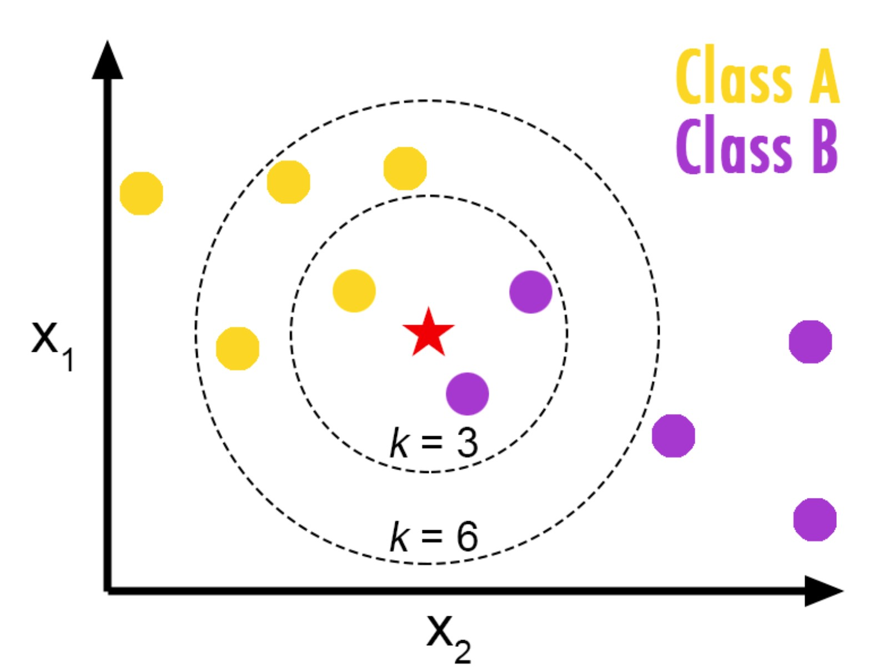
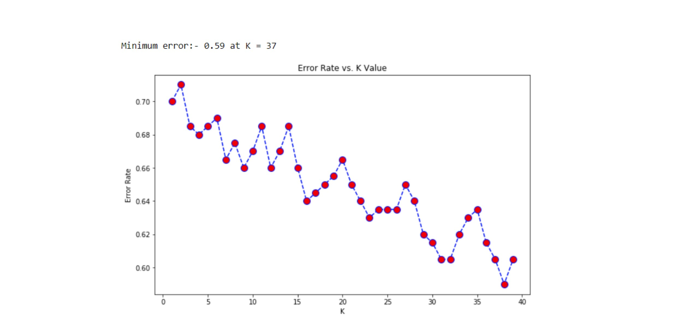
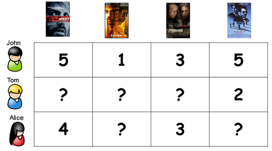

# K Nearest neighbors (KNN)

Before we start learning the K-nearest neighbors algorithm, we first need to clarify the difference between K-means clustering and k-nearest neighbors algorithm because they are often confused with each other.

We want to let you know that the ‘K’ in K-Means Clustering has nothing to do with the ‘K’ in KNN algorithm. k-Means Clustering is an unsupervised learning algorithm that is used for clustering whereas KNN is a supervised learning algorithm used for classification.

**What is K-nearest neighbors (KNN)?**

When you think about KNN think about your friends. You are the average of the people you spend most time with.
When you think about your feature space, think of it as your neighborhood, where each data point has a neightbor.

KNN is a simple algorithm but it's very powerful.  It classifies the data point on how its neighbor is classified. It makes predictions by averaging the k neighbors nearest to a given data point. For example, if we wanted to predict how much money a potential customer would spend at our store, we could find the 5 customers most similar to her and average their spending to make the prediction.

The average could be weighted based on similarity between data points and the similarity distance metric could be defined as well.

**Is KNN a parametric or non-parametric algorithm? Is it used as a classifier or regressor?**

KNN is non-parametric, meaning we don´t make any assumptions about the underlying distribution of your data, and KNN can be used either as a classifier or regressor. 

## How KNN works?

KNN makes predictions by:

-Averaging, for regression tasks.

-Majority voting for classification tasks.

**Steps:**

Step 1: Determine the value for K

Step 2: Calculate the distances between the new input (test data) and all the training data. The most commonly used metrics for calculating distance are Euclidean, Manhattan and Minkowski

Step 3: Sort the distance and determine k nearest neighbors based on minimum distance values

Step 4: Analyze the category of those neighbors and assign the category for the test data based on majority vote

Step 5: Return the predicted class

Let's explain further the follwoing two steps:

1. Choosing the right distance metric. Distance is heavily utilized in KNN. It just measures the distance between two data points.

But what distance metric should I choose?

- Manhattan distance for continuous values. We get the absolute values of the distances with the formula $|x1 - x2| + |y1 - y2|$.

- Euclidean distance for continuous values. Is the shortest and one of the most popular distance metrics of choice.

- Hamming distance for categorical values. If both of our values are related (both have 1) we would get 0, meaning they are exactly the same. If our distance metric is 1, they are not the same.

- Cosine similarity distance (for word vectors). What the angle is between two different points.

2. Choosing the value of k

*image by helloacm.com*

**How do we select the ideal number of neighbors for KNN?**

Choosing the right value of K is called parameter tuning and it’s necessary for better results. By choosing the value of K we square root the total number of data points available in the dataset.

a. K = sqrt (total number of data points).

b. Odd value of K is always selected to avoid confusion between 2 classes.

There is no closed-form solution for calculating k, so various heuristics are often used. It may be easiest to simply do cross validation and test several different values for k and choose the one that produces the smallest error during cross validation.

>As k increases, bias tends to increase and variance decreases.

*image by towardsdatascience.com*

## Pros and Cons

**Pros:**

- No training time is required

- Its simple and easy to implement

- New data points can be added to the train data set at any time since model training is not required.

- No assumptions about the data, so it is good for non linearity.

**Cons:**

- Require feature scaling

- Does not work well when the dimensions are high. Poor runtime on large train set.

- Sensitive to outliers

- Prediction is computationally expensive as we need to compute the distance between the point under consideration and all other points.

## KNN and Recommender Systems

We can extend this concept of neighbors to the applications of recommender systems. The statistical techniques of KNN allows us to find similar subsets of users (neighbors) to make recommendations on. The general idea is that a new user (data point) is matched against the entire data space to discover similar neighbors. The items that the neighbors like are then recommended to the new user.

*Image by www.aurigait.com*

Recommender systems can be loosely broken down into three categories: content based systems, collaborative filtering systems, and hybrid systems (which use a combination of the other two).

**Content based** approach utilizes a series of discrete characteristics of an item in order to recommend additional items with similar properties.

**Collaborative filtering** approach builds a model from a user’s past behaviors (items previously purchased or selected and/or numerical ratings given to those items) as well as similar decisions made by other users. This model is then used to predict items (or ratings for items) that the user may have an interest in.

Most businesses probably use a combination of both (hybrid approach) in their production recommender systems.

Recommender systems can be classified into 3 types:

- Simple recommenders: offer generalized recommendations to every user, based on movie popularity and/or genre. The basic idea is that movies that are more popular will have a higher probability of being liked by the average audience. 

- Content-based recommenders: suggest similar items based on a particular item. This system uses item metadata, such as genre, director, description, actors, etc. for movies, to make these recommendations. The general idea is that if a person likes a particular item, he or she will also like an item that is similar to it. And to recommend that, it will make use of the user's past item metadata. A good example could be YouTube, where based on your history, it suggests you new videos that you could potentially watch.

- Collaborative filtering engines: these systems are widely used, and they try to predict the rating or preference that a user would give an item-based on past ratings and preferences of other users. Collaborative filters do not require item metadata like its content-based counterparts.

Source:

https://www.dataquest.io/blog/top-10-machine-learning-algorithms-for-beginners/#:~:text=The%20first%205%20algorithms%20that,are%20examples%20of%20supervised%20learning.

https://towardsdatascience.com/how-to-find-the-optimal-value-of-k-in-knn-35d936e554eb

https://becominghuman.ai/comprehending-k-means-and-knn-algorithms-c791be90883d

https://towardsdatascience.com/knn-algorithm-what-when-why-how-41405c16c36f

https://medium.com/analytics-vidhya/a-beginners-guide-to-k-nearest-neighbor-knn-algorithm-with-code-5015ce8b227e

https://www.aurigait.com/blog/recommendation-system-using-knn/#:~:text=Collaborative%20Filtering%20using%20k%2DNearest,of%20top%2Dk%20nearest%20neighbors.
