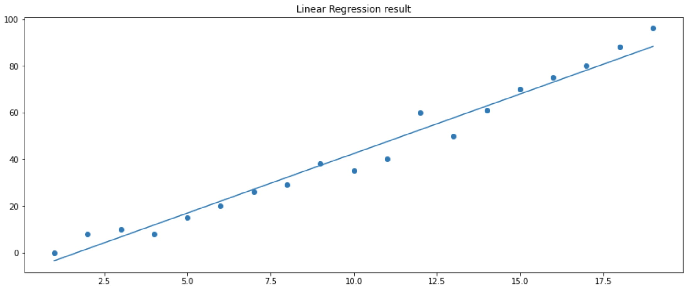
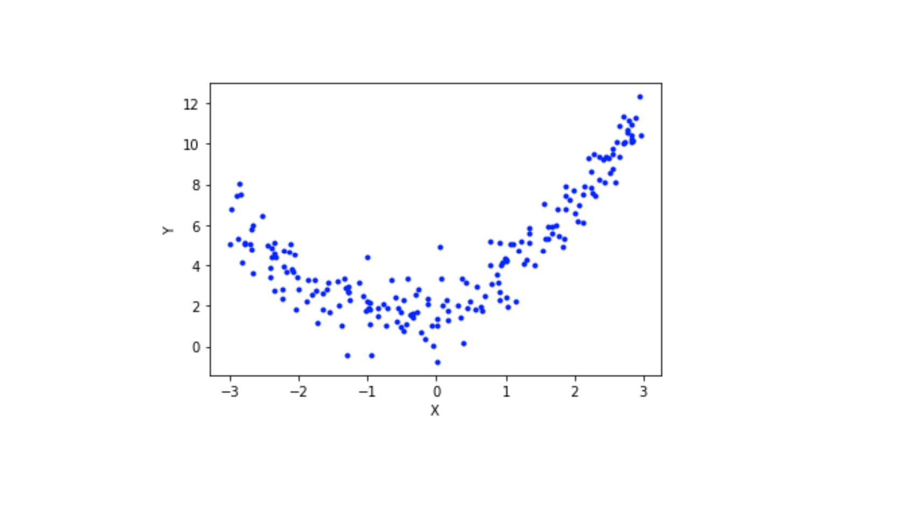
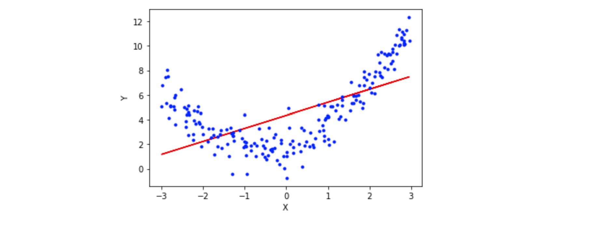
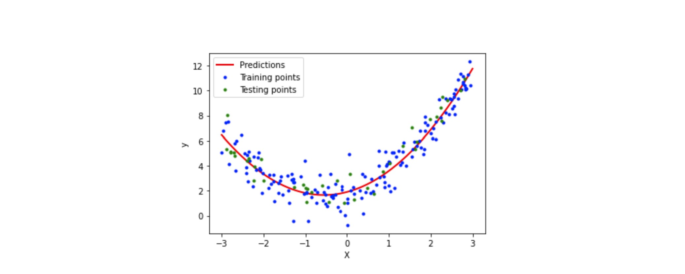
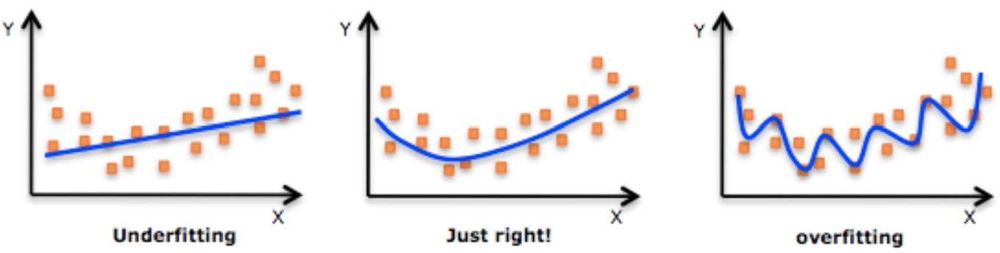

# Linear Regression

Linear regression is a basic yet super powerful machine learning algorithm. As you gain more and more experience with machine learning, you’ll notice how simple is better than complex most of the time. Linear regression is widely used in different supervised machine learning problems and it focuses on regression problem (the value we wish the predict is continuous).

It models the relationship between a single dependent variable (target variable) and one (simple regression) or more (multiple regression) independent variables. The linear regression model assumes a linear relationship between the input and output variables. If this relationship is present, we can estimate the coefficients required by the model to make predictions on new data.

What are the five linear regression assumptions and how can you check for them?

1. Linearity: the target (y) and the features (xi) have a linear relationship. To verify linearity we can plot the errors against the predicted y and look for the values to be symmetrically distributed around a horizontal line with constant variance.

2. Independence: the errors are not correlated with one another. To verify independence we can plot errors over time and look for non-random patterns (for time series data).

3. Normality: the errors are normally distributed. We can verify normality by ploting the errors with a histogram.

4. Homoskedasticity: the variance of the error term is constant across values of the target and features. To verufy it we can plot the errors against the predicted y.

5. No multicollinearity: Look for correlations above ~0.8 between features.

## Simple Linear Regression

Simple linear regression is a linear approach to modeling the relationship between a dependent variable and an independent variable, obtaining a line that best fits the data.

$y = a + bx$

Where X is the vector of features, and a, b are the coefficients we wish to learn. a is the intercept and b is the slope. The intercept represents the value of y when x is 0 and the slope indicates the steepness of the line.
The objective is to obtain the line that best fits our data (the line that minimize the sum of square errors). The error is the difference between the real value y and the predicted value y_hat, which is the value obtained using the calculated linear equation.

error = y(real) - y(predicted) = y(real) - (a+bx)

In linear regression, every dependent value has a single corresponding independent variable that drives its value. For example, in the linear regression formula of $y = 3x + 7$, there is only one possible outcome of 'y' if 'x' is defined as 2.

For curious people, let's see how could we implement linear regression between two variables from scratch:

```py

import numpy as np
import matplotlib.pyplot as plt

# Linear regression from scratch
import random

# Create data from regression
xs = np.array(range(1,20))
ys = [0,8,10,8,15,20,26,29,38,35,40,60,50,61,70,75,80,88,96]

# Put data in dictionary
data = dict()
for i in list(xs):
    data.update({xs[i-1] : ys[i-1]})

# Slope
m = 0
# y intercept
b = 0
# Learning rate
lr = 0.0001
# Number of epochs
epochs = 100000   #----->specifies the number of complete passes of the training dataset through the algorithm.

# Formula for linear line
def lin(x):
    return m * x + b

# Linear regression algorithm
for i in range(epochs):
    # Pick a random point and calculate vertical distance and horizontal distance
    rand_point = random.choice(list(data.items()))
    vert_dist = abs((m * rand_point[0] + b) - rand_point[1])
    hor_dist = rand_point[0]

    if (m * rand_point[0] + b) - rand_point[1] < 0:
        # Adjust line upwards
        m += lr * vert_dist * hor_dist
        b += lr * vert_dist   
    else:
        # Adjust line downwards
        m -= lr * vert_dist * hor_dist
        b -= lr * vert_dist
        
# Plot data points and regression line
plt.figure(figsize=(15,6))
plt.scatter(data.keys(), data.values())
plt.plot(xs, lin(xs))
plt.title('Linear Regression result')  
print('Slope: {}\nIntercept: {}'.format(m, b))

```

    Slope: 5.096261164108786
    Intercept: -8.549690202482191

  

    
Scikit-learn Linear regression makes it easier for us to implement and optimize linear regression models. You can see the scikit-learn linear regression documentation here: https://scikit-learn.org/stable/modules/generated/sklearn.linear_model.LinearRegression.html

## Multiple Linear Regression 

Multiple linear regression is a more specific calculation than simple linear regression. For straight-forward relationships, simple linear regression may easily capture the relationship between the two variables. For more complex relationships requiring more consideration, multiple linear regression is often better.

A multiple regression formula has multiple slopes (one for each variable) and one y-intercept. It is interpreted the same as a simple linear regression formula except there are multiple variables that all impact the slope of the relationship. It should be used when multiple independent variables determine the outcome of a single dependent variable.

$y =b₀+b₁x₁+b₂x₂+b₃x₃+…+bₙxₙ$

Multiple regressions can be linear and nonlinear. Multiple regressions are based on the assumption that there is a linear relationship between both the dependent and independent variables. It also assumes no major correlation between the independent variables.


**Is polynomial regression the same as multiple regression?**

Polynomial Regression is a form of Linear regression known as a special case of Multiple linear regression which estimates the relationship as an nth degree polynomial.

**Is a polynomial regression non-linear?**

No. It is a linear model that can be used to fit non-linear data.

## Polynomial Linear Regression

Polynomial Regression is derived using the same concept of Linear regression with few modifications to increase accuracy. Simple linear regression algorithm only works when the relationship between the data is linear, but suppose we have non-linear data, then linear regression will not be capable to draw a best-fit line.

**How Polynomial Regression overcomes the problem of Non-Linear data?**

Polynomial regression is a form of Linear regression where only due to the Non-linear relationship between dependent and independent variables we add some polynomial terms to linear regression to convert it into Polynomial regression. This should be done before preprocessing stage using some degree.

The equation of polynomial becomes something like this.

                 $y = a0 + a1x1 + a2x12 + … + anx1n$

The degree of order to use is a hyperparameter, and we need to choose it wisely. Using a high degree of polynomial tries to overfit the data and for smaller values of degree, the model tries to underfit, so we need to find the optimal value of a degree.


Let's see an example of hoy to implement this with code:

```py

#import libraries

import numpy as np
import matplotlib.pyplot as plt
from sklearn.model_selection import train_test_split
from sklearn.linear_model import LinearRegression
from sklearn.preprocessing import PolynomialFeatures
from sklearn.metrics import r2_score

#create and visualize the data

X = 6 * np.random.rand(200, 1) - 3
y = 0.8 * X**2 + 0.9*X + 2 + np.random.randn(200, 1)
#equation used -> y = 0.8x^2 + 0.9x + 2
#visualize the data
plt.plot(X, y, 'b.')
plt.xlabel("X")
plt.ylabel("Y")
plt.show()

```



```py
#split the data

x_train, x_test, y_train, y_test = train_test_split(X, y, test_size=0.2, random_state=2)

#apply simple linear regression

lr = LinearRegression()
lr.fit(x_train, y_train)
y_pred = lr.predict(x_test)
print(r2_score(y_test, y_pred))

#plot the prediction line

plt.plot(x_train, lr.predict(x_train), color="r")
plt.plot(X, y, "b.")
plt.xlabel("X")
plt.ylabel("Y")
plt.show()

```



Now we will convert the input to polynomial terms by using the degree as 2 because of the equation we have used, the intercept is 2. 

```py

#applying polynomial regression degree 2

poly = PolynomialFeatures(degree=2, include_bias=True)
x_train_trans = poly.fit_transform(x_train)
x_test_trans = poly.transform(x_test)

#include bias parameter
lr = LinearRegression()
lr.fit(x_train_trans, y_train)
y_pred = lr.predict(x_test_trans)
print(r2_score(y_test, y_pred))

#looking at coefficients and intercept value

print(lr.coef_)
print(lr.intercept_)

#visualize predicted line

X_new = np.linspace(-3, 3, 200).reshape(200, 1)
X_new_poly = poly.transform(X_new)
y_new = lr.predict(X_new_poly)
plt.plot(X_new, y_new, "r-", linewidth=2, label="Predictions")
plt.plot(x_train, y_train, "b.",label='Training points')
plt.plot(x_test, y_test, "g.",label='Testing points')
plt.xlabel("X")
plt.ylabel("y")
plt.legend()
plt.show()

```


After converting to polynomial terms we fit the linear regression which is now working as polynomial regression. Our coefficient was 0.9 and it has predicted 0.88 and intercept was 2 and it has given 1.9 which is very close to the original and the model can be said as a generalized model.

To implement polynomial regression with multiple columns see the sklearn polynomial regression documentation: https://scikit-learn.org/stable/modules/generated/sklearn.preprocessing.PolynomialFeatures.html


Having more features may seem like a perfect way for improving the accuracy of our trained model (reducing the loss) because the model that will be trained will be more flexible and will take into account more parameters. On the other hand, we need to be extremely careful about overfitting the data. As we know, every dataset has noisy samples. For example, a data point wasn’t measured accurately or is not up to date. The inaccuracies can lead to a low-quality model if not trained carefully. The model might end up memorizing the noise instead of learning the trend of the data.

Let's see an overfitted non-linear example:



If not filtered and explored up front, some features can be more destructive than helpful, repeat information that already expressed by other features and add high noise to the dataset.

Because overfit is an extremely common issue in many machine learning problems, there are different approaches to solving it. The main one is simplifying the models as much as possible. Simple models do not (usually) overfit. On the other hand, we need to pay attention the to gentle trade-off between overfitting and underfitting a model.


Source:

https://scikit-learn.org/

https://www.investopedia.com/ask/answers/060315/what-difference-between-linear-regression-and-multiple-regression.asp

https://www.analyticsvidhya.com/blog/2021/07/all-you-need-to-know-about-polynomial-regression/#:~:text=Polynomial%20Regression%20is%20a%20form%20of%20Linear%20regression%20known%20as,as%20an%20nth%20degree%20polynomial.

https://towardsdatascience.com/simple-and-multiple-linear-regression-with-python-c9ab422ec29c

https://medium.com/hackernoon/practical-machine-learning-ridge-regression-vs-lasso-a00326371ece


