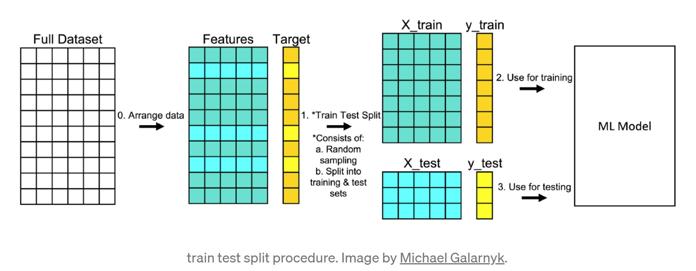
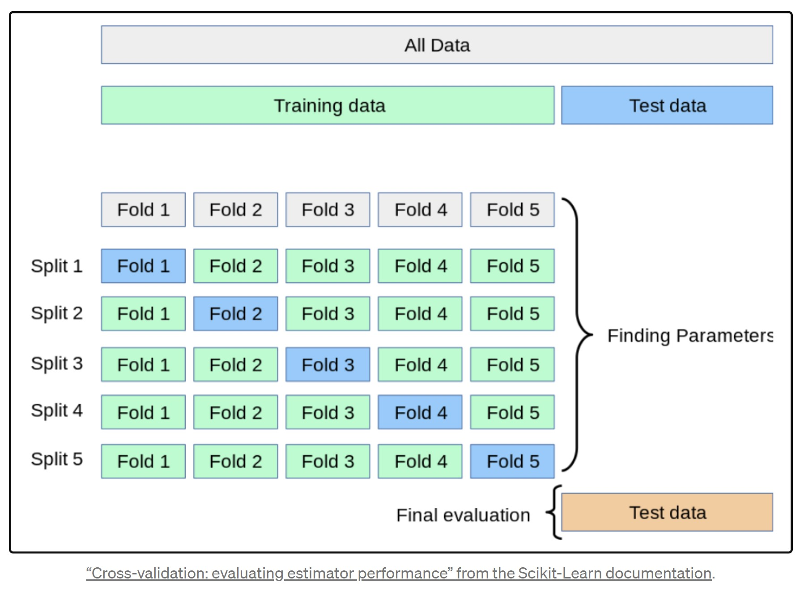

# Machine Learning Basics

## What is Machine Learning?

Machine learning is the field of science that studies algorithms that approximate functions increasingly well as they are given more observations. 

Machine learning algorithms are programs that can learn from data and improve from experience, without human intervention. Learning tasks may include learning the function that maps the input to the output, learning the hidden structure in unlabeled data; or ‘instance-based learning’, where a class label is produced for a new instance by comparing the new instance (row) to instances from the training data, which were stored in memory. 

## Types of machine learning algorithms

### Supervised learning 

It is useful in cases where a label is available for a certain training set, but is missing and needs to be predicted for other instances. It uses the labeled training data to learn the mapping function that turns input variables (X) into the output variable (Y).

Labeled data is data that has the information about target variable for each instance. 

Types of supervised machine learning algorithms:

- Classification is used to predict the outcome of a given sample when the output variable is in the form of categories.

- Regression is used to predict the outcome of a given sample when the output variable is in the form of real values.

- Ensembling is another type of supervised learning. It means combining the predictions of multiple machine learning models that are individually weak to produce a more accurate prediction on a new sample. Ensembling means combining the results of multiple learners (classifiers) for improved results, by voting or averaging. Voting is used during classification and averaging is used during regression. The idea is that ensembles of learners perform better than single learners. Bagging and Boosting are two types of ensambling algorithms.

**What is the difference between bagging and boosting?**

Bagging and boosting are both ensemble methods, meaning they combine many weak predictors to create a strong predictor. One key difference is that bagging builds independent models in parallel, whereas boosting builds models sequentially, at each step emphasizing the observations that were missed in previous steps.

Some examples of supervised learning algorithms are:

1. Decision Trees

2. Naive Bayes Classification

3. Ordinary Least Squares Regression

4. Logistic Regression

5. Support Vector Machines


### Unsupervised learning

It is useful in cases where the challenge is to discover implicit relationships in a given unlabeled dataset. In other words, we only have the input variables (X) and no corresponding output variables. 

Types of unsupervised learning:

- Association is used to discover the probability of the co-occurrence of items in a collection. For example, an association model might be used to discover that if a customer purchases bread, s/he is 80% likely to also purchase eggs.

- Clustering is used to group samples such that objects within the same cluster are more similar to each other than to the objects from another cluster.

- Dimensionality Reduction is used to reduce the number of variables of a data set while ensuring that important information is still conveyed. Dimensionality Reduction can be done using Feature Extraction methods and Feature Selection methods.

Some examples of unsupervised learning algorithms are:

1. K-means

2. PCA


### Reinforcement learning

It falls between these 2 extremes — It describes a set of algorithms that learn from the outcome of each decision.
Reinforcement algorithms usually learn optimal actions through trial and error. 

For example, a robot could use reinforcement learning to learn that walking forward into a wall is bad, but turning away from a wall and walking is good, or imagine, a video game in which the player needs to move to certain places at certain times to earn points. A reinforcement algorithm playing that game would start by moving randomly but, over time through trial and error, it would learn where and when it needed to move the in-game character to maximize its point total.


## Online vs offline learning

While online learning does have its uses, traditional machine learning is performed offline using the batch learning method. 
‍
In batch learning, data is accumulated over a period of time. The machine learning model is then trained with this accumulated data from time to time in batches. If new data comes in, an entire new batch (including all the old and new data) must be fed into the algorithm to learn from the new data. In batch learning, the machine learning algorithm updates its parameters only after consuming batches of new data.

It is the direct opposite of online learning because the model is unable to learn incrementally from a stream of live data. Online learning refers to updating models incrementally as they gain more information.
 


## How is data divided?

What is training data and what is it used for?

Training data is a set of examples that will be used to train the machine learning model.
For supervised machine learning, this training data must have a labeled. What you are trying to predict must be defined.
For unsupervised machine learning, the training data will contain only features and will use no labeled targets. What you are trying to predict is not defined.

What is a validation set and why use one?

A validation set is a set of data that used to evaluate a model's performance during training/model selection. After models are trained, they are evaluated on the validation set to select the best possible model.

It must never be used for training the model directly.

It must also not be used as the test data set because we have biased our model selection toward working well on this data, even tough the model was not directly trained on it.

What is a test set and why use one?

A test set is a set of data not used during training or validation. The model's performance is evaluated on the test set to predict how well it will generalize to new data.

### Training and validation techniques

A goal of supervised learning is to build a model that performs well on new data. If you have new data, it’s a good idea to see how your model performs on it. The problem is that you may not have new data, but you can simulate this experience with a procedure like train test split.

**Train-test-split**

Train test split is a model validation procedure that allows you to simulate how a model would perform on new/unseen data. Here is how the procedure works.

1. Make sure your data is arranged into a format acceptable for train test split. In scikit-learn, this consists of separating your full dataset into Features and Target.

2. Split the dataset into two pieces: a training set and a testing set. This consists of random sampling without replacement about 75% (you can vary this) of the rows and putting them into your training set and putting the remaining 25% to your test set. Note that the colors in “Features” and “Target” indicate where their data will go (“X_train”, “X_test”, “y_train”, “y_test”) for a particular train test split.

2. Train the model on the training set. This is “X_train” and “y_train” in the image.

3. Test the model on the testing set (“X_test” and “y_test” in the image) and evaluate the performance.



Example code:

```py

#Separate your full dataset into Features and Target

features = [‘bedrooms’,’bathrooms’,’sqft_living’,’sqft_lot’,’floors’]
X = df.loc[:, features]
y = df.loc[:, [‘price’]]

#Splits the data and returns a list which contains four NumPy arrays. 
#train_size = 0.75 puts 75% of the data into a training set and the remaining 25% into a testing set

X_train, X_test, y_train, y_test = train_test_split(X, y, random_state=0, train_size = 0.75)

#Fitting the model

reg.fit(X_train, y_train)

#Making predictions on validation set(X_test)

reg.predict(X_test)

#Measuring the results

score = reg.score(X_test, y_test)
print(score)

```

**Cross Validation**

Another model validation technique is Cross validation, also known as out of sampling technique. This is a resampling technique for more accurately training and validation models. It rotates what data is held out from model training to be used as the validation data. 

Several models are trained and evaluated, with every piece of data being held out from one model. The average performance of all the models is then calculated.

It is a more reliable way to validate models but is more computationally costly. For example, 5-fold cross validation requires training and validating 5 models instead of 1.



Some cross-validation techniques:

- Leave p out cross-validation

- Leave one out cross-validation

- Holdout cross-validation

- Repeated random subsampling validation

- k-fold cross-validation

- Stratified k-fold cross-validation

- Time Series cross-validation

- Nested cross-validation


Implementation of these cross-validations can be found out in the sklearn package. Read this [sklearn documentation](https://scikit-learn.org/stable/modules/cross_validation.html) for more details. K-fold and stratified k-fold cross-validations are the most used techniques. Here we will show how to implement K-fold cross validation.


K-fold cross-validation is a superior technique to validate the performance of our model. It evaluates the model using different chunks of the data set as the validation set.

We divide our data set into K-folds. K represents the number of folds into which you want to split your data. If we use 5-folds, the data set divides into five sections. In different iterations, one part becomes the validation set.

*K-fold cross validation implementation*

```py
from sklearn.model_selection import cross_validate

#Example with a function:

def cross_validation(model, _X, _y, _cv=5):

    scoring = ['accuracy', 'precision']

    results = cross_validate(estimator=model,
                                X=_X,
                                y=_y,
                                cv=_cv,
                                scoring=_scoring,
                                return_train_score=True)

    return {"Training Accuracy scores": results['train_accuracy'],
              "Mean Training Accuracy": results['train_accuracy'].mean()*100,
              "Training Precision scores": results['train_precision'],
              "Mean Training Precision": results['train_precision'].mean(),
              "Validation Accuracy scores": results['test_accuracy'],
              "Mean Validation Accuracy": results['test_accuracy'].mean()*100,
              "Validation Precision scores": results['test_precision'],
              "Mean Validation Precision": results['test_precision'].mean(),
              }
        
```

The custom cross_validation function in the code above will perform 5-fold cross-validation. It returns the results of the metrics specified above.

The estimator parameter of the cross_validate function receives the algorithm we want to use for training. The parameter X takes the matrix of features. The parameter y takes the target variable. The parameter scoring takes the metrics we want to use for evaluation. We pass a list containing metrics we want to use to check our model.


With any model validation procedure it is important to keep in mind some advantages and disadvantages which in the case of train test split are:

Some Advantages:

- Relatively simple and easier to understand than other methods like K-fold cross validation

- Helps avoid overly complex models that don’t generalize well to new data

Some Disadvantages:

- Eliminates data that could have been used for training a machine learning model (testing data isn’t used for training)

- With the change in the random state of the split, the accuracy of the model also changes, so we are not able to achieve a fixed accuracy for the model. The testing data should be kept independent of the training data so that no data leakage occurs. 

## What is overfitting?

Overfitting is when a model makes much better predictions on known data (data included in the training set) than unknown data (data not included in the training set).

How can we combat overfitting?

A few ways of combatting overfitting are:

- simplify the model (often done by changing)

- select a different model

- use more training data

- gather better quality data to combat overfitting

How can we tell if our model is overfitting the data?

If our training error is low and our validation error is high, then our model is most likely overfitting our training data.

How can we tell if our model is underfitting the data?

If our training and validation error are both relatively equal and very high, then our model is most likely underfitting our training data.

Source:
    
https://towardsdatascience.com/train-test-split-and-cross-validation-in-python-80b61beca4b6

https://www.kdnuggets.com/2020/09/understanding-bias-variance-trade-off-3-minutes.html

https://medium.com/@ranjitmaity95/7-tactics-to-combat-imbalanced-classes-in-machine-learning-datase-4266029e2861

https://www.kdnuggets.com/2016/08/10-algorithms-machine-learning-engineers.html

https://www.dataquest.io/blog/top-10-machine-learning-algorithms-for-beginners/#:~:text=The%20first%205%20algorithms%20that,are%20examples%20of%20supervised%20learning.

https://www.qwak.com/post/online-vs-offline-machine-learning-whats-the-difference#:~:text=While%20online%20learning%20does%20have,using%20the%20batch%20learning%20method.&text=In%20batch%20learning%2C%20data%20is,time%20to%20time%20in%20batches.

https://towardsdatascience.com/10-machine-learning-algorithms-you-need-to-know-77fb0055fe0

https://hackernoon.com/introduction-to-recommender-system-part-1-collaborative-filtering-singular-value-decomposition-44c9659c5e75

https://towardsdatascience.com/understanding-train-test-split-scikit-learn-python-ea676d5e3d1

https://towardsdatascience.com/understanding-8-types-of-cross-validation-80c935a4976d

https://www.section.io/engineering-education/how-to-implement-k-fold-cross-validation/
