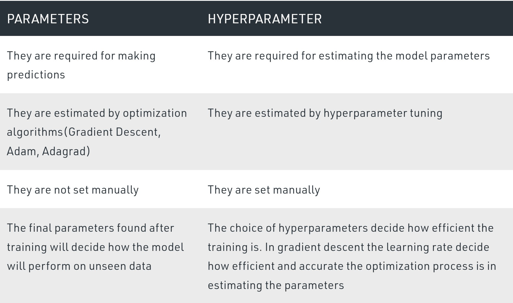

# Model Hyperparameter Optimization

## What is a model hyperparameter?

A model hyperparameter is the parameter whose value is set before the model start training. They cannot be learned by fitting the model to the data.

Examples of model hyperparameters in different models:

- Learning rate in gradient descent

- Number of iterations in gradient descent

- Number of layers in a Neural Network

- Number of neurons per layer in a Neural Network

- Number of clusters(k) in k means clustering

## Difference between parameter and hyperparameter

A model parameter is a variable of the selected model which can be estimated by fitting the given data to the model. For example in linear regression, the slope and the intercept of the line are two parameters estimated by fitting a straight line to the data by minimizing the RMSE.

And, as we already mentioned, a model hyperparameter value is set before the model start training and they cannot be learned by fitting the model to the data.

The best part is that you get a choice to select these for your model. Of course, you must select from a specific list of hyperparameters for a given model as it varies from model to model. 

Often, we are not aware of optimal values for hyperparameters which would generate the best model output. So, what we tell the model is to explore and select the optimal model architecture automatically. This selection procedure for hyperparameter is known as Hyperparameter Tuning.

## What are two common ways to automate hyperparameter tuning?

1. Grid Search - test every possible combination of pre-defined hyperparameter values and select the best one.

2. Randomized Search - randomly test possible combinations of pre-defined hyperparameter values and select the best tested one.

**What are the pros and cons of grid search?**

**Pros:**

Grid Search is great when we need to fine-tune hyperparameters over a small search space automatically. For example, if we have 100 different datasets that we expect to be similar, like solving the same problem repeatedly with different populations. We can use grid search to automatically fine-tune the hyperparameters for each model.

**Cons:** 

Grid Search is computationally expensive and inefficient, often searching over parameter space that has very little chance of being useful, resulting it being extremely slow. It's especially slow if we need to search a large space since it's complexity increases exponentially as more hyperparameters are optimized.

**What are the pros and cons of randomized search?**

**Pros:**

Randomized search does a good job finding near-optimal hyperparameters over a very large search space relatively quickly and doesn't suffer from the same exponential scaling problem as grid search.

**Cons:**

Randomized search does not fine-tune the results as much as grid search does since it tipically does not test every possible combination of parameters.

Source: 

https://www.geeksforgeeks.org/difference-between-model-parameters-vs-hyperparameters/

https://www.mygreatlearning.com/blog/hyperparameter-tuning-explained/