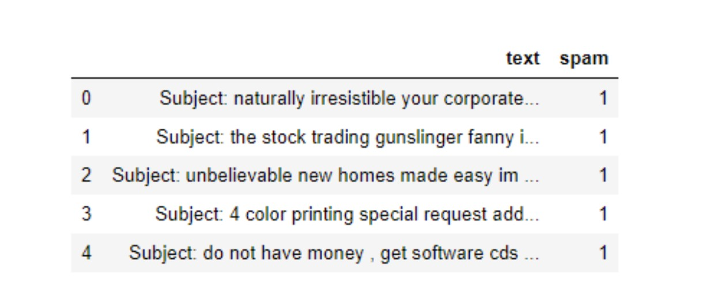
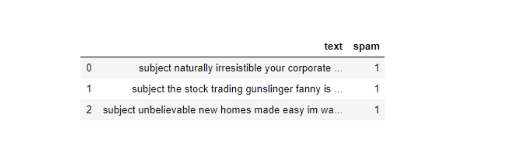
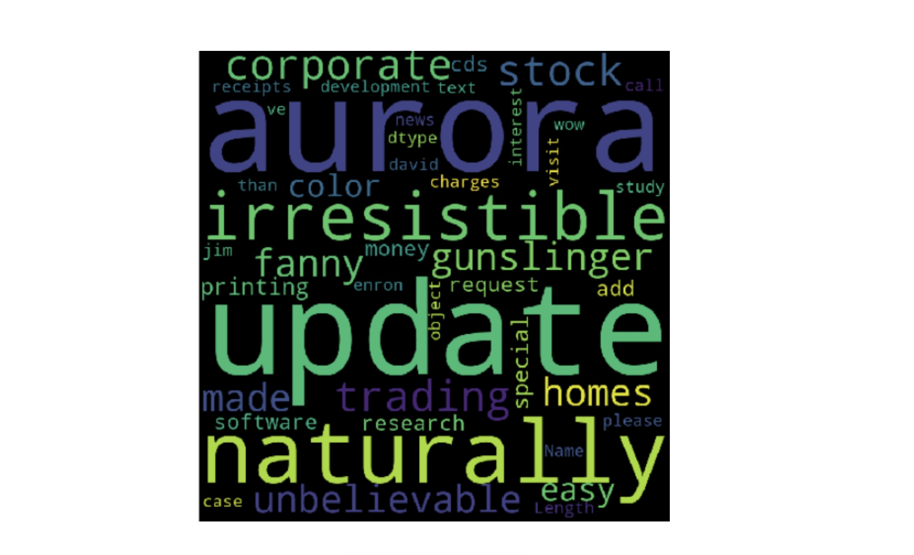

# Natural Language Processing (NLP)

**First of all, what is text classification?**

Text Classification is an automated process of classification of text into predefined categories. We can classify Emails into spam or non-spam, news articles into different categories like Politics, Stock Market, Sports, etc.

This can be done with the help of Natural Language Processing and different Classification Algorithms like Naive Bayes, Support Vector Machine and even Neural Networks in Python.

**What is Natural language processing?**

Natural Language Processing (NLP) is an Artificial Intelligence (AI) field that enables computer programs to recognize, interpret, and manipulate human languages.

While a computer can actually be quite good at finding patterns and summarizing documents, it must transform words into numbers before making sense of them. This transformation is needed because machines “learn” thanks to mathematics, and math doesn’t work very well on words. Before transforming the words into numbers, they are often cleaned of things like special characters and punctuation, and modified into forms that make them more uniform and interpretable.

## Steps to build an NLP model

- **Step 1:** Add the required libraries.

- **Step 2:** Set a random seed. This is used to reproduce the same result every time if the script is kept consistent otherwise each run will produce different results. The seed can be set to any number.

- **Step 3:** Load the dataset

- **Step 4:** Preprocess the content of each text. This is a very important step.

    Real-world data is often incomplete, inconsistent, and/or lacking in certain behaviors or trends, and is likely to contain many errors. Data pre-processing is a proven method of resolving such issues.This will help in getting better results through the classification algorithms. You can see the detail of the cleaning process below in "Detail of data pre-processing steps".

- **Step 5:** Separate train and test datasets

- **Step 6:** Encoding the target

    Label encode the target variable to transform its string type, if so, into numerical values which the model can understand. This can be done as one of your first   steps too, but make sure it is converted before splitting the data into train and test.

- **Step 7:** Bag of words (vectorization)

    It is the process of converting sentence words into numerical feature vectors. It is useful as models require data to be in numeric format. So if the word is present in that particular sentence then we will put 1 otherwise 0. The most popular method is called TF-IDF. It stands for “Term Frequency — Inverse Document” Frequency. TF-IDF are word frequency scores that try to highlight words that are more interesting, e.g. frequent in a document but not across documents. 
    
    This will help TF-IDF build a vocabulary of words which it has learned from the corpus data and it will assign a unique integer number to each of these words. Acoording to the following code, there will be a maximum of 5000 unique words. Finally we will transform X_train and X_test to vectorized X_train_Tfidf and X_test_Tfidf. These will now contain for each row a list of unique integer number and its associated importance as calculated by TF-IDF.

```py
Tfidf_vect = TfidfVectorizer(max_features=5000)
Tfidf_vect.fit(news_df['text_final'])

X_train_Tfidf = Tfidf_vect.transform(X_train)
X_test_Tfidf = Tfidf_vect.transform(X_test)
```

- **Step 8:** Use the ML Algorithm to Predict the outcome.


### Detail of data pre-processing steps

The following parts of the cleaning process will have different code implementation examples. You can always add or remove steps which best suits the data set you are dealing with:

**1. Remove blank or duplicated rows** in the data. We can do this using dropna and drop_duplicates respectively.

**2. Change all the text to lower case** because python interprets upper and lower case differently. Here an example on how to convert entries to lower case. Remember you can include this step as part of a cleaning function.

```py
news_df['text'] = [entry.lower() for entry in news_df['text']]
```

**3. Remove non-alpha text, tags, and punctuation** characters. This can be done with the help of regular expressions.

**4. Remove Stop words.** It removes all the frequently used words such as “I, or, she, have, did, you, to”.

Both steps 3 and 4 of the cleaning process (removing special characters and stop words) can be easily achieved by using the nltk and string modules. Let's see an example of the punctuation and stop words this modules have already defined.

```py
import string
import nltk

nltk.download('stopwords')
nltk.download('punkt')

stopwords = nltk.corpus.stopwords.words('english')
punctuation = string.punctuation

print(stopwords[:5])
print(punctuation)
>>>   ['i', 'me', 'my', 'myself', 'we']
>>>   !"#$%&'()*+,-./:;<=>?@[\]^_`{|}~

#creating functions to remove punctuation and stop words

def remove_punctuation(text):
    no_punct=[words for words in text if words not in string.punctation]
    words_wo_punct=''.join(no_punct)
    return words_wo_punct
news_df['title_wo_punct'] = news_df['title'].apply(lambda x: remove_punctuation(x))

def remove_stopwords(text):
    text=[word for word in text if word not in stopword]
    return text
news_df['title_wo_punct_split_wo_stopwords'] = news_df['title_wo_punct_split'].apply(lambda x: remove_stopwords(x))

```

We can also decide to remove the stop words by adding a parameter called “stop_words” in the “TFidfVectorizer” of the vectorization step.

**5. Word Tokenization.** It is the process of breaking a stream of text up into words, phrases, symbols, or other meaningful elements called tokens. The list of tokens becomes input for further processing. NLTK Library has word_tokenize and sent_tokenize to easily break a stream of text into a list of words or sentences, respectively. Here a couple of examples. The second example is a function that tokenizes and converts to lower case at the same time.

```py
#Example 1
news_df['text']= [word_tokenize(entry) for entry in news_df['text']]

#Example 2 : 
def tokenize(text):
    split=re.split("\W+",text) #--->\W+” splits on one or more non-word character
    return split
news_df['title_wo_punct_split']=news_df['title_wo_punct'].apply(lambda x: tokenize(x.lower())) #--->The new column has created a list, by splitting all the non-word characters.
```

**6. Word Lemmatization/ Stemming.** It is the process of reducing the inflectional forms of each word into a common base or root. The main purpose is to reduce variations of the same word, thereby reducing the corpus of words we include in the model. The difference between stemming and lemmatizing is that, stemming chops off the end of the word without taking into consideration the context of the word. Whereas, Lemmatizing considers the context of the word and shortens the word into its root form based on the dictionary definition. Stemming is a faster process compared to Lemmantizing. Hence, it a trade-off between speed and accuracy. For example, if the message contains some error word like “frei” which might be misspelled for “free”. Stemmer will stem or reduce that error word to its root word i.e. “fre”. As a result, “fre” is the root word for both “free” and “frei”. 

```py
print(ps.stem('believe'))
print(ps.stem('believing'))
print(ps.stem('believed'))
print(ps.stem('believes'))
```

*The stem results for all of the above is believ*

```py
print(wn.lemmatize(“believe”))
print(wn.lemmatize(“believing”))
print(wn.lemmatize(“believed”))
print(wn.lemmatize(“believes”))
```

*The lemmatize results in the order of print statements are — believe, believing, believed, and belief. Lemmatize produces the same result if the word is not in the corpus. Believe is lemmatized to belief (the root word)*
    
    
## Cleaning process with a word cloud example

What is a word cloud? 

Word clouds are a useful way to visualize text data because they make understanding word frequencies easier. Words that appear more frequently within the email text appear larger in the cloud. Word Clouds make it easy to identify “key words.”

```py
# Importing libraries
import pandas as pd
import sqlite3
import regex as re
import matplotlib.pyplot as plt
from wordcloud import WordCloud

# Loading dataset
df = pd.read_csv('emails.csv')

# Visualize first rows

df.head()
```




```py
# EDA: eliminate duplicate rows and establish some baseline counts.
print("spam count: " +str(len(df.loc[df.spam==1])))
print("not spam count: " +str(len(df.loc[df.spam==0])))
print(df.shape)
df['spam'] = df['spam'].astype(int)

df = df.drop_duplicates()
df = df.reset_index(inplace = False)[['text','spam']]
```

All the text should be in lower case and with no punctuation marks or special characters, to make it easier to analyze. Using regular expressions, it is easy to clean the text using a loop. The following code creates an empty list clean_desc, then uses a for loop to go through the text line by line, setting it to lower case, removing punctuation and special chars, and appending it to the list. Finally it replaces the text column with the data in the clean_desc list.

```py
clean_desc = []

for w in range(len(df.text)):
    desc = df['text'][w].lower()
    
    #remove punctuation
    desc = re.sub('[^a-zA-Z]', ' ', desc)
    
    #remove tags
    desc=re.sub("&lt;/?.*?&gt;"," &lt;&gt; ",desc)
    
    #remove digits and special chars
    desc=re.sub("(\\d|\\W)+"," ",desc)
    
    clean_desc.append(desc)

#assign the cleaned descriptions to the data frame
df['text'] = clean_desc

df.head(3)
```



Removing **stop words** from the email text allows the more relevant frequent words to stand out. Removing stop words is a common technique! Some Python libraries like NLTK come pre-loaded with a list of stop words, but it is easy to create one from scratch. The following code includes a few email related words like “re” and “subject” but it is up to the analyst to determine what words should be included or excluded.

```py
stop_words = ['is','you','your','and', 'the', 'to', 'from', 'or', 'I', 'for', 'do', 'get', 'not', 'here', 'in', 'im', 'have', 'on', 're', 'new', 'subject']
```

Now, how can we construct a word cloud? 

There is a Python library for creating word clouds. We can use pip to install it. The word cloud can be set with several parameters like height and width, stop words, and max words, and it can be shown using Matplotlib.

```py
pip install wordcloud

wordcloud = WordCloud(width = 800, height = 800, background_color = 'black', stopwords = stop_words, max_words = 1000
                      , min_font_size = 20).generate(str(df['text']))
                      
#plot the word cloud
fig = plt.figure(figsize = (8,8), facecolor = None)
plt.imshow(wordcloud)
plt.axis('off')
plt.show()
```



When you look at a word cloud, notice it is primarily single words. The larger the word, the higher its frequency. To prevent the word cloud from outputting sentences, the text goes through a processes called tokenization. It is the process of breaking down a sentence into the individual words. The individual words are called tokens.


Source:

https://projectgurukul.org/spam-filtering-machine-learning/

https://towardsdatascience.com/3-super-simple-projects-to-learn-natural-language-processing-using-python-8ef74c757cd9

https://www.youtube.com/watch?v=VDg8fCW8LdM

https://medium.com/@bedigunjit/simple-guide-to-text-classification-nlp-using-svm-and-naive-bayes-with-python-421db3a72d34

https://towardsdatascience.com/nlp-in-python-data-cleaning-6313a404a470


