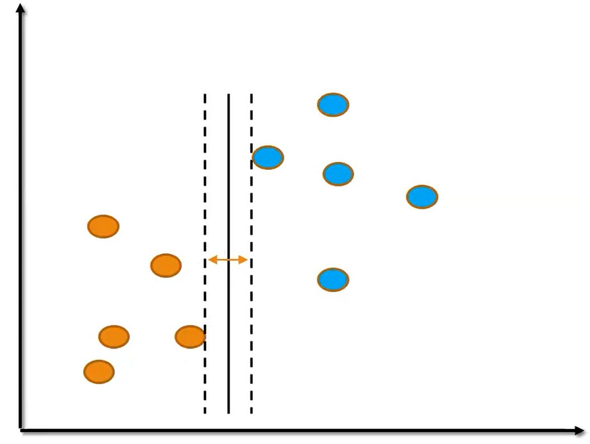
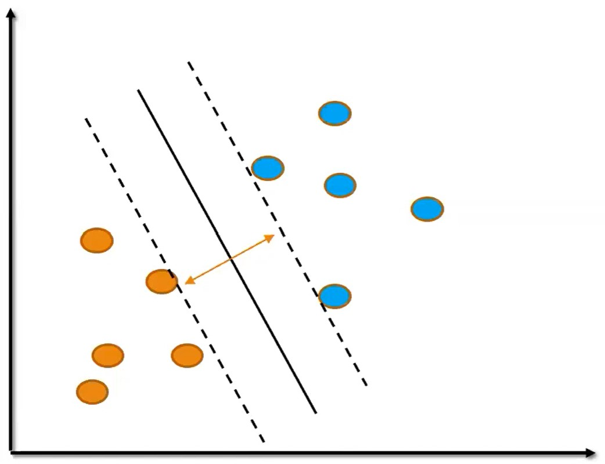
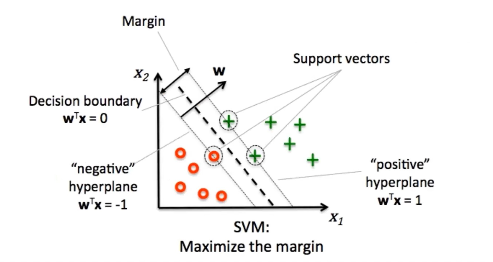

# Support Vector Machine

Support Vector Machine is a supervised learning algorithm so we need to have a labeled dataset to be able to use SVM. It can be used both for regression and classification and it can be of linear and non linear type. The optimization objective is to maximize the margin, which means finding the line for which the distance of the closest points is the farthest possible.

Let's see some graphs where the algorithm is trying to find the maximum distance between the closest points:

We can see that the third graph between lines is the greatest distance we can observe in order to put between our two groups.

To completely understand the Support Vector Machine terminology, let's look at the parts of it:

To sum up some possible uses of SVM models, they can be used for:

-Linear classification

-Non linear classification

-Linear Regression

-Non linear Regression

## What hyperparameters can we tune for SVM?

The hyperparameters that we commonly tune for SVM are:

-Regularization /cost parameter

-Kernel

-Degree of polynomial (if using a polynomial kernel)

-Gamma (modifies the influence of nearby points on the support vector for Gaussian RBF kernels)

-Coef() (influences impact of high vs low degree polynomials for polynomial or sigmoid kernels)

-Epsilon (a margin term used for SVM regressions)

**What common kernels can be used for SVM?**

1. Linear 

2. Polynomial

3. Gaussian RBF

4. Sigmoid

**Why is it important to scale features before using SVM?**

SVM tries to fit the widest gap between all classes, so unscaled features can cause some features to have a significantly larger or smaller impact on how the SVM split is created.

**Can SVM produce a probability score along with its classification prediction?**

No.

