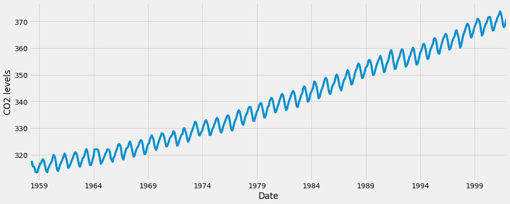
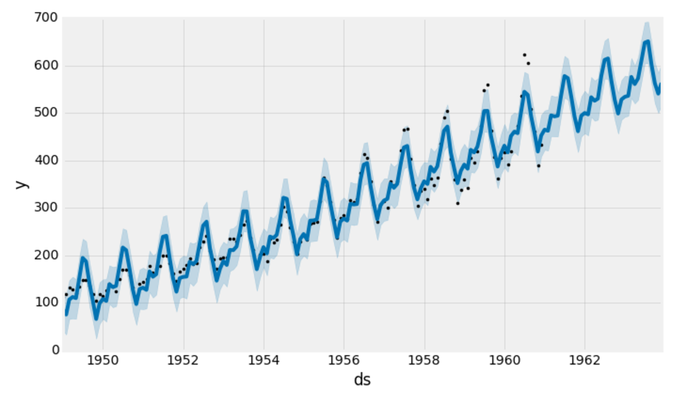

# Time Series

Time series data is any type of information presented as an ordered sequence. Sensors, monitoring, weather forecasts, stock prices, exchange rates, application performance metrics are just a few examples of the type of data that includes time series.

Time is the central attribute that distinguishes time series from other types of data. The time intervals applied to assemble the collected data in a chronological order are called the time series frequency. So having time as one of the main axes would be the main indicator that a given dataset is a time series. However, just because a series of events has a time element does not automatically make it a time series.

When working with time-series data, there are a few things to look out for:

- seasonality: does the data display a clear periodic pattern?

- trend: does the data follow a consistent upwards or downward slope?

- noise: are there any outlier points or missing values that are not consistent with the rest of the data?

## The ARIMA method

Forecasting is the process of making predictions of the future, based on past and present data. One of the most common methods for this is the ARIMA model, which stands for AutoRegressive Integrated Moving Average.

ARIMA models are denoted with the notation ARIMA(p, d, q). These three parameters account for seasonality, trend, and noise in data.

- **p** is the parameter associated with the auto-regressive aspect of the model, which incorporates past values. For example, forecasting that if it rained a lot over the past few days, you state its likely that it will rain tomorrow as well.

- **d** is the parameter associated with the integrated part of the model, which effects the amount of differencing to apply to a time series, for example, forecasting that the amount of rain tomorrow will be similar to the amount of rain today, if the daily amounts of rain have been similar over the past few days.

- **q** is the parameter associated with the moving average part of the model.

One of the most important features of a time series is variation. There are 4 variation categories: Seasonal, Cyclic, Trend, and Irregular fluctuations. Variations are patterns in the times series data. A time series that has patterns that repeat over known and fixed periods of time is said to have **seasonality**. 

If our model has a seasonal component, we use a seasonal ARIMA model (SARIMA). In that case we have another set of parameters: P,D, and Q which describe the same associations as p,d, and q, but correspond with the seasonal components of the model.

But how do we choose p,d,q values for the ARIMA, and P,D,Q values for the Seasonal component?

We can choose these values statistically, such as looking at correlation plots, or using your domain experience, but we can also perform a grid search over multiple values of p,d,q,P,D,and Q using some sort of performance criteria.

The pyramid-arima library for Python allows us to quickly perform this grid search. This library contains an auto_arima function that allows us to set a range of p,d,q,P,D,and Q values and then fit models for all the possible combinations.

When evaluating and comparing statistical models fitted with different parameters, each can be ranked against one another based on how well it fits the data or its ability to accurately predict future data points. We will use the **AIC** (Akaike Information Criterion) value, which is conveniently returned with ARIMA models fitted using statsmodels. After performing the grid search, the model will keep the combination that reported back the best AIC value. When having a model we can fit, we will need training and test data, so we will “chop off” a portion of our latest data and use that as the test set.

**Decomposition**

In time series data, a lot can be revealed through visualizing it. Here an example:

```py
y.plot(figsize=(15, 6))
plt.show()
```



*image from www.digitalocean.com*

Some distinguishable patterns appear when we plot the data. The previous time-series has an obvious seasonality pattern, as well as an overall increasing trend. We can also visualize our data using a method called time-series decomposition. Time series decomposition is a statistical task that deconstructs a time series into several components, allowing us to decompose our time series into three distinct components: trend, seasonality, and noise.

With *statsmodels* we will be able to see the trend, seasonal, and residual components of our data. Statsmodels provides the convenient seasonal_decompose function to perform seasonal decomposition.

Seasonal_decompose returns a figure of relatively small size, so the first two lines of this code chunk ensure that the output figure is large enough for us to visualize.

```py
from pylab import rcParams
rcParams['figure.figsize'] = 11, 9

decomposition = sm.tsa.seasonal_decompose(y, model='additive')
fig = decomposition.plot()
plt.show()
```

**Additive and multiplicative models**

We can use an additive model when it seems that the trend is more linear and the seasonality and trend components seem to be constant over time, for example when every year we add 100 units of something. A multiplicative model is more appropriate when we are increasing (or decreasing) at a non-linear rate, for example when each year we double the amount.

Trends can be upward or downward, and can be linear or non-linear. It is important to understand your data set to know whether or not a significant period of time has passed to identify an actual trend.

**Example code:**

We will use a “grid search” to iteratively explore different combinations of parameters. For each combination of parameters, we fit a new seasonal ARIMA model with the SARIMAX() function from the statsmodels module and assess its overall quality. Once we have explored the entire landscape of parameters, our optimal set of parameters will be the one that yields the best performance for our criteria of interest. Let’s begin by generating the various combination of parameters that we wish to assess:

```py
# Define the p, d and q parameters to take any value between 0 and 2
p = d = q = range(0, 2)

# Generate all different combinations of p, q and q triplets
pdq = list(itertools.product(p, d, q))

# Generate all different combinations of seasonal p, q and q triplets
seasonal_pdq = [(x[0], x[1], x[2], 12) for x in list(itertools.product(p, d, q))]

print('Examples of parameter combinations for Seasonal ARIMA...')
print('SARIMAX: {} x {}'.format(pdq[1], seasonal_pdq[1]))
print('SARIMAX: {} x {}'.format(pdq[1], seasonal_pdq[2]))
print('SARIMAX: {} x {}'.format(pdq[2], seasonal_pdq[3]))
print('SARIMAX: {} x {}'.format(pdq[2], seasonal_pdq[4]))
```

The code chunk below iterates through combinations of parameters and uses the SARIMAX function from statsmodels to fit the corresponding Seasonal ARIMA model. Here, the order argument specifies the (p, d, q) parameters, while the seasonal_order argument specifies the (P, D, Q, S) seasonal component of the Seasonal ARIMA model. After fitting each SARIMAX()model, the code prints out its respective AIC score.

```py
for param in pdq:
    for param_seasonal in seasonal_pdq:
        try:
            mod = sm.tsa.statespace.SARIMAX(y,
                                            order=param,
                                            seasonal_order=param_seasonal,
                                            enforce_stationarity=False,
                                            enforce_invertibility=False)

            results = mod.fit()

            print('ARIMA{}x{}12 - AIC:{}'.format(param, param_seasonal, results.aic))
        except:
            continue
```

Fitting an ARIMA model: Using grid search, we have identified the set of parameters that produces the best fitting model to our time series data. We can proceed to analyze this particular model in more depth.

We’ll start by plugging the optimal parameter values into a new SARIMAX model:

```py
mod = sm.tsa.statespace.SARIMAX(y,
                                order=(1, 1, 1),
                                seasonal_order=(1, 1, 1, 12),
                                enforce_stationarity=False,
                                enforce_invertibility=False)

results = mod.fit()
```


## Prophet method

The Core Data Science team at Facebook published a new method called Prophet, which enables data analysts and developers alike to perform forecasting at scale in Python 3.

In order to compute its forecasts, the fbprophet library relies on the STAN programming language. Before installing fbprophet, we need to make sure that the pystan Python wrapper to STAN is installed. This can be done using:

```py
pip install pystan
```

Once installed, we are ready to install fbprophet too and import it as follows:

```py
from fbprophet import Prophet
```

**How to use the Prophet library to predict future values of our time series?**

To begin, we must instantiate a new Prophet object. Prophet enables us to specify a number of arguments. For example, we can specify the desired range of our uncertainty interval by setting the interval_width parameter.

```py
# set the uncertainty interval to 95% (the Prophet default is 80%)
my_model = Prophet(interval_width=0.95)
```

Now that our Prophet model has been initialized, we can call its fit method with our DataFrame as input. The model fitting should take no longer than a few seconds.

```py
my_model.fit(df)
```

In order to obtain forecasts of our time series, we must provide Prophet with a new dataFrame containing a date column that holds the dates for which we want predictions. Conveniently, we do not have to concern ourselves with manually creating this DataFrame, as Prophet provides the make_future_dataframe helper function:

```py
# we clearly specify the desired frequency of the timestamps (in this case, MS is the start of the month).
future_dates = my_model.make_future_dataframe(periods=36, freq='MS')
future_dates.tail()
```

The DataFrame of future dates is then used as input to the predict method of our fitted model.

```py
forecast = my_model.predict(future_dates)
forecast[['ds', 'yhat', 'yhat_lower', 'yhat_upper']].tail()
```

- ds: the datestamp of the forecasted value

- yhat: the forecasted value of our metric (in Statistics, yhat is a notation traditionally used to represent the predicted values of a value y)

- yhat_lower: the lower bound of our forecasts

- yhat_upper: the upper bound of our forecasts

A variation in values from the output presented above is to be expected as Prophet relies on Markov chain Monte Carlo (MCMC) methods to generate its forecasts. MCMC is a stochastic process, so values will be slightly different each time.

Prophet also provides a convenient function to quickly plot the results of our forecasts:

```py
my_model.plot(forecast, uncertainty=True)
```



*image from www.digitalocean.com*

## Some recommendations when working with time series data:

- Check for discrepancies in your data that may be caused by region specific time changes like daylight savings time.

- Let others going through your code know what time zone your data is in, and think about converting to UTC or a standardized value in order to keep your data standardized.

- Missing data can occur frequently so make sure you document your cleaning rules and think about not backfilling information you wouldn’t have been able to have at the time of a sample.

- Remember that as you resample your data or fill in missing values, you’re losing a certain amount of information about your original data set. Keep track of all of your data transformations and tracking the root cause of your data issues.

- When you resample your data, the best method (mean, min, max, sum, etc.) will be dependent on the kind of data you have and how it was sampled. 


Source: 

https://towardsdatascience.com/how-to-forecast-time-series-with-multiple-seasonalities-23c77152347e

https://medium.com/@josemarcialportilla/using-python-and-auto-arima-to-forecast-seasonal-time-series-90877adff03c

https://towardsdatascience.com/basic-time-series-manipulation-with-pandas-4432afee64ea

https://towardsdatascience.com/an-end-to-end-project-on-time-series-analysis-and-forecasting-with-python-4835e6bf050b

https://www.digitalocean.com/community/tutorials/a-guide-to-time-series-forecasting-with-arima-in-python-3

https://www.digitalocean.com/community/tutorials/a-guide-to-time-series-visualization-with-python-3

https://www.digitalocean.com/community/tutorials/a-guide-to-time-series-forecasting-with-prophet-in-python-3

https://www.clarify.io/learn/time-series-data
