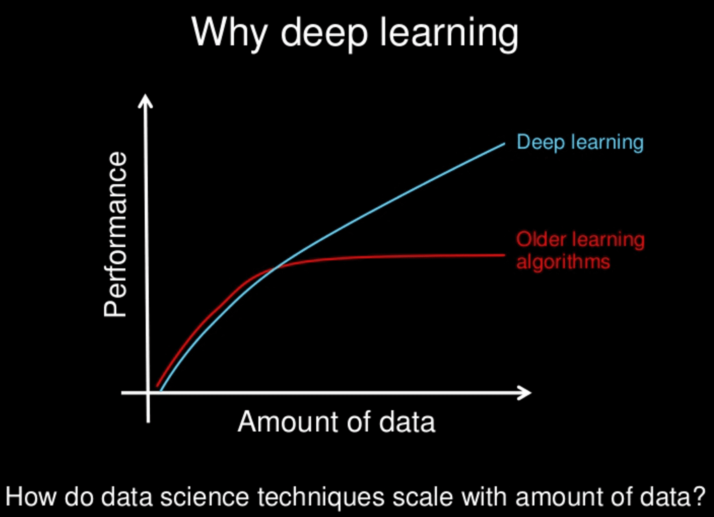
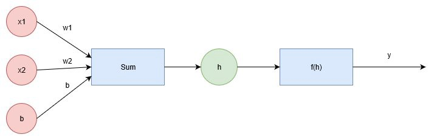
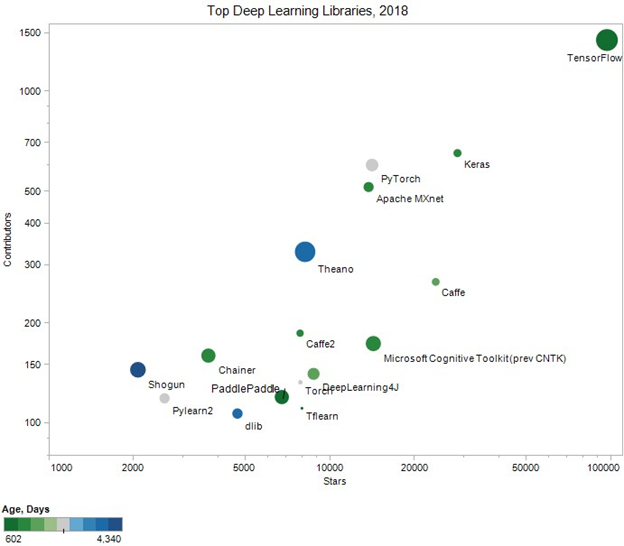

# Introducción al aprendizaje profundo

El aprendizaje profundo es un subcampo de Machine Learning que se ocupa de algoritmos inspirados en la estructura y función del cerebro llamados redes neuronales artificiales. Los algoritmos de aprendizaje profundo son similares a cómo se estructura el sistema nervioso, donde cada neurona está conectada entre sí y pasa información.

Los modelos de aprendizaje profundo tienden a funcionar bien con una gran cantidad de datos, mientras que los modelos antiguos de Machine Learning dejan de mejorar después de un punto de saturación. Una de las diferencias entre Machine Learning y los modelos de aprendizaje profundo está en el área de extracción de funciones. La extracción de características la realiza el ser humano en Machine Learning, mientras que el modelo de aprendizaje profundo se da cuenta por sí mismo.



*Imagen de Andrew Ng en https://www.slideshare.net/ExtractConf*

**¿Qué son las funciones de activación?**

Imaginemos un ejemplo sobre un modelo que decide si un estudiante es aceptado en una universidad en función de sus calificaciones. Las funciones de activación son funciones que deciden, dadas las entradas en el nodo, cuál debe ser la salida del nodo, por lo que en este caso la función de activación decide, dadas las calificaciones, si el estudiante es aceptado o no. 

Una forma en que las neuronas procesan las entradas es mediante el uso de combinaciones lineales de entradas ponderadas (es decir, neurona lineal). Otra es usar una función logística que devuelve un valor entre 0 y 1. Otras funciones de activación que verá son las funciones tanh y softmax.

**¿Qué son los pesos?**

Cuando los datos de entrada entran en una neurona, se multiplican por un valor de peso que se asigna a esta entrada en particular. Estos pesos comienzan como valores aleatorios y, a medida que la red neuronal aprende más sobre qué tipo de datos de entrada conducen a que un estudiante sea aceptado en una universidad, la red ajusta los pesos en función de los errores de categorización que resultaron de los pesos anteriores. A esto se le llama entrenar la red neuronal. El entrenamiento de redes neuronales puede verse como una especie de problema de optimización. El objetivo es minimizar el error de las redes neuronales mediante un entrenamiento constante.

Para averiguar cómo vamos a encontrar estos pesos, comienza por pensar en la meta. Queremos que la red haga predicciones lo más cercanas posible a los valores reales. Para medir esto, necesitamos una métrica de qué tan equivocadas están las predicciones, el error. Una métrica común es la suma de los errores cuadráticos (SSE), donde y^ es la predicción e y es el valor real, y toma la suma de todas las unidades de salida j y otra suma de todos los puntos de datos μ.

El SSE es una buena opción por varias razones. El cuadrado asegura que el error sea siempre positivo y que los errores más grandes se penalicen más que los errores más pequeños. Nuestro objetivo es encontrar pesos wij que minimicen el error cuadrático. Para hacer esto con una red neuronal, normalmente usamos el descenso de gradiente.

¿Recuerdas nuestro módulo 'Optimización de algoritmos'? Vimos un poco de Gradient Descent.

El descenso de gradiente es un algoritmo de optimización utilizado para encontrar los valores de los parámetros (coeficientes) de una función (f) que minimiza una función de cost (costo). El descenso de gradiente se usa mejor cuando los parámetros no se pueden calcular analíticamente (por ejemplo, usando álgebra lineal) y se deben buscar mediante un algoritmo de optimización. Utiliza técnicas de derivadas y cálculo a través de retropropagación, propagación resiliente y propagación de Manhattan y otras técnicas de optimización basadas en cálculos de gradiente.

El álgebra y el cálculo son la base de las redes neuronales profundas.

**Redes neuronales**

El siguiente diagrama muestra una red simple. Los pesos y bias (sesgos) son los parámetros que se pueden aprender. En la siguiente ecuación: $y = mx+b$ 'm' (la pendiente) sería el peso y 'b' representaría el bias. La combinación lineal de los pesos, las entradas y el bias forman la entrada h, que pasa a través de la función de activación f(h), dando la salida final, etiquetada como y.



La función de activación, f(h) puede ser cualquier función. Si hacemos f(h)=h, la salida será la misma que la entrada. Ahora la salida de la red es $y=Σi WiXi + b$.

**Propagación hacia adelante y hacia atrás**

Al propagar valores desde la primera capa (la capa de entrada) a través de todas las funciones matemáticas representadas por cada nodo, la red genera un valor. Este proceso se llama **pase hacia adelante**.

Reenvía la propagación para obtener el resultado y lo compara con el valor real para obtener el error. Ahora, para minimizar el error, se propaga hacia atrás encontrando la derivada del error con respecto a cada peso y luego restando este valor del valor del peso. Esto se llama **propagación inversa**.

Ahora veamos el código para implementar toda la propagación:

```py
import numpy as np
from data_prep import features, targets, features_test, targets_test

np.random.seed(21)

def sigmoid(x):
    """
    Calculate sigmoid
    """
    return 1 / (1 + np.exp(-x))


# Hiperparámetros
n_hidden = 2  # Número de unidades ocultas
epochs = 900
learnrate = 0.005

n_records, n_features = features.shape
last_loss = None
# Inicializar pesos
weights_input_hidden = np.random.normal(scale=1 / n_features ** .5,
                                        size=(n_features, n_hidden))
weights_hidden_output = np.random.normal(scale=1 / n_features ** .5,
                                         size=n_hidden)

for e in range(epochs):
    del_w_input_hidden = np.zeros(weights_input_hidden.shape)
    del_w_hidden_output = np.zeros(weights_hidden_output.shape)
    for x, y in zip(features.values, targets):
        ## Pase adelantado ##
        # TODO: Calcular la salida
        hidden_input = np.dot(x, weights_input_hidden)
        hidden_output = sigmoid(hidden_input)

        output = sigmoid(np.dot(hidden_output,
                                weights_hidden_output))

        ## Pase hacia atrás ##
        # TODO: Calcular el error de predicción de la red
        error = y - output

        # TODO: Calcular el término de error para la unidad de salida
        output_error_term = error * output * (1 - output)

        ## propagate errors to hidden layer

        # TODO: Calculate the hidden layer's contribution to the error
        hidden_error = np.dot(output_error_term, weights_hidden_output)

        # TODO: Calculate the error term for the hidden layer
        hidden_error_term = hidden_error * hidden_output * (1 - hidden_output)

        # TODO: Update the change in weights
        del_w_hidden_output += output_error_term * hidden_output
        del_w_input_hidden += hidden_error_term * x[:, None]

    # TODO: Update weights
    weights_input_hidden += learnrate * del_w_input_hidden / n_records
    weights_hidden_output += learnrate * del_w_hidden_output / n_records

    # Printing out the mean square error on the training set
    if e % (epochs / 10) == 0:
        hidden_output = sigmoid(np.dot(x, weights_input_hidden))
        out = sigmoid(np.dot(hidden_output,
                             weights_hidden_output))
        loss = np.mean((out - targets) ** 2)

        if last_loss and last_loss < loss:
            print("Train loss: ", loss, "  WARNING - Loss Increasing")
        else:
            print("Train loss: ", loss)
        last_loss = loss

# Calculate accuracy on test data
hidden = sigmoid(np.dot(features_test, weights_input_hidden))
out = sigmoid(np.dot(hidden, weights_hidden_output))
predictions = out > 0.5
accuracy = np.mean(predictions == targets_test)
print("Prediction accuracy: {:.3f}".format(accuracy))
```

## Deep learning techniques

There are various Deep Learning models which are used to solve complicated tasks. Each of them is used for specific tasks, with certain processes and limitations. The following deep learning techniques is a very good summary taken from Heartbeat (https://heartbeat.comet.ml/), an online publication community that provides educational resources for data science, machine learning, and deep learning practitioners.

### Multilayer Perceptrons (MLPs)

Multilayer Perceptrons is a feedforward artificial neural network, where a set of inputs are fed into the Neural Network to generate a set of outputs. MLPs are made up of input layers and an output layer that is fully connected.

When to use it?

- When your dataset is in a tabular format consisting of rows and columns. Typically CSV files

- Can be used for both Classification and Regression tasks where a set of ground truth values are given as the input.

### Convolutional Neural Network (CNN)

Convolutional Neural Network (CNN), also known as a ConvNet is a feed-forward Neural Network. It is typically used in image recognition, by processing pixelated data to detect and classify objects in an image. The model has been built to solve complex tasks, preprocessing, and data compilation.

When to use it?

- It works very well with Image Datasets An example of this is OCR document analysis, which recognizes text within a digital image.

- Ideally, the input data is a 2-dimensional field. However, it can also be converted into a 1-dimensional to make the process faster.

- This technique should also be used if the model requires high complexity in calculating the output.

### Recurrent Neural Networks (RNNs)

A Recurrent Neural Network is used to work for time series data or data that involve sequences. RNN uses the previous state’s knowledge and uses it as an input value for the current prediction.

Therefore, RNN can memorize previous inputs using its internal memory. They are used for time-series analysis, handwriting recognition, Natural Language Processing, and more.

When to use it? There are 4 different ways that you can use Recurrent Neural Networks:

1. One to one: a single input that produces a single output. An example of this is Image Classification

2. One to many: a single input that produces a sequence of outputs. An example of this is Image captioning, where a variety of words are detected from a single image

3. Many to one: a sequence of inputs that produces a single output. An example of this is Sentiment Analysis

4. Many to many: a sequence of inputs that produces a sequence of outputs. An example of this is Video classification, where you split the video into frames and label each frame separately

**Long Short Term Memory Networks (LSTMs)**

Long Short Term Memory Networks is a type of Recurrent Neural Network which can learn and memorize long-term dependencies. Its default behavior and the aim of an LSTM is to remember past information for long periods.

### Generative Adversarial Networks (GANs)

Generative Adversarial Networks use two neural networks which compete with one another, hence the “adversarial” in the name.

The two neural networks used to build a GAN are called ‘the generator’ and ‘the discriminator’. The Generator learns to generate fake data whilst the Discriminator learns from that fake information. They are used to ensure accuracy in the model’s predictions.

When to use it?

- Image inpainting — you can do this by restoring missing parts of images.

- Image super-resolution — you can do this by upscaling low-resolution images to high resolution.

- If you want to create data from images to texts.

### Restricted Boltzmann Machines (RBMs)

Restricted Boltzmann machine is a type of Recurrent Neural Network where the nodes make binary decisions with some bias. It was invented by Geoffrey Hinton and is used generally for dimensionality reduction, classification, regression, feature learning, and topic modeling.

RBMs uses two layers:

- Visible units

- Hidden units

The visible and hidden units have biases connected. The visible units are connected to the hidden units, and they do not have any output nodes.

When to use it?

- As the Boltzmann Machine will learn to regulate, this technique will be good to use when monitoring a system.

- It is efficient when you are building a binary recommendation system

- It is also used specifically when using a very specific dataset.

## Top applications of deep learning in 2022

Deep Learning has recently outperformed humans in solving particular tasks, for example, Image Recognition. The level of accuracy achieved by Deep Learning has made it become so popular, and everybody is figuring out ways to implement it into their business. Different applications include:

- Self driving cars

- News aggregation and fraud news detection

- Natural Language Processing

- Virtual Assistants

- Visual Recognition

- Fraud detection

- Personalized experiences in e-commerce

- Detecting developmental delay in children

- Healthcare: from medical imaging, discovering new drugs, clinical research.

- Colourisation of Black and White images

- Adding sounds to silent movies

- Automatic Machine Translation

- Automatic Handwriting Generation

- Automatic Game Playing

- Language Translations

- Pixel Restoration

- Photo Descriptions

- Demographic and Election Predictions

- Deep Dreaming

## Software tools

The following graph shows the top 16 open-source deep learning libraries used by Github contributors.



*Image by KDnuggets*

By all measures, TensorFlow is the undisputed leader, followed by Keras.

**TensorFlow** 

Tensorflow is a Python open-source library for fast numerical computing created and released by Google. It was designed for use both in research and development and in production systems. It can run on single CPU systems and GPUs, as well as mobile devices and large-scale distributed systems of hundreds of machines.

Computation is described in terms of data flow and operations in the structure of a directed graph.

- Nodes: Nodes perform computation and have zero or more inputs and outputs. Data that moves between nodes are known as **tensors**, which are multi-dimensional arrays of real values.

- Edges: The graph defines the flow of data, branching, looping, and updates to state. Special edges can be used to synchronize behavior within the graph, for example, waiting for computation on a number of inputs to complete.

- Operation: An operation is a named abstract computation that can take input attributes and produce output attributes. For example, you could define an add or multiply operation.

**Keras** 

Keras is a high-level neural networks API, written in Python and capable of running on top of TensorFlow, CNTK, or Theano. Keras is designed for human beings, not machines, by minimizing the number of user actions required for common use cases. It is also the most used deep learning framework among top-5 winning teams on Kaggle.

To sum up the relationship between Tensorflow and Keras, TensorFlow is an open-sourced end-to-end platform, a library for multiple machine learning tasks, while Keras is a high-level neural network library that runs on top of TensorFlow. Both provide high-level APIs used for easily building and training models, but Keras is more user-friendly because it's built-in Python.

The best place to start is with the user-friendly Keras sequential API. Let's see the following example taken from the Tensorflow website:

```bash
pip install tensorflow
```

```py
#import Tensorflow

import tensorflow as tf
print("TensorFlow version:", tf.__version__)

#load the MNIST dataset. Convert the sample data from integers to floating-point numbers.

mnist = tf.keras.datasets.mnist

(x_train, y_train), (x_test, y_test) = mnist.load_data()
x_train, x_test = x_train / 255.0, x_test / 255.0

#build a tf.keras.Sequential model by stacking layers

model = tf.keras.models.Sequential([
  tf.keras.layers.Flatten(input_shape=(28, 28)),
  tf.keras.layers.Dense(128, activation='relu'),
  tf.keras.layers.Dropout(0.2),
  tf.keras.layers.Dense(10)
])

# For each example, the model returns a vector of logits or log-odds scores, one for each class.

predictions = model(x_train[:1]).numpy()
predictions

# The tf.nn.softmax function converts these logits to probabilities for each class:

tf.nn.softmax(predictions).numpy()

# Define a loss function for training using losses.SparseCategoricalCrossentropy, which takes a vector of logits and a True index and returns a scalar loss for each example.

loss_fn = tf.keras.losses.SparseCategoricalCrossentropy(from_logits=True)

# This loss is equal to the negative log probability of the true class: The loss is zero if the model is sure of the correct class.
# This untrained model gives probabilities close to random (1/10 for each class), so the initial loss should be close to -tf.math.log(1/10) ~= 2.3.

loss_fn(y_train[:1], predictions).numpy()

# Before you start training, configure and compile the model using Keras Model.compile. Set the optimizer class to adam, set the loss to the loss_fn function you defined earlier, and specify a metric to be evaluated for the model by setting the metrics parameter to accuracy.

model.compile(optimizer='adam',
              loss=loss_fn,
              metrics=['accuracy'])

# Use the Model.fit method to adjust your model parameters and minimize the loss:

model.fit(x_train, y_train, epochs=5)

# The Model.evaluate method checks the models performance, usually on a "Validation-set" or "Test-set".

model.evaluate(x_test,  y_test, verbose=2)

```

The image classifier is now trained to ~98% accuracy on this dataset. If you want your model to return a probability, you can wrap the trained model, and attach the softmax to it:

```py
probability_model = tf.keras.Sequential([
  model,
  tf.keras.layers.Softmax()
])

probability_model(x_test[:5])
```

You have trained a machine learning model using a prebuilt dataset using the Keras API! See the exploring-neural-networks notebook to see another example in Keras!


Source: 

https://www.deeplearningbook.org/

https://machinelearningmastery.com/inspirational-applications-deep-learning/

https://heartbeat.comet.ml/deep-learning-techniques-you-should-know-in-2022-94f33e62d922

https://machinelearningmastery.com/introduction-python-deep-learning-library-tensorflow/

https://medium.com/intro-to-artificial-intelligence/deep-learning-series-1-intro-to-deep-learning-abb1780ee20

https://medium.com/@genvill/9-ways-to-become-the-macgyver-of-deep-learning-4f0133bc1f14

https://becominghuman.ai/face-detection-with-opencv-and-deep-learning-90b84735f421

https://machinelearningmastery.com/linear-algebra-cheat-sheet-for-machine-learning/

https://www.mygreatlearning.com/blog/deep-learning-applications/

http://playground.tensorflow.org/#activation=tanh&batchSize=10&dataset=circle&regDataset=reg-plane&learningRate=0.03&regularizationRate=0&noise=0&networkShape=4,2&seed=0.88210&showTestData=false&discretize=false&percTrainData=50&x=true&y=true&xTimesY=false&xSquared=false&ySquared=false&cosX=false&sinX=false&cosY=false&sinY=false&collectStats=false&problem=classification&initZero=false&hideText=false

https://machinelearningmastery.com/tutorial-first-neural-network-python-keras/

https://colab.research.google.com/github/tensorflow/docs/blob/master/site/en/tutorials/quickstart/beginner.ipynb#scrollTo=4mDAAPFqVVgn

https://www.tensorflow.org/tutorials/load_data/images

https://www.tensorflow.org/tutorials

https://heartbeat.comet.ml/deep-learning-techniques-you-should-know-in-2022-94f33e62d922
