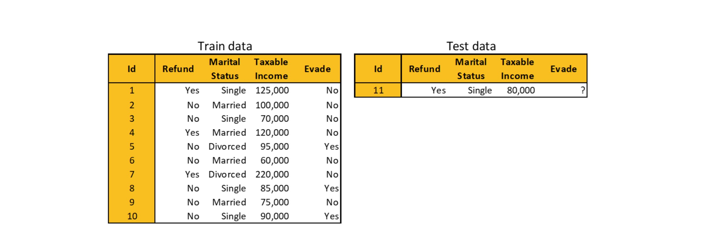
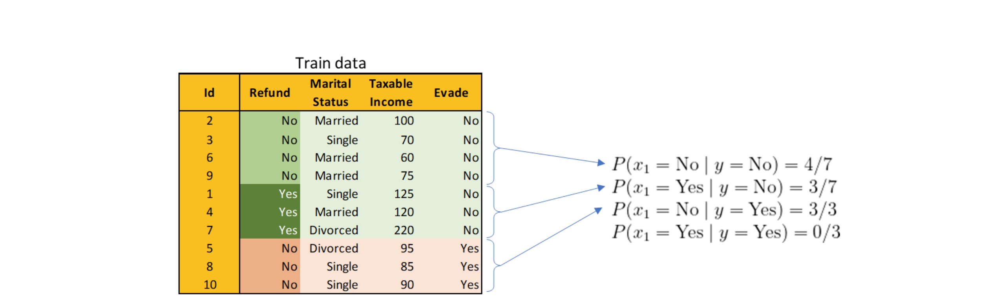
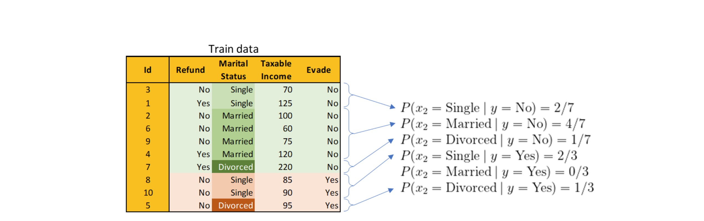
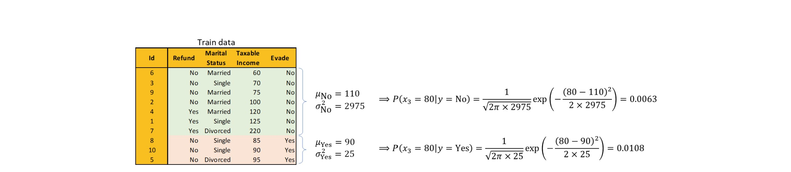
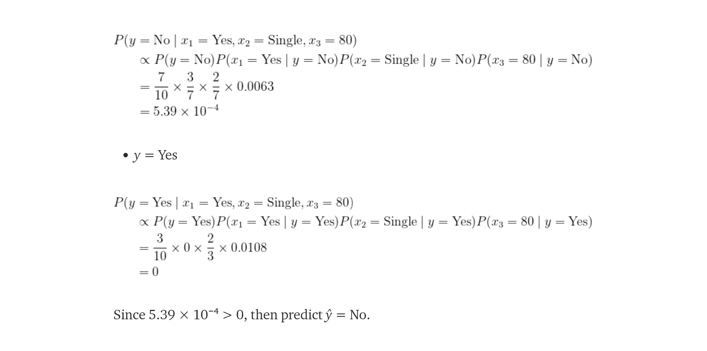

# Naive Bayes

Naive Bayes es un algoritmo probabilístico para la clasificación, basado en el Teorema de Bayes. Este algoritmo realmente te ayuda a comprender mucho sobre la clasificación y es probablemente uno de los algoritmos más útiles para casos de uso simples de Machine Learning. Es lo suficientemente simple como para ser completado a mano.

¿Recuerdas nuestras lecciones de probabilidad? ¿Teorema de Naive Bayes?

Veamos un ejemplo que usamos para resolver con el teorema de Naive Bayes.

Un médico sabe que la meningitis causa rigidez en el cuello el 50% de las veces. La probabilidad de que cualquier paciente tenga meningitis es 1/50000, y la probabilidad de que cualquier paciente tenga tortícolis es 1/20. Si un paciente tiene tortícolis, ¿cuál es la probabilidad de que tenga meningitis?

Un ejemplo diferente sería si quisiéramos predecir si una persona cumplirá con el pago de impuestos en función de características como la renta imponible y el estado civil.

**¿Cómo se aplica esto al problema de clasificación de Machine Learning?**

Estamos tratando de predecir algo dadas algunas condiciones. En la clasificación, dado un punto de datos X=(x1,x2,…,xn), ¿cuáles son las probabilidades de que Y sea y? Esto se puede reescribir como la siguiente ecuación:

P(Y=y |X=(x1,x2...xn))

Aplicando esta ecuación a nuestro ejemplo anterior, nuestra Y sería si la persona cumple con pagar impuestos, y tendríamos x1 como base imponible y x2 como estado civil.

## ¿Cómo funciona Naive Bayes?

El algoritmo evita considerar cada muestra individual en el conjunto de datos, como cualquier otro algoritmo de machine learning. En cambio, solo necesitamos ingresar la media, la desviación estándar y alfa para la característica que pertenece a cada clase. La mayoría de los datos se pierden en el proceso porque ni siquiera se consideran. Sin embargo, si todas las características se distribuyen normalmente, este algoritmo puede ser extremadamente preciso.

Este algoritmo NECESARIAMENTE necesita que comprenda la importancia de usar distribuciones en la ciencia de datos. Saber cuál es la mejor forma de modelar tus datos, por ejemplo, si pertenecen a una distribución lognormal o a una distribución normal, realmente marca la diferencia a la hora de construir modelos.

### Ventajas y desventajas del algoritmo Naive Bayes:

**Ventajas:**

- Naive Bayes es un algoritmo de machine learning realmente único porque no aprende a través del mecanismo de descenso de gradiente. En cambio, Naive Bayes calcula sus propios parámetros en un cálculo muy rápido.

- Esto hace que Naive Bayes sea un algoritmo de aprendizaje automático asombrosamente rápido en comparación con la mayoría de sus competidores de algoritmos ML que aprenden a través de un proceso de descenso de gradiente iterativo o cálculos de distancia.

- Naive Bayes se usa comúnmente y se prefiere en tareas de clasificación adecuadas. Se puede utilizar para la clasificación binaria y multiclase.

- Naive Bayes tiene fases de entrenamiento y predicción muy rápidas. Debido a su alto rendimiento, Naive Bayes puede preferirse en la implementación de machine learning en tiempo real o como un modelo complementario para mejorar modelos menos rápidos en una solución híbrida.

- Es una gran opción para problemas de clasificación de texto. Es una opción popular para la clasificación de correo electrónico no deseado.

- Se puede entrenar fácilmente en un pequeño conjunto de datos. Algunos modelos de machine learning requerirán una gran cantidad de datos para el entrenamiento y tendrán un rendimiento deficiente si no se proporcionan. Naive Bayes suele funcionar muy bien con tamaños moderados de conjuntos de datos de entrenamiento.

- Producirá informes de probabilidad que pueden ser muy útiles si los necesita. No solo indican la etiqueta objetivo de una muestra, sino que también indican la probabilidad de la predicción, lo que le brinda un mayor control sobre el proceso de clasificación al permitir o rechazar predicciones por debajo de un determinado porcentaje de probabilidad.

**Desventajas:**

- El algoritmo Naive Bayes implica el uso del teorema de Bayes. Por lo tanto, no funciona bien cuando tenemos valores faltantes particulares o una combinación faltante de valores.

- El algoritmo Naive Bayes funciona bien cuando tenemos categorías simples. Pero, no funciona bien cuando la relación entre las palabras es importante.

### Tipos de algoritmo Naive Bayes

Hay 3 tipos de algoritmo Naive Bayes:

- Gaussian Naive Bayes.

- Multinomial Naive Bayes.

- Bernoulli Naive Bayes.

Mientras que Gaussian Naive Bayes puede manejar datos continuos, Bernoulli Naive Bayes funciona muy bien con binario y Multinomial Naive Bayes se puede usar para clasificar conjuntos de datos multiclase discretos categóricos.

Esto ofrece una gran versatilidad y permite muchas ventajas para las implementaciones de clasificación relacionadas con el texto. Incluso hay Complement Naive Bayes, que es una variante de Multinomial Naive Bayes y tiene como objetivo mejorar la precisión del modelo cuando se trabaja con datos desequilibrados al reducir el sesgo a través de un enfoque de complemento.

### Aplicaciones del algoritmo Naive Bayes

Naive Bayes es uno de los algoritmos de clasificación más sencillos y rápidos. Es muy adecuado para grandes volúmenes de datos. Se utiliza con éxito en diversas aplicaciones, tales como:

- Filtrado de spam.

- Clasificación de texto.

- Análisis de los sentimientos.

- Sistemas de recomendación.

Utiliza el teorema de probabilidad de Bayes para la predicción de clases desconocidas. Su suposición de independencia de características y su eficacia para resolver problemas de varias clases lo hacen perfecto para realizar análisis de sentimiento. El análisis de sentimiento se refiere a la identificación de sentimientos positivos o negativos de un grupo objetivo (clientes, audiencia, etc.)

## Caso de estudio

Usaremos un caso de estudio muy simple de towardsdatascience.com para hacer que Naive Bayes sea fácil de entender. Todas las imágenes del siguiente ejemplo han sido tomadas de la publicación de Albers Uzila towardsdatascience.com.

Tomemos los datos de evasión de impuestos de nuestro ejemplo anterior, donde necesitábamos predecir si una persona cumplirá con el pago de impuestos según el estado civil y los ingresos imponibles. Agregaremos un nuevo predictor 'refund' (reembolso) y ajustaremos Naive Bayes en los datos train con 10 observaciones, luego predeciremos una sola observación invisible en los datos de prueba.



Ahora tenemos dos características categóricas (reembolso y estado civil) y una característica numérica (ingreso imponible). Calcular la probabilidad será diferente para cada uno.

Para mayor comodidad, llamaremos reembolso, estado civil e ingreso imponible x₁, x₂ y x₃, respectivamente. También preferiremos dividir x₃ por 1000 para no tratar con números demasiado grandes o demasiado pequeños (para la probabilidad). Finalmente, 'evade' (evadir) será y.

Veamos cómo el teorema de Naive Bayes calcula la probabilidad de las características categóricas. En la primera imagen tenemos el cálculo de la columna 'Refund' (Reembolso), y la segunda imagen muestra el cálculo de la columna 'Marital status' (Estado civil).

- Calculando de probabilidades condicionales de Reembolso dada 'evade':



- Calculando de probabilidades condicionales de Estado Civil dado 'evade':



Para características numéricas necesitamos asumir una distribución subyacente para cada característica. Supongamos que asume que x₃ se distribuye normalmente, ahora calculemos la probabilidad para x₃ = 80. μ y σ² representan la media y la varianza respectivamente.



Ahora estamos listos para predecir sobre la información invisible. Mira la solución:



Código de ejemplo:

El algoritmo de clasificación Naive Bayes no puede manejar datos categóricos, por lo que tenemos que convertir el reembolso y el estado civil a formato numérico. Después de la codificación categórica y la separación de nuestros datos en X (características) e y (objetivo), podemos dividir nuestros datos para el modelado:

```py

# Dividir los datos en Train y Test

from sklearn.model_selection import train_test_split
X_train, X_test, y_train, y_test = train_test_split(X, y, test_size=0.25, random_state=0)

# Paso 4 - Escalado de características

from sklearn.preprocessing import StandardScaler
ss_X = StandardScaler()
X_train = ss_X.fit_transform(X_train)
X_test = ss_X.transform(X_test)

# Paso 5 - Montar el clasificador

from sklearn.naive_bayes import GaussianNB
classifier = GaussianNB()
classifier.fit(X_train, y_train)

# Paso 6 - Predecir

y_pred = classifier.predict(X_test)

# Paso 7 - Matriz de confusión

from sklearn import metrics
cm = metrics.confusion_matrix(y_test, y_pred) 
print(cm)
accuracy = metrics.accuracy_score(y_test, y_pred) 
print("Accuracy score:",accuracy)
precision = metrics.precision_score(y_test, y_pred) 
print("Precision score:",precision)
recall = metrics.recall_score(y_test, y_pred) 
print("Recall score:",recall)
```

## Hipertuning Naive Bayes

El modelo Naive Bayes tiene un par de hiperparámetros útiles para ajustar en Scikit-Learn. Además de los hiperparámetros, probablemente el factor más importante en una implementación de Naive Bayes es la independencia de los predictores (características).

Este modelo de machine learning se llama Naive (Ingenuo) porque asume la independencia entre las funciones, lo que rara vez ocurre, por lo que el modelo es naive al respecto. 

Aquí hay algunos dos parámetros útiles que se pueden optimizar y ajustar en Naive Bayes:

- **Priors:**

Las Priors son probabilidades de una característica o un objetivo antes de que se introduzcan nuevos datos en el modelo. El parámetro Priors ofrece una opción para especificar las prioridades en lugar de que el modelo las derive de las frecuencias en los datos. La suma de las priors siempre debe dar 1. Esto es cierto cuando el modelo calcula las previas, así como cuando el usuario pasa las previas como un array al modelo. Si los anteriores no suman 1, es probable que ocurra un error de seguimiento.

```py
GNB = GaussianNB(priors = [0.33, 0.33, 0.34])
```

Ajustar las priors puede ser útil para abordar el bias en un conjunto de datos. Por ejemplo, si el conjunto de datos es pequeño y los valores objetivo ocurren de manera sesgada, el modelo Naive Bayes puede pensar que la frecuencia del objetivo A es menor que la del objetivo B y C y esto afectará los resultados. Pero al interceptar y asignar priorizaciones personalizadas que sabe que son más precisas, puede contribuir a la precisión del modelo.

- **var_smoothing:**

Var_smoothing es un parámetro que toma un valor flotante y es 1e-9 por defecto. Es un cálculo de estabilidad para ampliar (o suavizar) la curva y, por lo tanto, dar cuenta de más muestras que están más alejadas de la media de distribución.

```py
GNB = GaussianNB(var_smoothing=3e-10)
```

Si var_smoothing aumenta demasiado, la probabilidad de que todas las clases converjan en una distribución uniforme. La predicción de significado se distribuirá a los valores objetivo con la misma probabilidad, lo que hace que las predicciones sean bastante inútiles y convierte el modelo de machine learning de Naive Bayes en un lanzamiento de moneda.

El beneficio de var_smoothing es que cuando faltan datos o una clase no está representada, var_smoothing evita que el modelo se rompa.

Gracias a la adición de var_smoothing a anterior, el modelo puede terminar con una ecuación más razonable en lugar de confundirse cuando nunca antes se había producido un evento. Y como suele ser un valor muy pequeño cuando hay antecedentes, el efecto de var_smoothing es insignificante.

Laplace es el padre de este suavizado y se le ocurrió la idea cuando estaba pensando en la probabilidad de que el sol no saliera. Pensó que, dado que nunca sucedió antes, el teorema de Bayes no podía lidiar con eso.

Podría modificarse para asignarle una probabilidad de 1, lo que no tiene sentido (100% de probabilidad) o también podría modificarse para asignarle al evento una probabilidad de 0. Lo que probablemente sea más sensato pero aún no es ideal ya que no podemos decir es improbable simplemente porque nunca ha sucedido antes. Los mercados financieros nos lo enseñaron una y otra vez. Por lo tanto, al introducir una pequeña variación para aquellas observaciones no vistas anteriormente, salvamos la integridad del modelo.

> Recuerda, la puntuación de su modelo no solo depende de la forma en que lo ajuste, sino también de la calidad de sus datos.

**Consejos para mejorar la potencia del modelo Naive Bayes**

- Si las características continuas no tienen una distribución normal, debemos usar la transformación o diferentes métodos para convertirla en una distribución normal.

- Si el conjunto de datos de prueba tiene un problema de frecuencia cero, aplica técnicas de suavizado "Corrección de Laplace" para predecir la clase de conjunto de datos de prueba. La corrección laplaciana es una de las técnicas de suavizado. Aquí, puedes suponer que el conjunto de datos es lo suficientemente grande como para que agregar una fila de cada clase no haga una diferencia en la probabilidad estimada. Esto superará el problema de los valores de probabilidad a cero.

- Elimina las funciones correlacionadas, ya que las funciones altamente correlacionadas se votan dos veces en el modelo y puede llevar a una importancia exagerada.

- Los clasificadores Naive Bayes tienen opciones limitadas para el ajuste de parámetros como alfa = 1 para suavizar, fit_prior = [Verdadero / Falso] para aprender las probabilidades previas de la clase o no y algunas otras opciones (ve los detalles aquí: https://scikit-learn.org/stable/modules/generated/sklearn.naive_bayes.GaussianNB.html#sklearn.naive_bayes.GaussianNB).Se recomienda centrarse en el procesamiento previo de los datos y la selección de funciones.

- Podrías pensar en aplicar alguna técnica de combinación de clasificadores como ensemble, bagging and boosting, pero estos métodos no ayudarían. En realidad, “ensemble, boosting, bagging” no ayudará, ya que su propósito es reducir la varianza. Naive Bayes no tiene varianza para minimizar.


Fuente:

https://towardsdatascience.com/k-nearest-neighbors-naive-bayes-and-decision-tree-in-10-minutes-f8620b25e89b#c71a

https://medium.com/@omairaasim/machine-learning-project-14-naive-bayes-classifier-step-by-step-a1f4a5e5f834

https://www.analyticsvidhya.com/blog/2021/07/performing-sentiment-analysis-with-naive-bayes-classifier/

https://deeppatel23.medium.com/na%C3%AFve-bayes-classifier-177ad1307aff

https://github.com/pb111/Naive-Bayes-Classification-Project

https://www.analyticsvidhya.com/blog/2021/01/gaussian-naive-bayes-with-hyperpameter-tuning/

https://www.aifinesse.com/naive-bayes/naive-bayes-advantages/

https://www.aifinesse.com/naive-bayes/naive-bayes-tuning/


