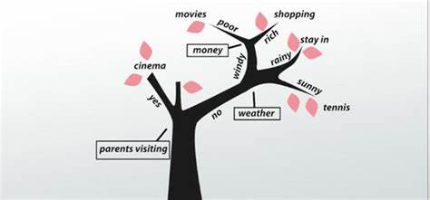

# Random Forest

El conjunto es otro tipo de aprendizaje supervisado. Combina las predicciones de múltiples modelos de Machine Learning que son individualmente débiles para producir una predicción más precisa en una nueva muestra. Al combinar modelos individuales, el modelo de conjunto tiende a ser más flexible🤸‍♀️ (menos bias) y menos sensible a los datos🧘‍♀️ (menos variación).

La idea es que los conjuntos de alumnos se desempeñen mejor que los alumnos individuales.

En las próximas dos lecciones, aprenderemos sobre dos técnicas de conjunto, embolsado con bosques aleatorios y potenciado con XGBoost.

**¿Qué significa bagging (embolsar)?**

Entrenando un montón de modelos individuales de forma paralela. Cada modelo es entrenado por un subconjunto aleatorio de los datos.

**¿Cómo funciona el modelo Random Forest?**

Para comprender el modelo de Random Forest, primero aprendimos sobre el árbol de decisiones, el componente básico de un bosque aleatorio. Todos usamos árboles de decisión en nuestra vida diaria, e incluso si no lo sabes, reconocerás el proceso.



Random Forest, como su nombre lo indica, consiste en una gran cantidad de árboles de decisión individuales que operan como un conjunto. Cada árbol individual en el Random Forest escupe una predicción de clase y la clase con más votos se convierte en la predicción de nuestro modelo.


Una explicación más profunda:

A diferencia de un árbol de decisiones, donde cada nodo se divide en la mejor característica que minimiza el error, en Random Forests elegimos una selección aleatoria de características para construir la mejor división. La razón de la aleatoriedad es: incluso con embolsado, cuando los árboles de decisión eligen la mejor característica para dividirse, terminan con una estructura similar y predicciones correlacionadas. Pero, empaquetar después de dividir en un subconjunto aleatorio de características significa menos correlación entre las predicciones de los subárboles.

El número de características que se buscarán en cada punto de división se especifica como un parámetro del algoritmo Random Forest.

Por lo tanto, en el empaquetamiento con Random Forest, cada árbol se construye usando una muestra aleatoria de registros y cada división se construye usando una muestra aleatoria de predictores.

Para aclarar la diferencia entre ellos, Random Forest es un método de conjunto que utiliza árboles de decisión empaquetados con subconjuntos de características aleatorias elegidos en cada punto de división. Luego, promedia los resultados de predicción de cada árbol (regresión) o usa los votos de cada árbol (clasificación) para hacer la predicción final.

> La razón por la que funcionan tan bien: 'Un gran número de modelos relativamente no correlacionados (árboles) que funcionan como un comité superarán a cualquiera de los modelos constituyentes individuales'. La baja correlación es la clave.

## ¿Qué hiperparámetros se pueden ajustar para un Random Forest además de los hiperparámetros de cada árbol individual?

Siempre un buen lugar para comenzar es leer la documentación en scikit learn: https://scikit-learn.org/stable/modules/generated/sklearn.ensemble.RandomForestClassifier.html

Los ajustes más importantes son:

- Num estimators - el número de árboles de decisión en el bosque.

- Max features - número máximo de características que se evalúan para dividir en cada nodo.

Pero podemos intentar ajustar una amplia gama de valores en otros hiperparámetros como:

- max_ depth = número máximo de niveles en cada árbol de decisión.

- min_samples_split = número mínimo de puntos de datos colocados en un nodo antes de dividir el nodo.

- min_samples_leaf = número mínimo de puntos de datos permitidos en un nodo hoja.

- bootstrap = método para muestrear puntos de datos (con o sin reemplazo).

Veamos cómo podríamos implementar un RandomizedSearchCV para encontrar hiperparámetros óptimos:

```py

from sklearn.model_selection import RandomizedSearchCV
# Número de árboles en Random Forest
n_estimators = [int(x) for x in np.linspace(start = 200, stop = 2000, num = 10)]
# Número de características a considerar en cada división
max_features = ['auto', 'sqrt']
# Número máximo de niveles en el árbol
max_depth = [int(x) for x in np.linspace(10, 110, num = 11)]
max_depth.append(None)
# Número mínimo de muestras requeridas para dividir un nodo
min_samples_split = [2, 5, 10]
# Número mínimo de muestras requeridas en cada nodo hoja
min_samples_leaf = [1, 2, 4]
# Método de selección de muestras para entrenar cada árbol
bootstrap = [True, False]
# Crear la cuadrícula aleatoria
random_grid = {'n_estimators': n_estimators,
               'max_features': max_features,
               'max_depth': max_depth,
               'min_samples_split': min_samples_split,
               'min_samples_leaf': min_samples_leaf,
               'bootstrap': bootstrap}
pprint(random_grid)
{'bootstrap': [True, False],
 'max_depth': [10, 20, 30, 40, 50, 60, 70, 80, 90, 100, None],
 'max_features': ['auto', 'sqrt'],
 'min_samples_leaf': [1, 2, 4],
 'min_samples_split': [2, 5, 10],
 'n_estimators': [200, 400, 600, 800, 1000, 1200, 1400, 1600, 1800, 2000]}
 
```

En cada iteración, el algoritmo elegirá diferentes combinaciones de características. ¡En total, hay 2 * 12 * 2 * 3 * 3 * 10 = 4320 configuraciones! Sin embargo, el beneficio de una búsqueda aleatoria es que no estamos probando todas las combinaciones, sino que estamos seleccionando al azar para muestrear una amplia gama de valores.

## ¿Son los modelos de Random Forest propensos al sobreajuste? ¿Por qué?

No, los modelos de Random Forest generalmente no son propensos a sobreajustarse porque la selección aleatoria de funciones y el embolsado tienden a promediar cualquier ruido en el modelo. La adición de más árboles no provoca el sobreajuste, ya que el proceso de aleatorización continúa promediando el ruido (más árboles generalmente reducen el sobreajuste en el Random Forest).

En general, los algoritmos de embolsado son resistentes al sobreajuste.

Dicho esto, es posible sobreajustar con modelos de Random Forest si los árboles de decisión subyacentes tienen una varianza extremadamente alta. En cada punto de división se considera una profundidad extremadamente alta y una división de muestra mínima baja, y un gran porcentaje de características. Por ejemplo, si todos los árboles son idénticos, el Random Forest puede sobreajustar los datos.

**¿Cómo puede mi Random Forest hacer predicciones de clase precisas?**

- Necesitamos características que tengan al menos algún poder predictivo.

- Los árboles del bosque y sus predicciones no deben estar correlacionados (al menos correlaciones bajas). Las características y los hiperparámetros seleccionados afectarán las correlaciones finales.   

Fuente: 

https://www.dataquest.io/blog/top-10-machine-learning-algorithms-for-beginners/#:~:text=The%20first%205%20algorithms%20that,are%20examples%20of%20supervised%20learning.

https://towardsdatascience.com/understanding-random-forest-58381e0602d2

https://towardsdatascience.com/basic-ensemble-learning-random-forest-adaboost-gradient-boosting-step-by-step-explained-95d49d1e2725

https://williamkoehrsen.medium.com/random-forest-simple-explanation-377895a60d2d

https://towardsdatascience.com/hyperparameter-tuning-the-random-forest-in-python-using-scikit-learn-28d2aa77dd74
