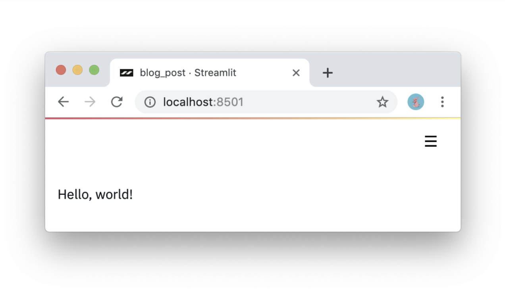
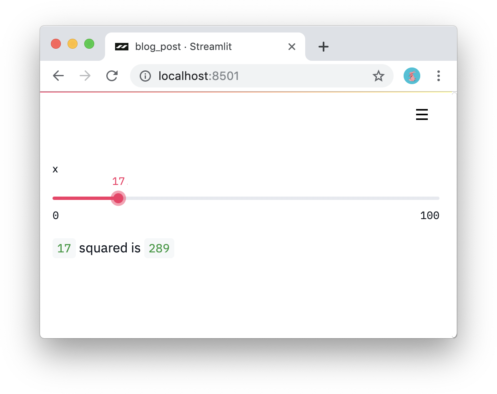
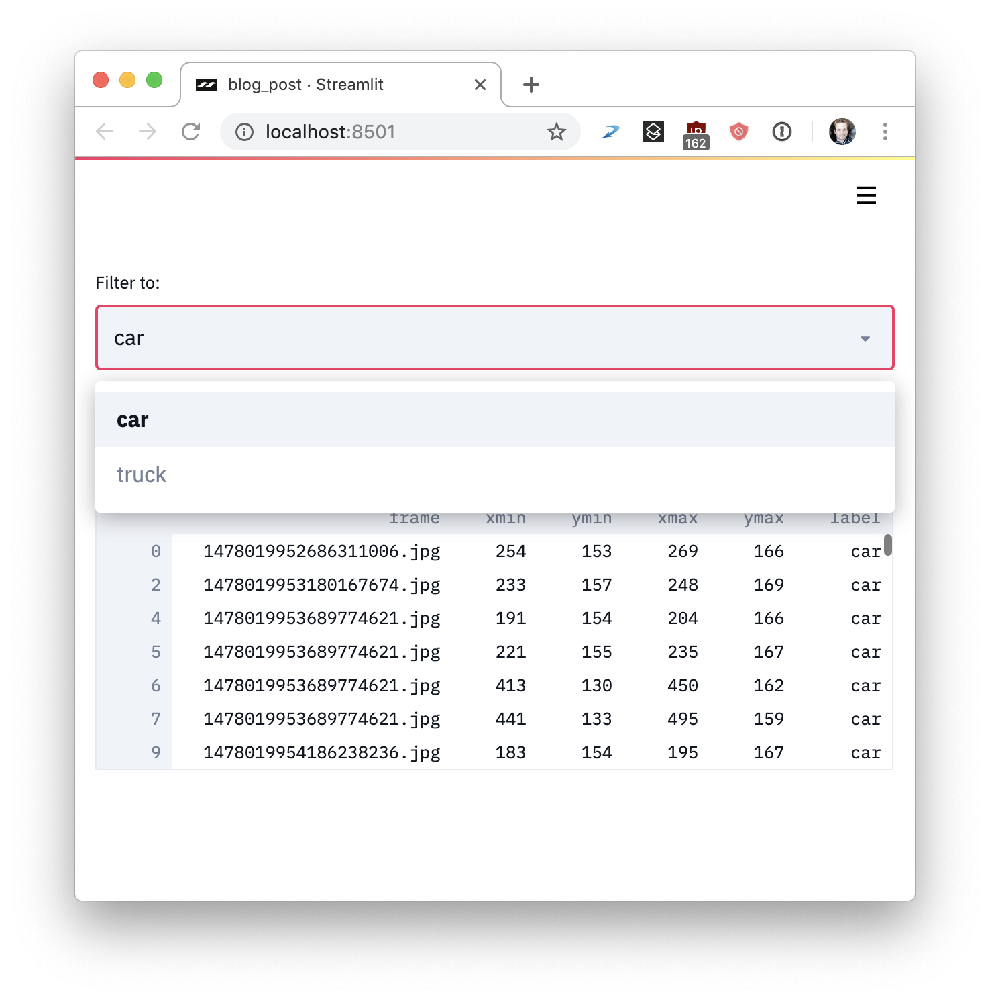
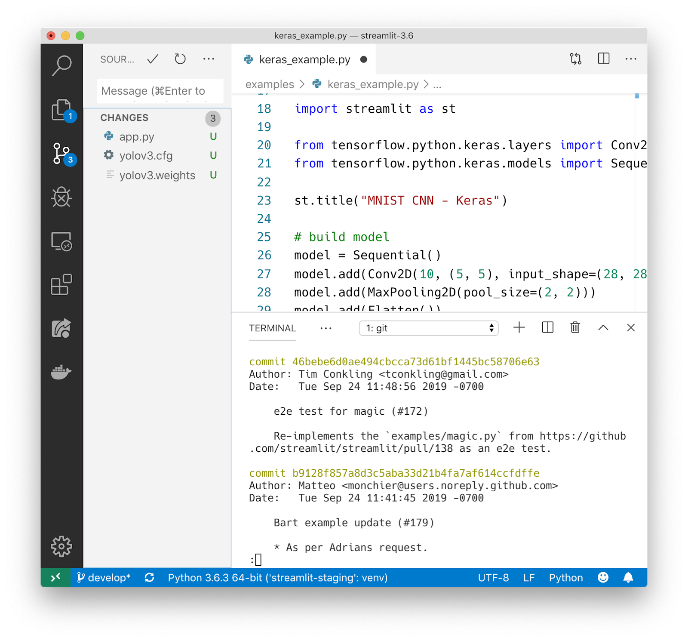
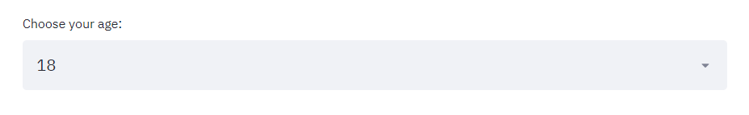
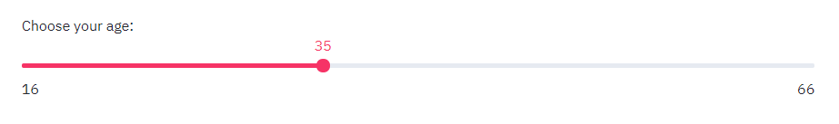
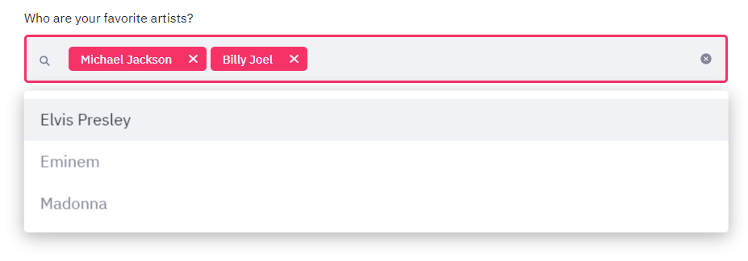
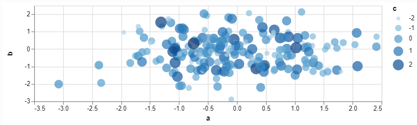
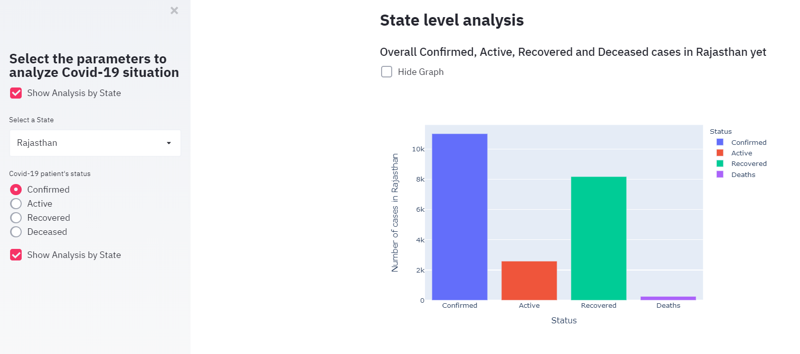
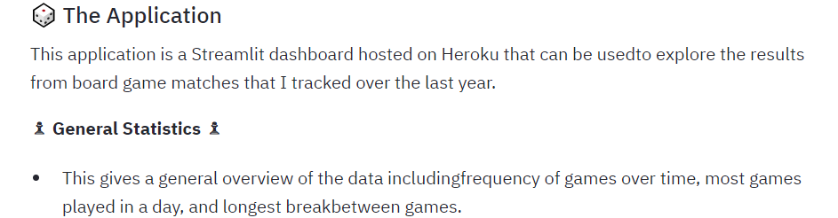

# Deployment of a Machine learning model using Streamlit and Heroku

In the previous lesson we learned how to build a machine learning web application using Flask, writing basic HTML, and deploying Flask apps with Heroku. But, what if we could build those apps as easy as writing Python scripts?

Imagine you can convert simple python scripts to beautiful web apps. Well, that tool exist and is called Streamlit.

Streamlit is an open-source framework to create data science and machine learning apps for data exploration in the fastest way possible. It even gives you a real-time coding experience. You can start your streamlit app and every time you save, you see your code reflecting in the browser at the same time!

## The core principles of Streamlit:

1. **Embrace Python scripting.** If you know how to write Python scripts, you can write Streamlit apps. For example, this is how you write to the screen:

```py
import streamlit as st
st.write('Hello, world!')
```



2. **Treat widgets as variables.** There are no callbacks in Streamlit! Every interaction simply reruns the script from top to bottom. This approach leads to really clean code:

```py
import streamlit as st
x = st.slider('x')
st.write(x, 'squared is', x * x)
```



3. **Reuse data and computation.** What if you download lots of data or perform complex computation? The key is to safely reuse information across runs. Streamlit introduces a cache primitive that behaves like a persistent, immutable-by-default, data store that lets Streamlit apps safely and effortlessly reuse information. Look at the following example:

```py
import streamlit as st
import pandas as pd

# Reuse this data across runs!
read_and_cache_csv = st.cache(pd.read_csv)

BUCKET = "https://streamlit-self-driving.s3-us-west-2.amazonaws.com/"
data = read_and_cache_csv(BUCKET + "labels.csv.gz", nrows=1000)
desired_label = st.selectbox('Filter to:', ['car', 'truck'])
st.write(data[data.label == desired_label])
```



Now, let's go ahead and install Streamlit using pip: 

```bash
pip install --upgrade streamlit
```

Once the installation is complete, use the following command to see a demonstration of an application with example code:

```bash
streamlit hello
```

You can now view your app in your browser: http://localhost:8501

The simplicity of these ideas does not prevent you from creating incredibly rich and useful apps with Streamlit.

- Streamlit apps are pure Python files. So you can use your favorite editor and debugger with Streamlit.

- Pure Python scripts work seamlessly with Git and other source control software, including commits, pull requests, issues, and comments. Because Streamlit’s underlying language is pure Python, you get all the benefits.

- Streamlit provides an immediate-mode live coding environment. Just click Always rerun when Streamlit detects a source file change.

- Streamlit is built for GPUs. Streamlit allows direct access to machine-level primitives like TensorFlow and PyTorch and complements these libraries.



## Streamlit basic features

Here we will explain some of the basic features but for a complete Streamlit documentation you can click on the following link: `https://docs.streamlit.io/`

**Selection Widgets**

There are many widgets available, including the following:

- SelectBox

```py
age = streamlit.selectbox("Choose your age:", np.arange(18, 66, 1))
```



Another option:

```py
select = st.selectbox('Select a State',data['State'])
```

The first parameter is the title of the selectbox and the second parameter defines a list of values to be populated in the selectbox. Here, the second parameter is a column name ‘State’ in the .csv file we loaded.

- Slider

```py
age = streamlit.slider("Choose your age: ", min_value=16,   
                       max_value=66, value=35, step=1)
```



- Multiselect

```py
artists = st.multiselect("Who are your favorite artists?", 
                         ["Michael Jackson", "Elvis Presley",
                         "Eminem", "Billy Joel", "Madonna"])
```



- Checkbox

```py
st.sidebar.checkbox("Show Analysis by State", True, key=1)
```

The first parameter in the checkbox defines the title of the checkbox, the second parameter defines True or False whether it is checked by default or not and the third parameter defines the unique key for the checkbox.

**Caching**

The problem with many dashboarding tools is that data is reloaded every time you select an option or switch between pages. Fortunately, Streamlit has an amazing option allowing you to cache the data and only run it if it has not been run before. You can cache any function that you create. This may include loading data, but also preprocessing data or training a complex model once.

```py
import pandas as pd
import streamlit as st

@st.cache
def load_data():
    df = pd.read_csv("your_data.csv")
    return df

# Will only run once if already cached
df = load_data()
```

**Visualization**

Streamlit supports many visualization libraries including: Matplotlib, Altair, Vega-Lite, Plotly, Bokeh, Deck.GL, and Graphviz. It even can load audio and video!

```py
import pandas as pd
import numpy as np
import altair as alt
import streamlit as st

df = pd.DataFrame(np.random.randn(200, 3), columns=['a', 'b', 'c'])
c = alt.Chart(df).mark_circle().encode(x='a', y='b', size='c',  
                                       color='c')
st.altair_chart(c, width=-1)
```



A different example:

```py
def get_total_dataframe(dataset):
    total_dataframe = pd.DataFrame({
    'Status':['Confirmed', 'Active', 'Recovered', 'Deaths'],
    'Number of cases':(dataset.iloc[0]['Confirmed'],
    dataset.iloc[0]['Active'], dataset.iloc[0]['Recovered'],
    dataset.iloc[0]['Deaths'])})
    return total_dataframe
state_total = get_total_dataframe(state_data)
if st.sidebar.checkbox("Show Analysis by State", True, key=2):
    st.markdown("## **State level analysis**")
    st.markdown("### Overall Confirmed, Active, Recovered and " +
    "Deceased cases in %s yet" % (select))
    if not st.checkbox('Hide Graph', False, key=1):
        state_total_graph = px.bar(
        state_total, 
        x='Status',
        y='Number of cases',
        labels={'Number of cases':'Number of cases in %s' % (select)},
        color='Status')
        st.plotly_chart(state_total_graph)
```



To plot the graph we used plotly.express library’s bar method. The first parameter is the dataframe we want to plot, the second parameter is the column for the x-axis, the third parameter is the column for the y-axis, labels parameter is optional in case you want to change the name of a column for the graph and the color parameter here is to color code the graph on the basis of the Status column from the data frame.

**Markdown**

We can generate markdown and beautiful READMEs with only a single function:

```py
import streamlit as st
st.markdown("### 🎲 The Application")
st.markdown("This application is a Streamlit dashboard hosted on Heroku that can be used"
            "to explore the results from board game matches that I tracked over the last year.")
st.markdown("**♟ General Statistics ♟**")
st.markdown("* This gives a general overview of the data including"
            "frequency of games over time, most games played in a day, and longest break"
            "between games.")
```



**Write**

The Write function behaves differently based on its input. For example, if you throw in a Matplotlib figure it will automatically show you that visualization.

A few examples:

write(string) : Prints the formatted Markdown string.
write(data_frame) : Displays the DataFrame as a table.
write(dict) : Displays dictionary in an interactive widget.
write(keras) : Displays a Keras model.
write(plotly_fig) : Displays a Plotly figure.

## Creating the application

Let’s see how can we create a very basic example web app. We will first create a python file app.py and import the libraries we will be needing.

```py
import streamlit as st
import pandas as pd
import numpy as np
import plotly.express as px
```

We then import the data:

```py
@st.cache(ttl=60*5, max_entries=20)
def load_data():
    data = pd.read_csv('https://github.com/4GeeksAcademy/machine-learning-content/blob/master/assets/titanic_train.csv')
    return data

data = load_data()
```

In the load_data() method, we are reading the .csv file using pandas library and we are making our code efficient by caching the data. If this data would keep changing, we are clearing our cache every 5 mins or for a maximum of 20 entries. If the data does not change very often, we can simply use @st.cache(persist=True). The code above is an example, but for Titanic model, we could keep the persist=True.

Now let's create a title, some content and a side menu

```py
st.markdown('<style>description{color:blue;}</style>', unsafe_allow_html=True)
st.title('Titanic survival prediction')
st.markdown("<description>The sinking of the Titanic is one of the most infamous shipwrecks in history. " + 
"On April 15, 1912, during her maiden voyage, the widely considered “unsinkable” RMS Titanic sank after colliding" +
"with an iceberg. Unfortunately, there weren’t enough lifeboats for everyone onboard, resulting in the death of " +
"1502 out of 2224 passengers and crew. While there was some element of luck involved in surviving, it seems some" +
" groups of people were more likely to survive than others. </description>", unsafe_allow_html=True)
st.sidebar.title('Select the parameters to analyze survival prediction')
```
The description shows in blue color because we used HTML to give the custom color as blue. We can also use header and subheader like we used st.title() for different headings. Or we can use markdown for that purpose.

Anything we call with sidebar will show in the sidebar.

Once you are done creating your own app, you can run it using:

```bash
streamlit run app.py
```

## Deployment

Now that we have a very basic web app, we can show it to others by deploying it to Heroku. Of course Heroku is not the only free option in the market. A different free option could be Amazon EC2, and many others.

If you had already installed the Heroku Command Line Interface (CLI) from the previous lesson, then you are ready to go. If not, you can do it from here: https://devcenter.heroku.com/articles/getting-started-with-python#set-up

This will help you manage your application, run it locally, view its logs, and much more.

**Deployment process**

- Open your cmd.exe and enter to the application folder. 

- Log in to Heroku with `heroku login`. You will be redirected to a login screen on your preferred browser.

- While having your cmd open in your application folder, first run `heroku create` to create a Heroku instance.

- Push all your code to that instance with `git push heroku master`.

This will create a Heroku instance and push all code in your application folder to that instance. Now, the app should be deployed.

- With `heroku ps:scale web=1` you will make sure that at least one instance of the app is running.

- Finally, run `heroku open` to open your application on the browser.


Source:

https://docs.streamlit.io/

https://www.heroku.com/

https://medium.com/towards-data-science/streamlit-101-an-in-depth-introduction-fc8aad9492f2

https://medium.com/insiderfinance/python-streamlit-app-lets-you-get-any-stock-information-with-just-4-lines-of-code-128b784afab8

https://medium.com/towards-data-science/quickly-build-and-deploy-an-application-with-streamlit-988ca08c7e83

https://medium.com/dataseries/interactive-convolutional-neural-network-65bc19d8d698

https://medium.com/towards-data-science/how-to-deploy-a-streamlit-app-using-an-amazon-free-ec2-instance-416a41f69dc3

https://medium.com/swlh/using-streamlit-to-create-interactive-webapps-from-simple-python-scripts-f78b08e486e7

https://towardsdatascience.com/coding-ml-tools-like-you-code-ml-models-ddba3357eace

https://neptune.ai/blog/streamlit-guide-machine-learning

