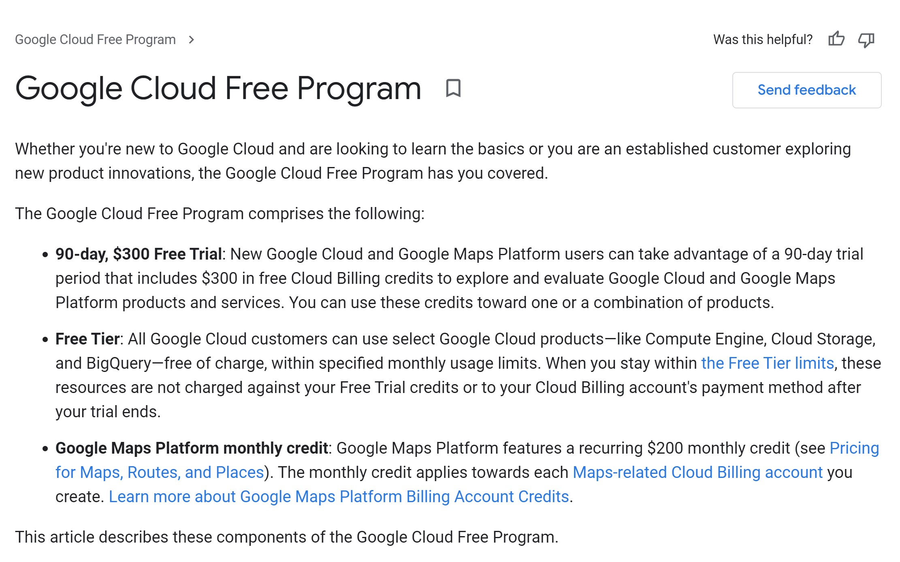

# Cloud data warehouses

Laptops and desktops work fine for routine tasks, but with the recent increase in size of datasets and computing power needed to run machine learning models, taking advantage of cloud resources is a necessity for data science.

Cloud computing is the on-demand availability of computer system resources, especially data storage and computing power, without direct active management by the user. Large clouds often have functions distributed over multiple locations, each location being a data center. 

Cloud computing relies on sharing of resources to achieve coherence and typically using a "pay-as-you-go" model which can help in reducing capital expenses but be careful because it may also lead to unexpected operating expenses for unaware users.

There are many benefits we could mention from implementing cloud computing in our organizations. Of course cloud computing can also involve risks. It can be helpful with cost reduction and inmediacy but it can involve dependency and privacy related aspects risks.

The main characteristics of cloud computing are:

- It is self-service and on-demand.

- Accesible from all around the world, and transparent allocation.

- Scalable. You can add more resources as you need them, or you can reduce resources.

- There is an option to pay for what you use.

When we talk about AI, we always talk about levels of responsability. The levels of responsability in cloud computing are always shared, so we are responsible of certain tasks and the cloud provider is responsible of other tasks.

When we talk about on-premises scheme, we basically are not on the cloud and we are responsible of everything. When we migrate to an IaaS model (Infrastructure as a service), it means that we are going to rent the infrastructure services to the cloud provider, for example virtual machines, servers, storage, etc. When we migrate to PaaS (Platform as a service), the provider is not only offering us an infrastructure, they are offering a platform that we can use. Finally, in Saas (Software as a service), the provider is in charge of everything. 

What are the costs in cloud computing services?

Cloud services have pricing models based in 'pay per use'. An advantage of this is that there are no infrastructure initial costs and there is no need to buy expensive infrastructure that we may not entirely use. Another great advantage is that we can pay for additional resources if we need them, this is what we call elasticity, and of course we can stop paying for those resources if we we no longer need them.

If you own a company, there are some questions you need to answer before migrating your company to the cloud. There have been succesful migrations to the cloud, but there have also been failing migrations. We need to understand that we are talking about a digital transformation process. Generally, the companies that start a digital transformation, have certain maturity in their procedures, in their culture (human resources), and in their technologies. Companies that have failed in this transformation, normally focus in the new technologies, but they forget about redesigning their processes, or do not bother training their human resources on how to use this new technologies. After some months or a couple of years, they realize they wasted their time and money. Sometimes the reason is they did not even started with clear goals of what to achieve with their digital transformation.

So before migrating to the cloud, make yourself these questions:

1. What do I want to achieve by migrating to the cloud?

2. What services do I wish to migrate to the cloud?

3. What type of model should I choose?

4. What company will I choose to provide me that service?

In order to answer the last question, we need to know what providers exist in the market. There are a lot of cloud computing providers, for example Digital Ocean, IBM Cloud, OpenStack, etc. However there are three big providers in the west market, AWS, Microsoft Azure and Google Cloud platform, from which AWS has the biggest market share, and its the most widely used.

>A lot of providers have free tiers. AWS, GCP and Azure do offer them.

## Cloud computing concepts

**What is a Data Lake?**

It is a service that allows us to store data in a raw format, without any kind of preprocessing. We can store structured data, for example an excel file, semi structured data, like a json file, and non-structured data, for example an audio.

This data lakes are meant to store non-structured data, however they can store the other two types of data, too. Data lakes allow us to import any amount of real time data, store and label that data in a safe way, analyse it without the need to move the data to a separate analysis tool, and of course we can use them to create predictive models.

Data Lakes help companies take better decisions because they become a centralized and standarized information source. They adapt easily to changes, they can scale much more than a relational database, and they allow crossing diverse data sources, not just relational.

However, they also have difficulties, like big initial investments and expensive maintenance. The people who will be working with this service need to be strongly trained because the integration of different data sources is very complex and there is always a big security risk of compromising the company's information if the data lake is compromised.  

**What is the difference between a Data Lake and a Data Warehouse?**

A data warehouse is an optimized database to analyse relational data that comes from transactional systems and business applications. The data gets cleaned, enriched and transformed so that they can act as the only true source in which users can trust.

A data lake is different because it stores relational data from business applications and no relational data from mobile applications, IoT devices and social networks. The structure or scheme of the data is not defined when the data is captured.

## Cloud computing providers

### Amazon Web Services (AWS)

AWS is the most used cloud platform today. This cloud solution allows us to virtually execute any application on the cloud, from web applications to IoT solutions and big data.

**S3** is a data storage service 

`aws.amazon.com/console`

Where to learn AWS skills: `aws.amazon.com/es/training/awsacademy/`

### Google Cloud Platform (GCP)

Google Cloud Platform offers you three ways to carry out machine learning:

- Keras with a TensorFlow backend to build custom, deep learning models that are trained on Cloud ML Engine

- BigQuery ML to build custom ML models on structured data using just SQL

- Auto ML to train state-of-the-art deep learning models on your data without writing any code

Choose between them based on your skill set, how important additional accuracy is, and how much time/effort you are willing to devote to the problem. Use BigQuery ML for quick problem formulation, experimentation, and easy, low-cost machine learning. Once you identify a viable ML problem using BQML, use Auto ML for code-free, state-of-the-art models. Hand-roll your own custom models only for problems where you have lots of data and enough time/effort to devote.

Check out the Google Cloud Platform free program to discover new tools for your machine learning models.

#### Big Query

With BigQuery, there’s no infrastructure to set up or manage, letting you focus on finding meaningful insights using standard SQL and taking advantage of flexible pricing models across on-demand and flat-rate options. In BigQuery ML, you can use a model with data from multiple BigQuery datasets for training and for prediction.

**Benefits**

- Cost effective

- Real-time analytics

- Serverless solution

- Geoexpansion

- Automatic backup and easy restore

[Big Query official documentation](https://cloud.google.com/bigquery/docs)

If you are new/want to explore GCP for first time, then use google sandbox account which is free and login with your account information and can access GCP toolkit with limited resource.

**Big Query ML**

**Benefits:**

- You don't need to know Python or any other language for managing Machine Learning models. You can train models and make predictions using SQL queries.

- The data export involves many steps, and it’s a time-consuming process. Google BigQuery ML saves time and resources by letting users use Machine Learning models in Google BigQuery.

- It allows users to run Machine Learning models on large datasets within minutes as it uses computation resources of Google BigQuery Data Warehouse.

- It features some automated Machine Learning models that reduce the workload to manipulate data manually. It saves time and allows users to quickly train and test models on the dataset.

[Big Query ML official documentation](https://cloud.google.com/bigquery-ml/docs)

`console.cloud.google.com`

Free tier of 3 months with USD 300

Where to learn GCP skills: `go.qwiklabs.com`, `cloudskillsboost.google`

### Microsoft Azure

`azure.microsoft.com`

How to learn Microsoft skills: [Microsoft Learn](docs.microsoft.com/en-us/learn), [Azure fundamentals](docs.microsoft.com/en-us/certifications/azure-fundamentals/).

**Source:**

https://en.wikipedia.org/wiki/Cloud_computing

GCP:

-https://medium.com/ibm-data-ai/machine-learning-in-google-cloud-with-bigquery-25d40b158f91

-https://medium.com/@rajdeepmondal/predicting-cab-fare-for-chicago-using-bqml-395126343c92

-https://windsor.ai/how-to-get-your-analytics-crm-and-media-data-into-bigquery/

-https://towardsdatascience.com/build-a-useful-ml-model-in-hours-on-gcp-to-predict-the-beatles-listeners-1b2322486bdf

-https://towardsdatascience.com/choosing-between-tensorflow-keras-bigquery-ml-and-automl-natural-language-for-text-classification-6b1c9fc21013

https://towardsdatascience.com/running-jupyter-notebook-in-google-cloud-platform-in-15-min-61e16da34d52

https://towardsdatascience.com/automated-machine-learning-on-the-cloud-in-python-47cf568859f