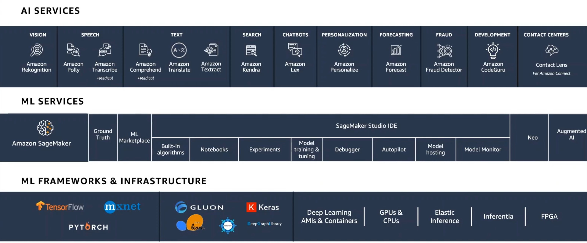

# Getting started with Machine learning on AWS tools

Regardless of the problem you are working on, you normally have to go through the following steps:

We start with our business problem and spend some time converting it into a machine learning problem, which is not a simple process. Then we start collecting the data, and once we have all our data together, we visualize it, analyse it, and do some feature engineering to finally have clean data ready to train our model. We probably won't have our ideal model since the beginning, so with model evaluation we measure how the model is doing, if we like the perfomance or not, if it is accurate or not, and then we start to optimize it by tuning some hyperparameters. 

Once we are satisfied with our model we need to verify if it satisfies our initial business goal, otherwise we would have to work on feature augmentation or in collecting more data. Once our business goal is satisfied, we can deploy our model to make predictions in a production environment and it doesn't end there because we want to keep them up to date and current so we keep retraining them with more data. While in software you write rules to follow, in machine learning the model figures out the rule based on the data that it has been trained on. So in order to stay current you need to retrain your model on current data.

It is not simple but we have already learned how to do all this on our own. The good news about cloud computing is that we can implement some ML solutions without having to go through each of the previous steps.

Because it is currently the number one cloud computing provider, We chose AWS to learn some cloud computing skills. In the following image we can see the three layer AWS machine learning stack.



In the bottom of the stack we can find 'ML frameworks & infrastructure', which is what AWS would call the "hard" way of doing machine learning, by running some virtual machines where we are able to use GPUs if we need them and install some frameworks, for example Tensorflow, to start doing all the steps mentioned above.

There is an easier way, which is the 'ML services'. This is all about the service called SageMaker. 
SageMaker is a service that has the previous pipeline ready for you to use but you still need to know about the algorithms that you want to use, and you still need to code a little bit if you want to go a little bit deeper.

Now let's see the easiest way at the top of the stack image. In 'AI Models' the models are built already. We use for example a natural language processing service called 'Amazon Translate'.
AI services are a great way to try AI, specially if you don´t have any background, or if you are working in some rapid experimentation, they are a quick way to get into the business value, and if you find where the business value is and you need something more customized, then you can move down the stack to the next layer.

The great thing about this AI services APIS is that, as a developer, you can jumpstart to experiment instead of having to learn a lot of stuff before start using them, and then you can go deeper and customize them.

Three things that developer need to learn to get the most out of this services:

1. Understand your data, not only in AI services, but in all machine learning.

2. Understand your use case, test the service with your particular use case, not just the generic one.

3. Understand what success looks like. Machine learning is very powerful but it is not going to be 100% accurate.

## Amazon SageMaker

**What is Amazon SageMaker?**

Amazon SageMaker provides machine learning capabilities for data scientists and developers to prepare, build, train, and deploy high-quality ML models efficiently.

**SageMaker Workflow:**

1. Label data: Set up and manage labeling jobs for highly accurate training datasets within Amazon SageMaker, using active learning and human labeling.

2. Build: Connect to other AWS services and transform data in Amazon SageMaker notebooks.

3. Train: Use Amazon SageMaker's algorithms and frameworks, or bring your own, for distributed training.

4. Tune: Amazon SageMaker automatically tunes your model by adjusting multiple combinations of algorithm parameters.

5. Deploy: After training is completed, models can be deployed to Amazon SageMaker endpoints, for real-time predictions.

6. Discover: Find, buy and deploy ready-to-use model packages, algorithms, and data products in AWS marketplace.

**SageMaker benefits**

- For data exploration and preprocessing, it provides fully managed instances running Jupyter notebooks that include example code for common model training and hosting exercises.

- When you are ready to train your data, simply indicate the type and quantity of instances you need and start the training with a single click.

- It provides machine learning algorithms highly optimized on speed, accuracy and scaling to run on extremely large training datasets.

- SageMaker provides model artifacts and scoring images for deployment to Amazon EC2 or anywhere else.

### SageMaker Studio

When you log in to Amazon Web Services and choose SageMaker, there are some important first steps to be done:

First we need to create a Studio domain. This is a one time process you do in your Aws console just for SageMaker. 

Once created, AWS manages the server for you, and you as a consumer will log in to a user profile. You can have as many user profiles as you want per Studio domain. What normally happens in organizations is that they give a Studio domain to a team of data scientists and they create as many user profiles as they need. 

Every time you create a user profile it is again the jupyter server that AWS manages, but every time you create a new notebook, app or machine, they will be running on a new EC2 instance each, so you have to be cautious because all your running instances is what will be charged, so make sure to log out or if you are not using an instance, shut it down so that you are not charged. The good part is that you can have as many machines running as you want and you have them running in all different environments so you can have an R machine, a Spark machine, a Pytorch machine, a tensorflow machine, among others.

Reasons to pick SageMakaer Studio:

- You have more compute power, you can have more machines to run on top of.

- You can add as much data to the server and it just grows.

- All the widgets that it has: Projects, Data Wrangler, Feature Store, Pipelines, Experiments and trials, Model registry, Endpoints, etc.

#### **Use Case**

In the left control panel of SageMaker you will find SageMaker Studio. Once you click on it, you will find a kind of Jupyter Lab environment and you will be presented with a Launch screen.

1. **Background**

In this SageMaker example, you will learn the steps to build, train, tune and deploy a fraud detection model.
The following steps include preparation of your SageMaker notebook, downloading data from the internet into SageMaker, transforming the data, using Gradient Boosting algorithm to create a model, evaluate its effectiveness and setting the model up to make predictions.

2. **Preparation**

Once you install pandas, you need to specify some details:

- The S3 bucket and prefix that you want to use for training and modeling the data, because the data has to come from some storage. It is not recommended to have your data uploaded in a notebook because if you have a lot of data and you are constantly uploading it, you are constantly being charged for it and is also slower. S3 is definitely more friendly in terms of uploading and landing our datasets because it can store terabytes of data. Data can also be in Elastic file system (EFS).

- The IAM role arn used to give training and hosting access to your data. This role is the role you have been assigned whenever launched the SageMaker Studio. With get_execution_role() we fetch that role. It is important because it provides access to SageMaker to other AWS resources.

```py
!pip install --upgrade pandas
```

>It is important to mention that when you create a new notebook, when you select the kernel you can reuse the kernel from an existing session so it will have all the packages to avoid reinstalling. Another way is separately building a base docker image and attach it to your Studio domain.

```py
import sagemaker
bucket = sagemaker.Session().default_bucket()
prefix = 'sagemaker/fraud-detection'

#Define IAM role
import boto3
import re
from sagemaker import get_execution_role

role = get_execution_role()

#Import the python libraries we will need
import numpy as np
import pandas as pd
import matplotlib.pyplot as plt
from Ipython.display import Image #to display images in the notebook
from Ipython.display import display #to display outputs in the notebook
from time import gmtime, strftime #for labeling SageMaker models
import sys
import math
import json
import zipfile
```

You don't strictly need the SageMaker Python SDK to use SageMaker. There are a couple other ways to invoke SageMaker APIs:

- You can use boto3

- You can use the AWS CLI.

```py
#make sure pandas version is set to 1.2.4 or later. It is always good  to check versions. In Sagemaker features are constantly being added.
pd.__version__
```

3. **Data**


4. **Training**

5. **Hosting**

6. **Evaluation**

7. **Extensions**