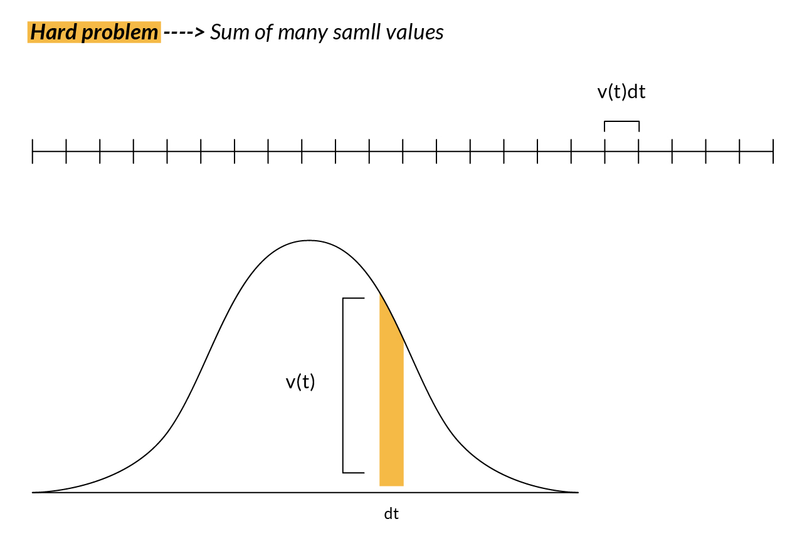
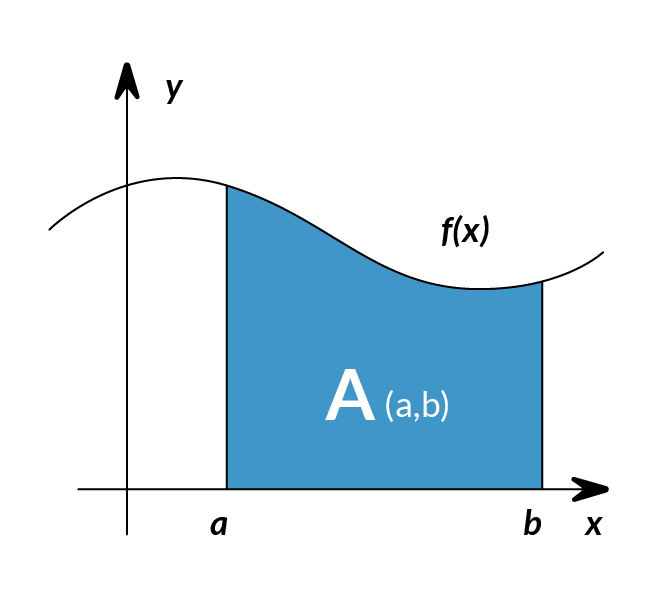
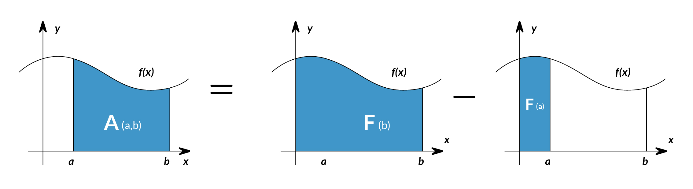
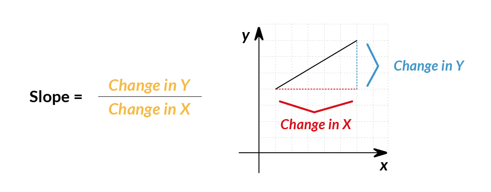
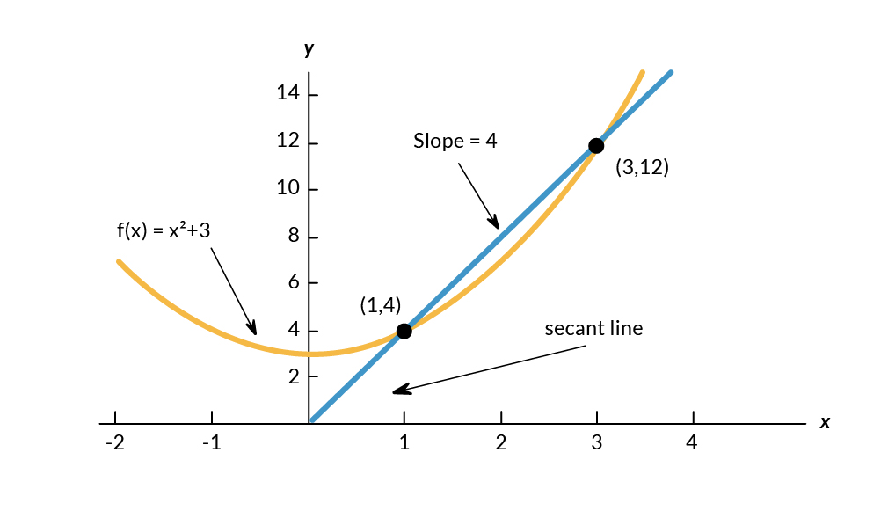

# Calculus

Calculus, linear algebra and probability are the 'languages' in which machine learning is written. 
Learning these topics will provide a deeper understanding of the underlying algorithmic mechanics and allow the development of new algorithms, which can ultimately be deployed as more sophisticated quantitative trading strategies.

Calculus is the mathematical study of continuous change. You need to know some basic calculus to understand better the machine learning concepts and the function's behavior.

Let's talk about the three big ideas of Calculus: Integrals, Derivatives, and the fact that they are opposites.

**Derivatives** are about understanding how functions change over time.

**Integrals** let you calculate the total amount of a quantity that accumulates over a time period.

So, thinking like an engineer, we don't just care about finding answers. We care about developing problem-solving tools and techniques. A big theme in Calculus is that the approximation using many smaller pieces gives us the flexibility to reframe our original question into something simpler. A hard problem is on one hand the sum of many small values, but on the other hand, that sum also approaches the area under a graph.

### Integrals

For example, if we wanted to know how far a person walked based on its velocity at each point of time, we can divide it by many points in time and multiply the velocity at each time (t) by some small change in time (dt) to get the corresponding smaller distance walked in that smaller time.

Many of these types of problems turn out to be equivalent to finding the area under some graph. The purpose of small approximations is that it lets us reframe the problem of how far the person has walked into the question of finding the area under a certain curve.

So having just solved a problem by reframing it as an area under a graph, you might start thinking about how to find the area under other graphs. Now let's see a different graph.

The integral of $f(x)$ corresponds to the computation of the area under the graph of $f(x)$. The area under $f(x)$ between the points $x = a$ and $x = b$ is denoted as follows:

The area $A(a,b)$ is bounded by the function $f(x)$ from above, by the x-axis from below, and by two vertical lines at $x = a$ and $x = b$. Those two points $x = a$ and $x = b$ are denoted the limits of integration. The $∫$ sign comes from the Latin word summa. The integral is the sum of the values of $f(x)$ between the two limits of integration.
The area under $f(x)$ between $x = a$ and $x = b$ is obtained by calculating the change in the integral function as follows:

We can approximate the total area under the function $f(x)$ between $x = a$ and $x = b$ by splitting the graph into small vertical rectangular strips of width $h$, then adding up the areas of those rectangular strips. The figure below shows how to compute the area under $f(x) = x2$ between $x = 3$ and $x = 6$ by approximating it as six rectangular strips of width $h = 0.5$.

So to recap $A(x)$ which gives the area under the graph of x2 between some fixed-left point and some variable right point gives us a clear panoram that many practical problems that can be approximated by adding up a large number of small things can be reframed as a question about the area under a certain curve.

### Derivatives

What is a derivative?
A Derivative can be defined in two ways:

1.	Instantaneous rate of change (Physics)
2.	The slope of a line at a specific point (Geometry)

We will use the geometry definition for simplicity in explanation.
The slope represents the steepness of a line. It means: How much does $y$ (or $f(x)$) change given a specific change in $x$?

The slope between $(1,4)$ and $(3,12)$ would be:

slope= $\frac{(y2−y1)}{(x2−x1)}$ = $\frac{(12-4)}{(3-1)} = 4$

### Machine Learning use cases

Machine learning uses derivatives in optimization problems. Optimization algorithms like gradient descent use derivatives to decide whether to increase or decrease weights to maximize or minimize some objective (e.g. a model’s accuracy or error functions). Derivatives also help us approximate nonlinear functions as linear functions (tangent lines), which have constant slopes. With a constant slope, we can decide whether to move up or down the slope (increase or decrease our weights) to get closer to the target value (class label).

References:

https://en.wikipedia.org/wiki/Calculus

https://www.youtube.com/watch?v=WUvTyaaNkzM

https://ml-cheatsheet.readthedocs.io/en/latest/calculus.html#introduction-1

