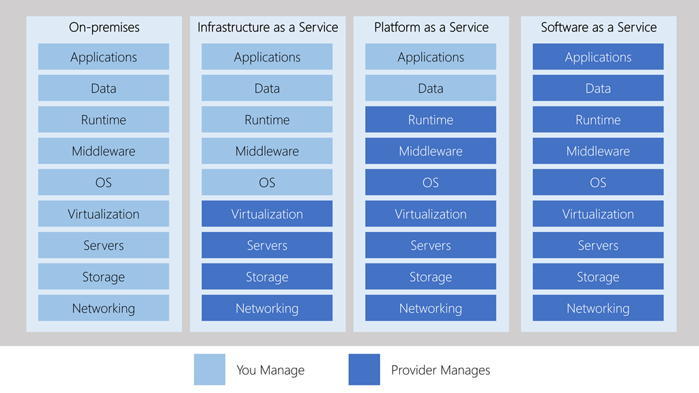

# Cloud data warehouses

Laptops and desktops work fine for routine tasks, but with the recent increase in size of datasets and computing power needed to run machine learning models, taking advantage of cloud resources is a necessity for data science.

Cloud computing is the on-demand availability of computer system resources, especially data storage and computing power, without direct active management by the user. Large clouds often have functions distributed over multiple locations, each location being a data center. 

Cloud computing relies on sharing of resources to achieve coherence and typically using a "pay-as-you-go" model which can help in reducing capital expenses but be careful because it may also lead to unexpected operating expenses for unaware users.

There are many benefits we could mention from implementing cloud computing in our organizations. Of course cloud computing can also involve risks. It can be helpful with cost reduction and inmediacy but it can involve dependency and privacy related aspects risks.

The main characteristics of cloud computing are:

- It is self-service and on-demand.

- Accesible from all around the world, and transparent allocation.

- Scalable. You can add more resources as you need them, or you can reduce resources.

- There is an option to pay for what you use.

When we talk about AI, we always talk about levels of responsability. The levels of responsability in cloud computing are always shared, so we are responsible of certain tasks and the cloud provider is responsible of other tasks.

When we talk about on-premises scheme, we basically are not on the cloud and we are responsible of everything. When we migrate to an IaaS model (Infrastructure as a service), it means that we are going to rent the infrastructure services to the cloud provider, for example virtual machines, servers, storage, etc. When we migrate to PaaS (Platform as a service), the provider is not only offering us an infrastructure, they are offering a platform that we can use. Finally, in Saas (Software as a service), the provider is in charge of everything. 

What are the costs in cloud computing services?

Cloud services have pricing models based in 'pay per use'. An advantage of this is that there are no infrastructure initial costs and there is no need to buy expensive infrastructure that we may not entirely use. Another great advantage is that we can pay for additional resources if we need them, this is what we call elasticity, and of course we can stop paying for those resources if we we no longer need them.

If you own a company, there are some questions you need to answer before migrating your company to the cloud. There have been succesful migrations to the cloud, but there have also been failing migrations. We need to understand that we are talking about a digital transformation process. Generally, the companies that start a digital transformation, have certain maturity in their procedures, in their culture (human resources), and in their technologies. Companies that have failed in this transformation, normally focus in the new technologies, but they forget about redesigning their processes, or do not bother training their human resources on how to use this new technologies. After some months or a couple of years, they realize they wasted their time and money. Sometimes the reason is they did not even started with clear goals of what to achieve with their digital transformation.

So before migrating to the cloud, make yourself these questions:

1. What do I want to achieve by migrating to the cloud?

2. What services do I wish to migrate to the cloud?

3. What type of model should I choose?

4. What company will I choose to provide me that service?

In order to answer the last question, we need to know what providers exist in the market. There are a lot of cloud computing providers, for example Digital Ocean, IBM Cloud, OpenStack, etc. However there are three big providers in the west market, AWS, Microsoft Azure and Google Cloud platform, from which AWS has the biggest market share, and its the most widely used. In addition to the core infrastructure services, each cloud provider brings their unique proprietary offerings in the NoSQL, Big Data, Analytics, ML and other such areas.

>A lot of providers have free tiers. AWS, GCP and Azure do offer them.

## Cloud computing concepts

**What is a Data Lake?**

It is a service that allows us to store data in a raw format, without any kind of preprocessing. We can store structured data, for example an excel file, semi structured data, like a json file, and non-structured data, for example an audio.

This data lakes are meant to store non-structured data, however they can store the other two types of data, too. Data lakes allow us to import any amount of real time data, store and label that data in a safe way, analyse it without the need to move the data to a separate analysis tool, and of course we can use them to create predictive models.

Data Lakes help companies take better decisions because they become a centralized and standarized information source. They adapt easily to changes, they can scale much more than a relational database, and they allow crossing diverse data sources, not just relational.

However, they also have difficulties, like big initial investments and expensive maintenance. The people who will be working with this service need to be strongly trained because the integration of different data sources is very complex and there is always a big security risk of compromising the company's information if the data lake is compromised.  

**What is the difference between a Data Lake and a Data Warehouse?**

A data warehouse is an optimized and centralized data repository to analyse relational data that comes from transactional systems and business applications. The data gets cleaned, enriched and transformed so that they can act as the only true source in which users can trust.

A data lake is different because it stores relational data from business applications and no relational data from mobile applications, IoT devices and social networks. The structure or scheme of the data is not defined when the data is captured.

The main difference between data lake and data warehouse has to do with the format in which data is processed and stored. In a data warehouse, we will always find structured and preprocessed data. Deciding if having a data lake or a data warehouse, depends on the type of data you will be working with, and also the frequency in which the data will be updated and queried. Data warehouses are analytical databases so they are not intended for frequent queries and updates.
Depending on the needs, a company may have a data lake as well as a data warehouse. Both data structures are very valuable. 

**What is a data mart?**

A datawarehouse is composed of datamarts. Data marts are small databases oriented to specific topics from the organization. For example a datamart for each department (Marketing, Purchases, etc). The process that extracts, transforms and loads the data from datamarts into the data warehouse is known as **ETL**. This ETL processes are normally done by batches, which are loaded during a specific time of the day, normally at nights when the work loads are not so high.

A data warehouse, compared to a data mart, tries to centralize information, and fight against having multiple truths from having multiple databases.

## Cloud computing providers

Machine learning is a critical element of the data science process, but training ML models is often a time consuming process that requires a lot of resources. Machine learning and deep learning models involve thousands of training iterations. You need these extensive amounts of iterations to produce the most accurate model. For example, if you have a set of training samples with only 1TB of data, 10 iterations of this training set will require 10TB of speed with which the data transfer takes place between the hard disk drive and RAM. In the past, gaining access to ML resources was difficult and expensive. Today, many cloud computing vendors offer resources for data science in the cloud.

Cloud computing enables you to model storage capacity and handle loads at scale, or to scale the processing across nodes. For example, AWS offers Graphics Processing Unit (GPU) instances with 8–256GB memory capacity. These instances are priced at an hourly rate. GPUs are specialized processors designed for complex image processing.

### Amazon Web Services (AWS)

AWS is the most used cloud platform today. This cloud solution allows us to virtually execute any application on the cloud, from web applications to IoT solutions and big data. In AWS, as in any cloud provider, we have to choose the region in the world in which the servers that provide the service, are installed. Remember to always choose a region that is the closest possible to the client that will use the resources. Amazon Web Services has a lot of tools and services but in this lesson, we want to mention some of them that can help you improving your machine learning models.

**S3** is an Amazon data storage service. One of the most important products from Amazon. **S3** is an object based storage service that allows to store as much data as you want because the scaling is automatic. When we talk about object based we mean the minimal unit, in this case, the files. 

All files or objects are stored in buckets. We can think of a bucket as a folder where we store our files. A bucket is a container that can store different types of objects. We can not create a bucket with a name that already exists. Bucket names in S3 are unique and we can configure if buckets are public or private. Inside a bucket we can modify a file and have its versions during time.

S3 storage format: https://[bucket name].s3.amazonaws.com/video.mp4

**Cloud9** is like a Visual Studio Code but from AWS. It allows us to create environments. When we configure them, in the background this creates and executes a virtual machine service called Elastic Compute Cloud (EC2). 

**SageMaker** is a fully-managed machine learning platform for data scientists and developers. The platform also runs on Elastic Compute Cloud (EC2), and enables you to build machine learning models, organize your data, and scale your operations. Machine learning applications on SageMaker range from speech recognition, computer vision, and recommendations. The AWS marketplace offers models to use, instead of starting from scratch. You can start training and optimizing your model. The most common choices are frameworks like Keras, TensorFlow, and PyTorch. SageMaker can optimize and configure these frameworks automatically, or you can train them yourself. You can also develop your own algorithm by building it in a Docker container and you can use a Jupyter notebook to build your machine learning model, and visualize your data.

Link of the Amazon Web Services: `aws.amazon.com/console`

Where to learn AWS skills: `aws.amazon.com/es/training/awsacademy/`

### Google Cloud Platform (GCP)

Google Cloud Platform offers you three ways to carry out machine learning:

**Auto ML** to train state-of-the-art deep learning models on your data without writing any code, for begineers. 

Auto ML is a cloud-based machine learning platform built for inexperienced users. You can upload your datasets, train models, and deploy them on the website. AutoML integrates with all Google’s services and stores data in the cloud. You can deploy trained models via the REST API interface. There are a number of available AutoML products you can access via a graphical interface. This includes training models on structured data, image and video processing services, and a natural language processing and translation engine.

**BigQuery ML** to build custom ML models, train them and make predictions on structured data using just SQL. Use BigQuery ML for quick problem formulation, experimentation, and easy, low-cost machine learning. Once you identify a viable ML problem using BQML, use Auto ML for code-free, state-of-the-art models. Hand-roll your own custom models only for problems where you have lots of data and enough time/effort to devote.

**Cloud ML Engine** to build custom, deep learning models using Keras with a TensorFlow backend, for more experienced data professionals. It can be used to train a complex model by leveraging GPU and Tensor Processing Unit (TPU) infrastructure. You can also use the service to deploy an externally trained model. Cloud ML automates all monitoring and resource provisioning processes for running the jobs. Besides hosting and training, Cloud ML can also perform hyperparameter tuning that influences the accuracy of predictions. Without hyperparameter tuning automation, data scientists need to manually experiment with multiple values while evaluating the accuracy of the results.

TensorFlow is an open source software library that uses data-flow graphs for numerical operations. Mathematical operations in these graphs are represented by nodes, while edges represent data transferred from one node to another. Data in TensorFlow is represented as tensors, which are multidimensional arrays. TensorFlow is usually used for deep learning research and practice. TensorFlow is cross-platform. You can run it on GPUs, CPUs, TPUs, and mobile platforms.

Choose between them based on your skill set, how important additional accuracy is, and how much time/effort you are willing to devote to the problem. 

Check out the Google Cloud Platform free program to discover new tools for your machine learning models.

Link of the Google Cloud Platform: `console.cloud.google.com`

Where to learn GCP skills: `go.qwiklabs.com`, `cloudskillsboost.google`

### Microsoft Azure

Just like the SageMaker of Amazon and ML Engine of Google, Azure AI is the answer of Microsoft to Amazon and Google. Moreover, Azure AI offers a range of open and comprehensive platforms for the building, evaluating, and deployment of machine learning models and many more features supporting various AI frameworks such as PyTorch, TensorFlow, Sci-kit Learn, and more.

Compared to AWS, Azure machine learning offerings are more flexible in terms of out-of-the-box algorithms. 

**Azure ML** is a huge library of pre-trained, pre-packaged machine learning algorithms. Azure ML Service also provides an environment for implementing these algorithms and applying them to real-world applications. The UI of Azure ML enables you to build machine learning pipelines that combine multiple algorithms. You can use the UI to train, test, and evaluate models.

Azure ML also provides solutions for Artificial Intelligence (AI). This includes visualization and other data that can help understand model behavior, and compare algorithms to find the best option.

Link of the Microsoft Azure platform: `azure.microsoft.com`

How to learn Microsoft skills: [Microsoft Learn](docs.microsoft.com/en-us/learn), [Azure fundamentals](docs.microsoft.com/en-us/certifications/azure-fundamentals/).

**Source:**

-https://en.wikipedia.org/wiki/Cloud_computing

-https://www.c-sharpcorner.com/article/aws-vs-azure-vs-google-cloud-comparative-analysis-of-cloud-platforms-for-machi/

-https://towardsdatascience.com/data-science-in-the-cloud-239b795a5792

-https://medium.com/ibm-data-ai/machine-learning-in-google-cloud-with-bigquery-25d40b158f91

-https://medium.com/@rajdeepmondal/predicting-cab-fare-for-chicago-using-bqml-395126343c92

-https://windsor.ai/how-to-get-your-analytics-crm-and-media-data-into-bigquery/

-https://towardsdatascience.com/build-a-useful-ml-model-in-hours-on-gcp-to-predict-the-beatles-listeners-1b2322486bdf

-https://towardsdatascience.com/choosing-between-tensorflow-keras-bigquery-ml-and-automl-natural-language-for-text-classification-6b1c9fc21013

-https://towardsdatascience.com/running-jupyter-notebook-in-google-cloud-platform-in-15-min-61e16da34d52

-https://towardsdatascience.com/automated-machine-learning-on-the-cloud-in-python-47cf568859f
