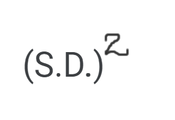

# DESCRIPTIVE STATISTICS

We can divide Statistics field in two categories:
    
Descriptive Statistics and Inferential Statistics.

Descriptive Statistics means summarizing and organizing the data, for example having a lot of data and you want to tell someone about it without giving them all of the data, so you can use indicative numbers.
This is different from Inferential Statistics.
Inferential Statistics means attempting to make inferences  or conclusions from a sample to the whole population.

So using descriptive statistics maybe you want to use a number that is most indicative of all of the numbers in that set. Or some of the numbers that represent the central tendency.

We will begin by listing the measures of central tendency, which represents the idea that there is one number that best summarizes the entire set.

### Measures of central tendency

**Moments**

A moment is a quantitative measure that says something about the shape of a distribution. There are central moments and non-central moments. This section is focused on the central moments. This central tendency measures represent the idea that there is one number that best summarizes the entire set.

The 0th central moment is the total probability and is always equal to 1.

The 1st moment is the mean (expected value).

The 2nd central moment is the variance.

**Mean**

The arithmetic mean is probably what you are most familiar with when people talk about average.
If you have five numbers, the mean would be the sum of those five numbers divided by 5. It is the balance point and it is also called the first moment.

**Median**

Value that divides data in two equal parts. If the number of elements in the data is even, then the median would be the average of the two middle terms.
When the difference between the consecutive terms is constant (arithmetic progression) then the median = mean.

**Mode**

The mode is essentially what number is most common in a set. If two values appear same time more than others then we have a bimodal set. We can also can trimodal or multimodal sets.

### Measures of variability

This measures represent how spread is the data.

**Standard Deviation**

Standard deviation tells us how far is the mean from each observation in the given data set.

In descriptive statistics we generally deal with data available in a sample, not in a population. The standard deviation is calculated with the square root of the variance.

**Mean Deviation**

The mean deviation gives information about how far the data values are spread out from the mean value.

**Variance**

Just another measure of dispersion, of how data points differ from the mean. Variance is the expectation of the squared deviation of a random variable from its population mean or sample mean. Variance is interesting in a mathematical sense, but the standard deviation is often a much better measure of how spread out the distribution is.

**Range**

Range is the difference between the lowest and the highest value.

**Percentile**

It is a way to represent position of a value in data set. To calculate it,  values should always be in ascending order.

12  

24

41   

51  

67  

67   

85   

99

The median 59 has four values less than itself out of eight. 59 is the 50th percentile because 50% of data are less than 59.

**Quartiles**

Quartiles are values that divide your data into quarters. Sorted in ascending order.

12

24

41

51

67

67

85

99

115

Q2 = 67 is 50th percentile of data and is also the median.

Q1 = 41 is the 25th percentile of data.

Q3 = 85 is 75th percentile of data

IQR = interquantile range = Q3 - Q1 

                          = 85 - 41 
                          
                          = 44

### Skewness

The 3rd central moment is the skewness. A measure that describes the contrast of one tail versus the other tail. For example, if there are more high values in your distribution than low values then your distribution is 'skewed' towards the high values.

To calculate skewness:

1. Pearson First Coefficient of Skewness (Mode Skewness) 

2. Pearson Second Coefficient of Skewness (Median Skewness)

Direction of skewness is given by sign. 0 means no skewness. Negative means negative skewed.
The coefficient compares the sample distribution with a normal distribution.

### Correlation

Statistical technique that can show whether and how strongly pairs of variables are correlated.

Correlation coefficient (r) ranges from -1 to +1.

The closer to +1 or -1, the more closely the two variables are correlated.

If r is close to 0, there is no relationship.

If r is positive, it means that as one variable gets larger, the other gets larger.

If r is negative, it means that as one variable gets larger , the other gets smaller.

### Kurtosis

The 4th central moment is Kurtosis. It is about the existance of outliers.It is a measure of whether the data are heavy-tailed (profusion of outliers) or light-tailed (lack of outliers) relative to a normal distribution. It is about how fat the tails in the distribution are.

Leptokurtic means tails are thick and heavy
Platykurtic means tails are thinner.

The main difference between skewness and kurtosis is:
    
    Skewness refers to a degree of symmetry.
    Kurtosis refers to a degree of presence of outliers.

The higher the moment, the harder it is to estimate with samples. Larger samples are required in order to obtain good estimates.

References:

https://towardsdatascience.com/understanding-descriptive-statistics-c9c2b0641291

